# Экзаменационный билет №1

## 1. Структуры данных и математические модели.

Одной из наиболее общих математических абстракций является понятие алгебраической системы < А, О, R >, где

- A - множество операндов
- О - множество операций 
- R - множество отношений ()
-  - арность операций
-  - арность отношений.

Если операций нет - модель (структура). Если отношений нет - универсальная алгебра.

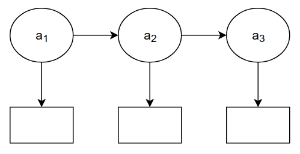

**Математическая структура**  есть одно или несколько множеств , элементы которых находятся в некоторых отношениях .

-  – базисные множества структуры.
- Каждое отношение pi есть двоичная функция, аргументами которой являются элементы базисного множества.
  - Если аргументы функции находятся в отношении, то значение  = ИСТИНА.


**Структура данных** - модель данных в виде математической структуры.

Примеры:

- множество операндов и операций и порядок их записи (арифметическое выражение)
- множество узлов детали и порядок их соединения (чертеж)
- множество людей и родственные связи между ними (генеалогическое дерево)
- множество населенных пунктов и пути сообщения (карта).

## 2. Разработка общего представления линейного списка для обеспечения списковой структуры хранения.

Значения представлены в виде объектов классов, являющихся производными из одного общего базового класса.


В поле значения звена списка размещается указатель на объект значение.

- pFirst – указатель на первое звено списка
- pLast – указатель на последнее звено списка
- pCurrLink – указатель на текущее звено списка
- pPrevLink – указатель на звено, предшествующее текущему
- CurrPos – номер текущего звена
- ListLen – количество звеньев в списке

Для **повышения общности** схемы реализации будем использовать вместо величины NULL константу pStop для фиксации ситуаций, в которых указатель не содержит адрес какого-либо звена списка.

Информационные методы:

- IsEmpty – проверить, не является ли список пустым
- GetListLength – получить количество звеньев списка

Методы доступа к значениям в списке:

- GetDatValue – получить указатель на значение из звена списка
  - обращение возможно только к первому (FIRST), текущему (CURRENT) или последнему звеньям списка (LAST)
  - желаемый вариант доступа задается через параметр метода

Методы навигации по списку (итератор):

- Reset – установить текущую позицию на первое звено
- GoNext – переместить текущую позицию на звено вправо
- IsListEnded – проверка завершения списка
  - под ситуацией завершения списка понимается состояние после применения GoNext для текущей позиции, установленной на последнем звене списка, т.е. когда pPrevLink=pLast, pCurrLink=pStop
- GetCurrentPos – получить номер текущего звена, SetCurrentPos – установить текущую позицию на звено с заданным номером

Вставка звеньев:

- InsFirst – вставить звено перед первым звеном списка
- InsLast – вставить звено после последнего звена
- InsCurrent – вставить звено перед текущим звеном списка
- При выполнении операций вставки звеньев следует учитывать, что список может быть пустым
- После выполнения вставки необходимо обеспечить корректность значений указателей первого, текущего и последнего звеньев списка
- При корректировке указателей следует учитывать возможность различного положения текущей позиции списка
  - текущая позиция является первым звеном (pCurrLink=pFirst)
  - текущая позиция является вторым звеном (pPrevLink=pFirst)
  - текущая позиция находится внутри списка
  - текущая позиция является последним звеном (pCurrLink=pLast)
  - текущая позиция выходит за пределы списка (pPrevLink=pLast)

Удаление звеньев:

- DelFirst – удалить первое звено списка
- DelCurrent – удалить текущее звено
- DelList – удалить список


# Экзаменационный билет №2

## 1. Понятие экземпляра и схемы структуры на примере стека. Элементы базисного множества динамической структуры стек.

**Схема стуктуры** - структура данных 
, соответствующая рассмотрению структуры как переменной величины.

Алгоритм соответствует схеме структуры

**Экземпляр** - структура данных 
с установленными значениями элементов.

-  отражает не отношения между элементами, а индивидуальные свойства элемента

Вычисление соответствует экземпляру

Структуры с бинарными отношениями допускают случай графического изображения

- Элементы множества изображаются точками или кружками
- пары , для которых отношение истина, соединяются стрелкой от первого аргумента ко второму
- образ структуры с бинарными отношениями - ориентированный граф

## 2. Плекс, как представление арифметического выражения.

**Плекс** - структура представления для выражений самого общего вида (линия – операция, точки – операнды)

Пример:

- Арифметическое выражение 


# Экзаменационный билет №3

## 1. Динамические структуры: свойства и применение.

Структуры данных являются **операндами операций обработки**.

<!-- CORRECT KATEX MATRIX BUT NOT SHOWN ON GITHUB OR IN PRESENTATION
$$ab^T = \begin{pmatrix}
a_{1}\\
a_{2}\\         
\vdots\\
a_{n}
\end{pmatrix} * (b_1 \dots b_m) = \begin{pmatrix}
c_{11} & \dots & c_{1m}\\
& \dots\\
c_{n1} & \dots & c_{nm}
\end{pmatrix} = c$$ -->

<!-- WORKS FOR PRESENTATIONS -->


Результаты вычислений также являются структурами, модель которых может как совпадать, так и отличаться от структуры исходных данных.

### Пример. Организация последовательного вызова подпрограмм.

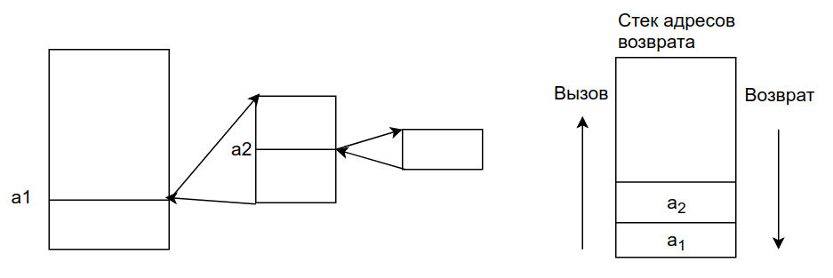

- Для возврата в точку вызова необходимо запоминать адрес возврата
- При завершении вызываемой подпрограммы для возврата используется последний запомненный адрес
- В ходе вызова подпрограмм количество запоминаемых адресов постоянно изменяется
  - увеличивается при вызове очередной подпрограммы и уменьшается после завершения работы текущей подпрограммы
- Отличительная особенность – структура исходных и результирующих данных являются близкими.

Анализ примера:

- Текущий набор адресов – линейная структура  <!-- $S_n=(a_1 a_2 … a_n)$ -->.
- Пусть T – операция исключения последнего адреса.
- Тогда . Пусть P – операция добавления нового адреса. Тогда .
- Орграф результата является подорграфом орграфа операнда или включает его
- Последовательное применение операций T и P позволяет получить набор состояний стека адресов
- Пусть
  - P1 - отношение следования, порождаемое операцией вставки
  - P2 - отношение следования, порождаемое операцией исключения
- Тогда стек есть структура 
  - каждый элемент – структура
  - в любой момент существует только один конкретный элемент из M
  - элементы частично упорядочены по включению

**Динамическая структура** - математическая структура, которой соответствует частично-упорядоченное (по включению) базовое множество M, элементы которого являются структурами данных. При этом отношения включения индуцируются операциями преобразования структуры данных.

Примеры:

- очередь (FIFO) вставка в конец очереди исключение из начала
- дек - вставка и исключение из начала и конца дека - FOLIFOLO

**Средства поддержки динамической структуры** - программы реализующие отношения включения

### Взято из интернета

**Динамические структуры данных** – это структуры данных, память под которые выделяется и освобождается по мере необходимости.

Свойства:

- ей выделяется память в процессе выполнения программы
- количество элементов структуры может не фиксироваться;
- отсутствует физическая смежность элементов структуры в памяти;
- размерность структуры может меняться в процессе выполнения программы;
- в процессе выполнения программы может меняться характер взаимосвязи между элементами структуры

Выгодно использовать, если:

- Используются переменные, имеющие довольно большой размер (например, массивы большой размерности), необходимые в одних частях программы и совершенно не нужные в других
- В процессе работы программы нужен массив, список или иная структура, размер которой изменяется в широких пределах и трудно предсказуем.
- Когда размер данных, обрабатываемых в программе, превышает объем сегмента данных

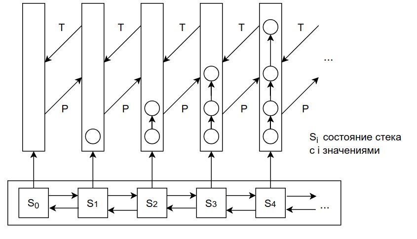

**Может быть эта схема здесь не нужна**

## 2. Реализация списка на языке программирования высокого уровня.

### Подход 1

Для имитации звеньев могут быть использованы два массива один из которых используется для хранения значений, другой- для хранения индексов следующих элементов. В этом случае, звено есть элемент массивов с одинаковым индексом, адрес (имя) звена – индекс массивов.

### Подход 2

С использованием ООП звено может быть представлено в виде объекта. Образ памяти, выделенной для хранения структур данных, в это случае будет представлять массив звеньев-объектов.

```C++
Class TLink
{
 public:
    Int value;  //значение
    Int next;  //индекс следующего звена
 protected:
    TLink();
};
TLinkMem[MemLimit];
```


# Экзаменационный билет №4

## 1. Реализация множества как набора номеров элементов универса. Оценка сложности по памяти. Оценка сложности по времени.

**Множество** – набор элементов

### Операции над множествами

- получение значения бита n
  - проверка наличия элемента (a принадлежит A)
  - при условии, если бит больше -1 и меньше количества битов
  - в противном случае возвращается 0

```C++
int TBitField::GetBit(const int n) const
{
	if ((n > -1) && (n < BitLen))
		return (pMem[(GetMemIndex(n))] & (GetMemMask(n)));
	else return(0);
}
```

- установка бита
  - добавление элемента (A + a)
  - происходит в позицию n том случае, если бит больше -1 и меньше количества битов

```C++
void TBitField::SetBit(const int n)
{	if ((n > -1) && (n < BitLen))
		pMem[(GetMemIndex(n))] |= GetMemMask(n);
}
```

- удаление бита в позиции n
  - удаление элемента A – a
  - при условии, если бит больше -1 и меньше количества битов

```C++
void TBitField::ClrBit(const int n)
{	if ((n > -1) && (n < BitLen))
		pMem[(GetMemIndex(n))] &= ~GetMemMask(n);
}
```

### Теоретико-множественные операции

- объединение A ⋃ B
  - Операция "или" для двух битовых полей, осуществляется с помощью сравнивания двух полей, причем, результирующее будет с длиной наибольшего из них
  - Затем последовательно выполняется дизъюнкция для i-ых элементов двух массивов

```C++
TBitField TBitField::operator|(const TBitField& bf)
{
	int i, len;
	if (BitLen > bf.BitLen)
		len = BitLen;
	else len = bf.BitLen;
	TBitField temp(len);
	for (i = 0; i < MemLen; i++)
		temp.pMem[i] = pMem[i];
	for (i = 0; i < bf.MemLen; i++)
		temp.pMem[i] |= bf.pMem[i];
	return temp;
}
```

- пересечение A ∩ B
  - Операция "и" для двух битовых полей, осуществляется с помощью сравнивания двух полей, результирующее будет с длиной наименьшего из них
  - Затем последовательно выполняется конъюнкция для i-ых элементов двух массивов

```C++
TBitField TBitField::operator&(const TBitField &bf)
{
	int i, len;
	if (BitLen < bf.BitLen)
		len = BitLen;
	else len = bf.BitLen;
	TBitField temp(len);
	for (i = 0; i < MemLen; i++)
		temp.pMem[i] = pMem[i];
	for (i = 0; i < bf.MemLen; i++)
		temp.pMem[i] &= bf.pMem[i];
	return temp;
}
```

- вычитание A \ B
  - Для отрицания последовательно выполняется инверсия для каждого бита массива

```C++
TBitField TBitField::operator~(void)
{
    TBitField temp(BitLen);
    for (int i = 0; i < MemLen; i++)
    	temp.pMem[i] = ~pMem[i];
    return temp;
}
```

**Универс** U – множество всех элементов.

Конкретизация (допущения и ограничения):

- элементы множества проиндексированы (каждому элементу соответствует уникальный индекс)
- множество индексов элементов составляют непрерывный диапазон целых значений
- Тогда любое множество A ⊂ U может быть описано характеристическим вектором <!-- $a=(a_1 a_2 \dots a_n). a_i = 1$ -->
  - если <!-- $a_i \in A$, $a_i$ = 0 --> иначе
- Множество → битовая строка → массив битовых элементов → оперативная память (обратный порядок хранения)
- Нумерация бит в битовой строке – слева направо
- Нумерация элементов в массиве – слева направо, биты элемента – справа налево
- Байты двухбайтового элемента располагаются в ОП в обратном порядке (сначала байт с младшими битами, затем байт со старшими битами)

### Оценка сложности по времени

**Битовое поле** представляет из себя массив int

<!-- TODO:
- Make this topic -->

**Бред, который нужно исправить**:

- все операции с конкретным int это константны
  - там везде битовые операции они грубо говоря все О(1)
- остаётся только найти этот int
- мы там делили нацело, потом брали ещё остаток как смещение и шагали по массиву, а потом по int в этом массиве
- это всё грубо говоря О(1) - очень быстро.

### Оценка сложности по памяти

<!-- TODO:
- Make this topic -->

**Бред, который нужно исправить**:

- делили на 32 (типо int 4 байта 1 байт 8 битов) значит в int 32 бита
- будет [n/32] + 1
  - +1 ,потому что если элементов меньше 32, то деление даст 0
- предположим 5/32 = 0 деление же целочисленное значит для хранения 5 элементов множества нужно 5/32 + 1 = 1
- элемент в массиве это размер чтобы получить индекс мы делали n » 5
  - по факту делили на 32 без остатка, только делая это битовым сдвигом
- битовые операции просто быстрее работают

## 2. Линейный список как динамическая структура. Базисное множество. Неоднозначность операций вставки и удаления.

<!-- TODO:
- Add more info -->

Структура хранения данного типа (звенья, сцепление, барьер, переменная связи) называется линейным или односвязным списком.

Среда выполнения обеспечивает динамически–распределяемую область памяти:

- звено
- выделение звена PTemp = new TDatLink()
- освобождение звена –delete pTemp

**Базисное множество** - структуры

**Неоднозначность операций** в том что можем вставлять как в голову так и в хвост и после текущего и удалять можно тоже по-разному.

Для показа неоднозначности взять простой односвязный линейный список с головой
и двусвязный с хвостом и головой.


# Экзаменационный билет №5

## 1. Представление множества битовой строкой. Оценки сложности по памяти и времени.


## Проектирование

- Нумерация бит в битовой строке - слева направо
- Нумерация элементов в массиве - слева направо
    - биты элементв - слева направо
- Байты двухбайтового элемента располагаются в оперативной памяти в **обратном порядке**
    - сначала байт с младшими битами
    - затем байт со старшими битами
    - поддержка отображения на аппаратном уровне 

#### ВОЗМОЖНО ПО ТЕМЕ

**Множество** – набор элементов

### Операции над множествами

- получение значения бита n
  - проверка наличия элемента (a принадлежит A)
  - при условии, если бит больше -1 и меньше количества битов
  - в противном случае возвращается 0

```C++
int TBitField::GetBit(const int n) const
{
	if ((n > -1) && (n < BitLen))
		return (pMem[(GetMemIndex(n))] & (GetMemMask(n)));
	else return(0);
}
```

- установка бита
  - добавление элемента (A + a)
  - происходит в позицию n том случае, если бит больше -1 и меньше количества битов

```C++
void TBitField::SetBit(const int n)
{	if ((n > -1) && (n < BitLen))
		pMem[(GetMemIndex(n))] |= GetMemMask(n);
}
```

- удаление бита в позиции n
  - удаление элемента A – a
  - при условии, если бит больше -1 и меньше количества битов

```C++
void TBitField::ClrBit(const int n)
{	if ((n > -1) && (n < BitLen))
		pMem[(GetMemIndex(n))] &= ~GetMemMask(n);
}
```

### Теоретико-множественные операции

- объединение A ⋃ B
  - Операция "или" для двух битовых полей, осуществляется с помощью сравнивания двух полей, причем, результирующее будет с длиной наибольшего из них
  - Затем последовательно выполняется дизъюнкция для i-ых элементов двух массивов

```C++
TBitField TBitField::operator|(const TBitField& bf)
{
	int i, len;
	if (BitLen > bf.BitLen)
		len = BitLen;
	else len = bf.BitLen;
	TBitField temp(len);
	for (i = 0; i < MemLen; i++)
		temp.pMem[i] = pMem[i];
	for (i = 0; i < bf.MemLen; i++)
		temp.pMem[i] |= bf.pMem[i];
	return temp;
}
```

- пересечение A ∩ B
  - Операция "и" для двух битовых полей, осуществляется с помощью сравнивания двух полей, результирующее будет с длиной наименьшего из них
  - Затем последовательно выполняется конъюнкция для i-ых элементов двух массивов

```C++
TBitField TBitField::operator&(const TBitField &bf)
{
	int i, len;
	if (BitLen < bf.BitLen)
		len = BitLen;
	else len = bf.BitLen;
	TBitField temp(len);
	for (i = 0; i < MemLen; i++)
		temp.pMem[i] = pMem[i];
	for (i = 0; i < bf.MemLen; i++)
		temp.pMem[i] &= bf.pMem[i];
	return temp;
}
```

- вычитание A \ B
  - Для отрицания последовательно выполняется инверсия для каждого бита массива

```C++
TBitField TBitField::operator~(void)
{
    TBitField temp(BitLen);
    for (int i = 0; i < MemLen; i++)
    	temp.pMem[i] = ~pMem[i];
    return temp;
}
```

**Универс** U – множество всех элементов.

Конкретизация (допущения и ограничения):

- элементы множества проиндексированы (каждому элементу соответствует уникальный индекс)
- множество индексов элементов составляют непрерывный диапазон целых значений
- Тогда любое множество A ⊂ U может быть описано характеристическим вектором <!-- $a=(a_1 a_2 \dots a_n). a_i = 1$ -->
  - если <!-- $a_i \in A$, $a_i$ = 0 --> иначе
- Множество → битовая строка → массив битовых элементов → оперативная память (обратный порядок хранения)
- Нумерация бит в битовой строке – слева направо
- Нумерация элементов в массиве – слева направо, биты элемента – справа налево
- Байты двухбайтового элемента располагаются в ОП в обратном порядке (сначала байт с младшими битами, затем байт со старшими битами)

## 2. Реализация стека с использованием динамически распределяемой памяти.

### Вставка в стек

```C++
    PTDatLink pTemp;
    pTemp = new TDatLink();
    pTemp-> SetDatValue(Val);
    pTemp->SetNextLink(pFirst);
    pFirst = pTemp;
```

### Выборка из стека

```C++
    PTDatLink pTemp = pFirst;
    Val = pFirst->GetDatValue();
    pFirst = pFirst->GetNextLink();
    delete pTemp;
```


# Экзаменационный билет № 6

## 1. Управление памятью путем перепаковки структур хранения на примере реализации N стеков на одном массиве.

**Перепаковка памяти (перепаковка)** - процедура динамического перераспределения памяти путем переписи части хранимых значений в другую область

Перепаковка **обеспечивает эффективное использование** одного ресурса ЭВМ (памяти) за счет другого ресурса (времени).


**Управление памятью** - выполнение функций анализа свободной памяти, планирование размещения структур, переписывание структур

**Система управления памятью** - комплекс программ, реализующих управление памятью

Необходимость перепаковки обуславливается принятым способом реализации отношений следования.

- N – количество стеков
- m – размер памяти


Свойства:

-  - условие неподвижности 1 стека
-  - условие пустоты
-  - условие неперекрытия
-  - условие переполнения
- Для выполнимости последних двух условий для всех стеков введем фиктивный стек N, для которого 
- Будем предполагать, что все стеки используются с одинаковой интенсивностью
  - значит память распределяется всем стекам поровну: 

Выполняется при попытке вставки нового значения в стек s, у которого отсутствует свободная память: 

- F = 0 – свободной памяти нет
- F = 1 – свободен 1 элемент памяти и его следует отдать стеку s
- F > 1 – необходимо перераспределить свободную память.

Для гарантированного выделения свободной памяти стеку s при наличии только одного свободного элемента памяти (случай 2), выполним:

-  – перед началом процедуры оценки свободной памяти
-  – после завершения перепаковки. Снова предположим, что все стеки используются с одинаковой интенсивностью - значит свободная память должна распределиться всем стекам поровну: 
  - 
  - 
  - 
- На равномерности распределения памяти может сказаться целочисленность операции деления


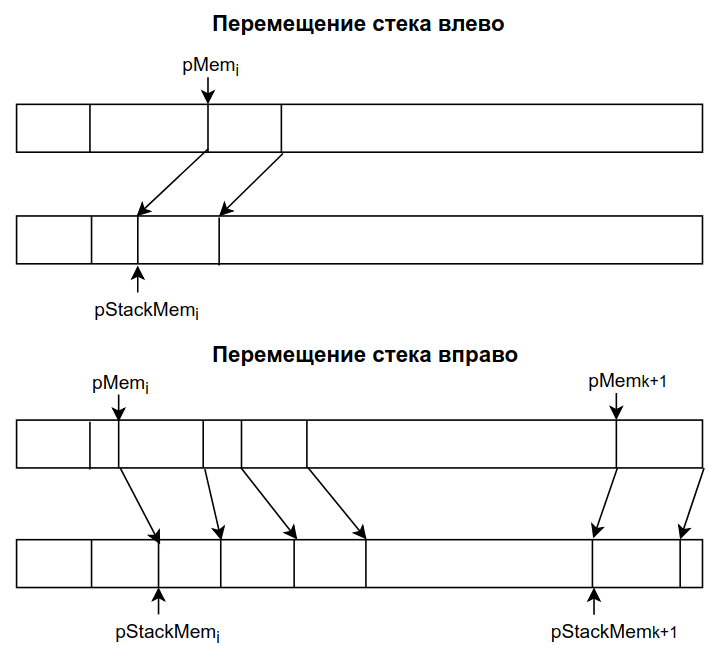

## 2. Структуры хранения для матриц специального вида

### Ленточные матрицы

Для хранения элементов можно выделить непрерывный вектор памяти размера 3*n-2

Адрес 


### Треугольные матрицы


Подход 1:

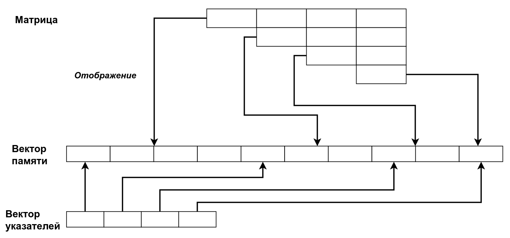

- Матрицы подобного вида можно представить как матрицы общего вида и использовать для хранения двухиндексные массивы. - Используется память  = n2, необходимая память  = n * (n+1) / 2
- Эффективность использования памяти Emem = 0.5

Подход 2:

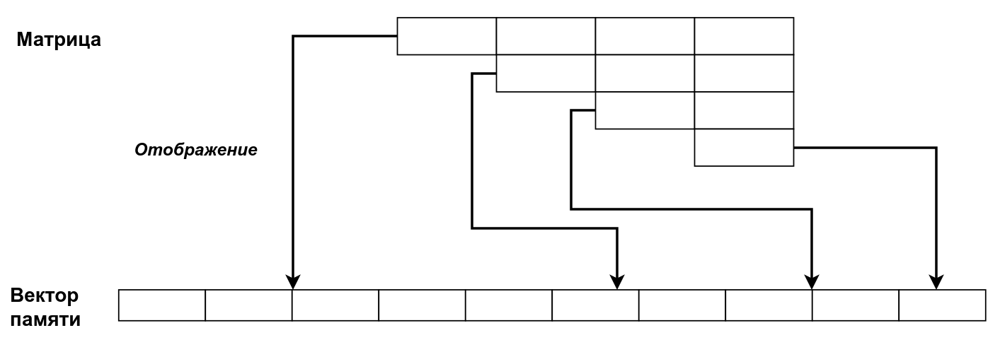

- Исключение хранения элементов ниже главной диагонали (построчная запись в массив)
- Адрес 
- Ускорение доступа – использование вектора указателей на первые элементы каждой строки. Адрес 

Подход 3:


- Представление матрицы в виде набора векторов

Подход 4:

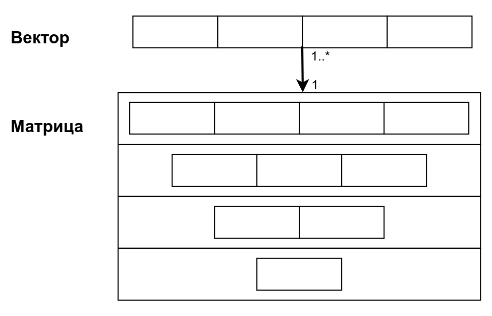

- Матрица как вектор векторных элементов (шаблоны)


# Экзаменационный билет №7

## 1. Матрица как вектор векторов и матрица как вектор указателей. Оценки сложности по памяти и времени.


**Бред, который нужно исправить**

### Оценки сложности по памяти

это же треугольные матрицы, в матрице рамером n \* n n ^ 2 ячееки, нулевые мы не храним

### Оценки сложности по времени

поиск будет О(1)т.к. мы просто индекс считаем грубо говоря,если с матрицами типо A + B,где а и б матрицы, то нам нужно каждый элемент с каждым сложитьсоотв. это будет такой же O как и у памятивычитание аналогично
а как скалярное произведение матриц-сумма попарных произведений?

## 2. Статическое и динамическое распределение памяти.

**Статическое распределение памяти** - распределение памяти до начала процесса вычислений.

**Динамическое распределение памяти** - распределение памяти в ходе выполнения программы.

**Перепаковка памяти (перепаковка)** - процедура динамического перераспределения памяти путем переписи части хранимых значений в другую область памяти.

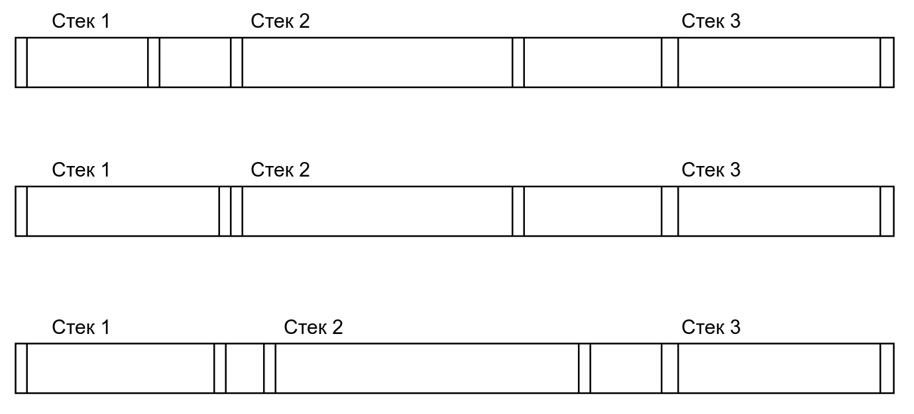


# Экзаменационный билет №8

## 1. Роль гипотез о росте структур при разработке систем управления памятью путем перепаковки на примере работы с N стеками.

### Гипотезы о поведении структур служат основой для принятия решений о распределении памяти.

Формирование гипотез происходит в результате теоретического анализа модели решаемой задачи или может быть выполнено на основе статистических данных, получаемых в ходе вычислительных экспериментов с проектируемой программной системой.

**Гипотеза 1**: Стеки используются с одинаковой интенсивностью, память разделяется между стеками поровну.

**Гипотеза 2**: Интенсивность использования стеков различается.

- Конструктивное предположение о характере такой неравномерности может состоять в гипотезе сохранения локальных тенденций роста стеков
  - в каждый момент времени использование стеков на последующих шагах вычислений характеризуется точно таким же поведением, что и на предшествующих этапах обработки данных.
- Сохранение локальных тенденций роста:

  - показатель роста стека 
  - суммарный показатель роста 
  - правило распределение памяти для стеков в соответствии с их показателями роста 

**Гипотеза 3**: Использование вероятностных предположений о поведении стеков.

- Пусть есть 
- вероятность выполнимости гипотезы сохранения локальных тенденций роста. Тогда 

## 2. Структура хранения множеств.

**Множество** – набор элементов


### Операции над множествами

- получение значения бита n
  - проверка наличия элемента (a принадлежит A)
  - при условии, если бит больше -1 и меньше количества битов
  - в противном случае возвращается 0

```C++
int TBitField::GetBit(const int n) const
{
	if ((n > -1) && (n < BitLen))
		return (pMem[(GetMemIndex(n))] & (GetMemMask(n)));
	else return(0);
}
```

- установка бита
  - добавление элемента (A + a)
  - происходит в позицию n том случае, если бит больше -1 и меньше количества битов

```C++
void TBitField::SetBit(const int n)
{	if ((n > -1) && (n < BitLen))
		pMem[(GetMemIndex(n))] |= GetMemMask(n);
}
```

- удаление бита в позиции n
  - удаление элемента A – a
  - при условии, если бит больше -1 и меньше количества битов

```C++
void TBitField::ClrBit(const int n)
{	if ((n > -1) && (n < BitLen))
		pMem[(GetMemIndex(n))] &= ~GetMemMask(n);
}
```

### Теоретико-множественные операции

- объединение A ⋃ B
  - Операция "или" для двух битовых полей, осуществляется с помощью сравнивания двух полей, причем, результирующее будет с длиной наибольшего из них
  - Затем последовательно выполняется дизъюнкция для i-ых элементов двух массивов

```C++
TBitField TBitField::operator|(const TBitField& bf)
{
	int i, len;
	if (BitLen > bf.BitLen)
		len = BitLen;
	else len = bf.BitLen;
	TBitField temp(len);
	for (i = 0; i < MemLen; i++)
		temp.pMem[i] = pMem[i];
	for (i = 0; i < bf.MemLen; i++)
		temp.pMem[i] |= bf.pMem[i];
	return temp;
}
```

- пересечение A ∩ B
  - Операция "и" для двух битовых полей, осуществляется с помощью сравнивания двух полей, результирующее будет с длиной наименьшего из них
  - Затем последовательно выполняется конъюнкция для i-ых элементов двух массивов

```C++
TBitField TBitField::operator&(const TBitField &bf)
{
	int i, len;
	if (BitLen < bf.BitLen)
		len = BitLen;
	else len = bf.BitLen;
	TBitField temp(len);
	for (i = 0; i < MemLen; i++)
		temp.pMem[i] = pMem[i];
	for (i = 0; i < bf.MemLen; i++)
		temp.pMem[i] &= bf.pMem[i];
	return temp;
}
```

- вычитание A \ B
  - Для отрицания последовательно выполняется инверсия для каждого бита массива

```C++
TBitField TBitField::operator~(void)
{
    TBitField temp(BitLen);
    for (int i = 0; i < MemLen; i++)
    	temp.pMem[i] = ~pMem[i];
    return temp;
}
```

**Универс** U – множество всех элементов.

Конкретизация (допущения и ограничения):

- элементы множества проиндексированы (каждому элементу соответствует уникальный индекс)
- множество индексов элементов составляют непрерывный диапазон целых значений
- Тогда любое множество A ⊂ U может быть описано характеристическим вектором <!-- $a=(a_1 a_2 \dots a_n). a_i = 1$ -->
  - если <!-- $a_i \in A$, $a_i$ = 0 --> иначе
- Множество → битовая строка → массив битовых элементов → оперативная память (обратный порядок хранения)
- Нумерация бит в битовой строке – слева направо
- Нумерация элементов в массиве – слева направо, биты элемента – справа налево
- Байты двухбайтового элемента располагаются в ОП в обратном порядке (сначала байт с младшими битами, затем байт со старшими битами)


# Экзаменационный билет №9

## 1. Управление свободной памятью при использовании сцепления.

### ОБЩАЯ ИНФОРМАЦИЯ О СЦЕПЛЕНИЯХ(НЕ ЯВЛЯЕТСЯ ОТВЕТОМ НА ВОПРОС)

**Сцепление** - способ задания отношения следования, в котором фиксация месторасположения следующего элемента производится путем запоминания соответствующего адреса памяти (пары, хранящие  и , сцеплены адресными указателями)


Сверху - логический порядок звеньев
Снизу - физический порядок звеньев

- Для изображения структуры хранения с использованием сцепления звенья памяти рисуются в виде **прямоугольников**, а сцепление звеньев показывается в виде **стрелок**.
- Индикация последнего звена в списке обычно производится записью в поле адреса некоторого барьера – фиктивного (неадресного) значения (как правило, 0 или -1).
- Для доступа к звеньям списка должен быть известен адрес первого звена списка.
- Указатель, в котором этот адрес запоминается, называется **переменной связи**.
- Структура хранения данного типа (звенья, сцепление, барьер, переменная связи) называется **линейным или односвязным списком**.

## 2. Алгоритм сложения многочленов от N переменных.

Основные алгоритмические моменты метода сложения полиномов operator+ состоят в следующем:

- результат сложения запоминается в объекте первого операнда
- операция сложения сводится к последовательной обработке мономов полиномов-операндов p и q
  - если моном p меньше монома q, то моном q добавляется в полином p и текущая позиция в q сдвигается вправо
  - если моном p старше монома q, то текущая позиция в p сдвигается вправо
  - если моном p равен моному q, то коэффициенты мономов складываются и запоминаются в p
  - далее если результат сложения равен 0, то моном в p удаляется и текущая позиция в q сдвигается вправо
  - если же результат сложения ненулевой, то текущая позиция сдвигается вправо, и в p, и в q.

```C++
TList TList::plus(TList list)
{
    pLink tmp, ptr, temp, prev1, prev2, cnt, n;
    tmp = prev1 = cnt = Head;
    ptr = prev2 = temp = n = list.Head;
    size = this->GetSize();
    int flag = 1;
    while ((tmp->pNext->data != -1) && (ptr->pNext->data != -1))
    {
        if ((ptr->data == -1) && (tmp->data == -1))
        {
            ptr = ptr->pNext;
            tmp = tmp->pNext;
            temp = temp->pNext;
            cnt = cnt->pNext;
        }
        if ((tmp->data > ptr->data) && (flag == 1))
        {
            ptr = ptr->pNext;
            this->insCurrent(temp->data, temp->data2);
            list.deleteCurrent(temp->data);
            temp = ptr;
            flag = 0;
        }
        if ((tmp->data < ptr->data) && (flag == 1))
        {
            ptr = ptr->pNext;
            tmp = tmp->pNext;
            this->insCurrent(temp->data, temp->data2);
            list.deleteCurrent(temp->data);
            temp = ptr;
            flag = 0;
        }
        if ((tmp->data == ptr->data) && (flag == 1))
        {
            this->insCurrent(tmp->data, tmp->data2 + ptr->data2);
            if ((tmp->data2 + ptr->data2) == 0)
            {
                while ((prev1->pNext != tmp) && (n->pNext != ptr))
                {
                    prev1 = prev1->pNext;
                    n = n->pNext;
                }
                tmp = tmp->pNext;
                ptr = ptr->pNext;
                this->deleteCurrent(cnt->data);
                list.deleteCurrent(temp->data);
                cnt = tmp;
                temp = ptr;
            }
            flag = 0;
        }
        flag = 1;
    }
    if ((ptr->data == tmp->data) && (ptr->data != -1)
    && (tmp->data != -1))
    {
        this->insCurrent(ptr->data, tmp->data2 + ptr->data2);
        if ((tmp->data2 + ptr->data2) == 0)
        {
            while ((prev1->pNext != tmp) && (n->pNext != ptr))
            {
                prev1 = prev1->pNext;
                n = n->pNext;
            }
            tmp = tmp->pNext;
            ptr = ptr->pNext;
            this->deleteCurrent(cnt->data);
            list.deleteCurrent(temp->data);
            list.size--;
            cnt = tmp;
            temp = ptr;
        }
    }
    if (ptr->data != tmp->data)
    {
        if (tmp->data == -1)
            while (ptr->pNext != list.Head)
            {
                this->insCurrent(ptr->data, ptr->data2);
                ptr = ptr->pNext;
                list.size--;
            }
    }
    if ((ptr->data != -1) && (tmp->data != -1))
    {
        this->insCurrent(ptr->data, ptr->data2);
        list.deleteCurrent(ptr->data);
    }

    return *this;
}
```


# Экзаменационный билет №10

## 1. Общая характеристика стандартной библиотеки шаблонов.

В стандарте языка С++ предусматривается наличие в среде программирования стандартной библиотеки шаблонов (Standard Template Library, STL).

Основные понятия библиотеки STL.

Библиотека включает в свой состав большое количество контейнеров, представляющих собой структуры данных, в которых могут храниться объекты.

В числе имеющихся контейнеров:

- `vector<T>` - вектор переменного размера
- `list<T>` - двусвязный список
- `queue<T>` - очередь
- `stack<T>` - стек
- `deque<T>` - дек
- `priority_queue<T>` - приоритетная очередь
- `set<T>` - множество
- `multiset<T>` - множество с повторением элементов
- `map<key,val>` - ассоциативный массив (таблица)
- `multimap<key,val>` - ассоциативный массив с повторением ключей

Для быстрого и эффективного построения вычислительных процедур, библиотека обеспечивает итераторы для всех видов контейнеров, которые представляют унифицированный механизм последовательного доступа к элементам контейнеров.

Общая схема:

- `<класс-контейнер>::iterator Iter;` - объявление итератора
- `Iter = <объект-контейнер>.begin();` - установка на первый элемент
- `Iter != <объект-контейнер>.end();` - проверка на завершение
- `++Iter` – переход к следующему элементу

В зависимости от типа контейнера, итератор может обеспечивать прямой доступ, быть одно- или дву- направленным, предназначенным только для чтения или записи и др. Библиотека содержит для контейнеров большое количество реализованных обобщенных алгоритмов.

В числе таких алгоритмов:

- `for_each()` - вызвать функцию для каждого элемента,
- `find()` - найти первое вхождение элемента
- `find_if()` - найти первое соответствие условию
- `count()`- подсчитать число вхождений элемента
- `count_if()` - подсчитать число соответствий условию
- `replace()` - заменить элемент новым значением
- `copy()` - скопировать элементы
- `unique_copy()` - скопировать только различные элементы
- `sort()` - отсортировать элементы
- `merge()` - объединить отсортированные последовательности и др

## 2. Алгоритм обхода иерархического списка (итератор).

Печать текста: схема обхода

- текст текущей строки
- текст подуровня
- текст следующего раздела текста того же уровня (top-down-next).

```C++
while (1)
{
   if ( pLink != NULL )
   {
       cout << pLink->Str; // обработка звена
       St.push(pLink); // запись в стек
       pLink = pLink->pDown; // переход на подуровень
   }
   else if ( St.empty() )
       break;
   else
   {
       pLink = St.top();
       St.pop(); // выборка из стека
       pLink = pLink->pNext; // переход по тому же уровню
   }
}
```

**Ввод текста из файла**: уровень текста в файле можно выделить строками специального вида (например, скобками '{' и '}').

Общая схема алгоритма:

```
повторить:
ввод строки
ЕСЛИ '}' ТО Завершить
ЕСЛИ '{' ТО Выполнить рекурсивно Ввод_текста
Добавить строку на том же уровне
```


# Экзаменационный билет №11

## 1.Представление многочленов от N переменных. Исключение хранения мономов с нулевыми коэффициентами

- Структура хранения полинома, тождественно равного нулю, не содержит звеньев (список вырождается)
- Данная ситуация может отражаться установкой нулевого значения указателю на список, но тогда все программы для полиномов должны включать специальные действия по обнаружению и обработке уникального состояния полинома
  Возможное решение проблемы может состоять во введении дополнительного служебного звена размещаемого в начале списка(**звено-заголовок**)


- **Звено-заголовок** маркируется логически-недопустимым значением индекса монома
- Аналогичным образом можно уйти от проверки нулевого указателя последнего звена, установив в последнем звене в качестве следующего звена первый элемент списка (звено-заголовок)
  - Данная модификация приводит к использованию в качестве структуры хранения циклического списка


- Цикличность списка, кроме того позволит разработать более эффективные программы обработки полиномов
- Структура хранения полинома имеет вид:


## 2. Копирование текста

Для копирования текста необходимо предварительно скопировать разделы текста, на которые указывают указатели `pDown` и `pNext`

Алгоритмы обхода NDT или DNT.

- Для навигации по тексту-копии также необходим стек
- Использование стеков исходного текста и текста-копии должны быть согласованы
- Для навигации по исходному тексту и тексту-копии используется один объединенный стек

Каждое звено текста копируется за два прохода:

- **Первый проход** – при подъеме из подуровня (pDown):
  - создание копии звена
  - заполнение поля `pDown` (подуровень уже скопирован)
  - запись в поле `Str` значения Copy (для распознания звена при попадании на него при втором проходе)
  - запись в поле `pNext` указателя на звено-оригинал (для возможности последующего копирования текста исходной строки)
  - запись указателя на звено-копию в стек
- **Второй проход** – при извлечении звена из стека:
  - заполнение полей `Str` и `pNext`
  - указатель на звено-копию запоминается в переменной cpl


# Экзаменационный билет №12

## 1.Сборка мусора (Повторное использование памяти)

При удалении разделов текста для освобождения звеньев следует учитывать следующие моменты:

- Обход всех звеньев удаляемого текста может потребовать длительного времени
- При множественности ссылок на разделы текста (для устранения дублирования одинаковых частей) удаляемый текст нельзя исключить – этот текст может быть задействован в других фрагментах текста

Память, занимаемая удаляемым текстом, не освобождается, а удаление текста фиксируется установкой указателей в состояние NULL (например, `pFirst=NULL`).

- Подобный способ выполнения операций удаления текста может привести к ситуации, когда в памяти, используемой для хранения текста, могут присутствовать звенья, на которые нет ссылок в тексте и которые не возвращены в систему управления памятью для повторного использования
- Элементы памяти такого вида носят наименование "**мусора**"
- Наличие "мусора" в системе может быть допустимым, если имеющейся свободой памяти достаточно для работы программ
- В случае нехватки памяти необходимо выполнить "**сборку мусора**".

Возможный подход доступа к системе управления памятью – разработка специальной системы управления при помощи перегрузки операторов `new` и `delete`.

### Общая схема подхода

- Для системы управления память выделяется полностью при начале работы программы
- Вся память форматируется и представляется в виде линейного списка свободных звеньев
- Для фиксации состояния памяти в классе `TTextLink` создается статическая переменная `MemHeader` типа `TTextMem`

```C++
class TTextMem{
    PTTextLink pFirst; // первое звено
    PTTextLink pLast; // последнее звено
    PTTextLink pFree; // первое свободное
```

- Для выделения и форматирования памяти определяется статический метод `InitMemSystem` класса `TTextLink`

```C++
void TTextLink::InitMemSystem(int size) // инициализация памяти
{
    char Line[100];
    char *tmp = new char[sizeof(TTextLink)*size];
    MemHeader.pFirst = (PTTextLink)new char[sizeof(TTextLink)*size];
    MemHeader.pFree = MemHeader.pFirst;
    MemHeader.pLast = (PTTextLink)tmp + size - 1;
    PTTextLink pLink = MemHeader.pFirst;
    for (int i = 0; i < size - 1; i++, pLink++) // размер памяти
        pLink->pNext = pLink + 1;
    pLink->pNext = nullptr;
}
```

- При запросе памяти в операторе new выделяется первое свободное звено

```C++
void* TTextLink::operator new(size_t size) // выделение звена
{
    PTTextLink pLink = MemHeader.pFree;
    if (MemHeader.pFree != nullptr)
        MemHeader.pFree = pLink->pNext;
    return pLink;
}
```

- При освобождение звена в операторе `delete` звено включается в список свободных звеньев

```C++
void operator delete (void *pM)
{
    PTTTextLink pLink = (PTTTextLink)pM;
    pLink->pNext = MemHeader.pFree;
    MemHeader.pFree = pLink;
}
```

- Для различения звеньев «мусора» и текста – маркировка текстовых звеньев и звеньев списка свободных звеньев

## 2. Оценка сложности обработки деревьев поиска.


 (при сбалансированном дереве)
 (при вырожденном дереве)


Из последнего выражения следует:


 умножим на  

 подставим (3) в (1)


Отсюда можно получить (проверяется подстановкой):


 (формула Эйлера, )


Пусть  есть средняя длина пути для идеально сбалансированного дерева


# Экзаменационный билет №13

## 1.Представление текста связным списком

Текст – линейная последовательность символов


Текст – линейная последовательность слов (слово - линейная последовательность символов)


Текст – линейная последовательность строк, строки состоят из слов, слова – из символов и т.д.

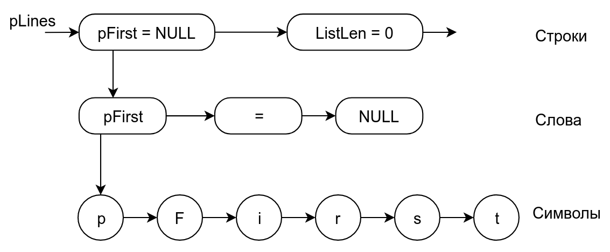

Математическая модель текста – иерархическая структура представления (дерево).


- На всех уровнях представления (кроме символов) значение задается указателем на соответствующую структуру ниже расположенного уровня
- Разработанная структура хранения называется **связным (иерархическим) списком**
- Абстрактная структура типа дерева представима в виде **связного списка**
- В списке существуют делимые и неделимые (атомарные, терминальные) элементы
- Визуальное представление текста содержит только атомарные элементы, структура хранения должна включать все элементы - Разные типы звеньев – трудности при управлении памятью, дублирование программ обработки

Единый тип звена:

```C++
typedef Tlink *PTLink;
class TLink
{
    PTLink pNext;
    int Atom; // =1 – звено-атом
    union {PTLink pDown; char Symb;}
```

## 2. Таблицы с вычислимым входом

**Таблица с вычисляемым входом (хеш-таблица)** – это таблица, элементы которой располагаются в соответствии с некоторой функцией расстановки (**хеш-функцией**)

Функция расстановки f (ключ) вычисляет для каждого элемента таблицы по его ключу номер (позицию) элемента в массиве.

- Диапазон значений функции f (ключ) – `0…N–1` или `1…N`
- Хеш-таблица должна быть инициализирована, т. е. элементы таблицы вначале должны получить значение “пусто”, что позволяет определить, есть в данной позиции элемент или нет
- При поиске данных в таблицах во многих случаях можно предварительно оценить место расположения искомых записей
- Пусть для ключей записей имеется правило преобразования к значениям целого типа. Используем получаемые значения для определения места расположения записей

### Пример

- Пусть ключ есть строка не более чем из 6 символов
- Каждый символ может быть преобразован в целое число (код символа)
- Тогда и ключ может рассматриваться как значение целого типа 
- Всего разных имен может быть , тогда положив размер памяти для таблицы , возможно организовать **прямой доступ** к записм

Организация прямого доступа в рассмотренном виде приводит к неэффективному использованию памяти
- требуется больше памяти (М >> 1)
- количество используемых ключей, как правило, существенно меньше теоретически возможного набора

Размер памяти для представления таблицы значительно меньше возможного количества имен (M << N), и, как результат, получаемые по ключам числовые значения необходимо преобразовывать к диапазону номеров (адресов) строк памяти

**Функция** (хеширования, перемешивания, рассеивания) **расстановки** (hash - мешанина, путаница) - функция преобразования значения ключа к номеру (адресу) строки памяти для хранения записи H : K -> L (L = (0, ..., M - 1))

**Таблицы с вычислимыми адресами (хеш-таблицы, перемешиваемые таблицы)** - таблицы, представление которых организуется при использовании функции расстановки

**Метод цепочек**

Замечания к открытому перемешиванию как способу размешения коллизий:

- Размер памяти для таблиц фиксирован
- Хранение записей без упорядоченности по ключам.

Широко используемый подход для разрешения коллизий - **метод цепочек**, когда все записи, для которых функция хеширования определяет одно и тоже значение,представляются в виде линейного списка.

Открытое перемешивание еще называют **закрытым хэшированием**, метод цепочек - **открытое хэширование**.


# Экзаменационный билет №14

## 1.Алгоритм обхода иерархического списка (итератор)

Печать текста: схема обхода

- текст текущей строки
- текст подуровня
- текст следующего раздела текста того же уровня (top-down-next).

```C++
while (1)
{
   if (pLink != NULL)
   {
       cout << pLink->Str; // обработка звена
       St.push(pLink); // запись в стек
       pLink = pLink->pDown; // переход на подуровень
   }
   else if (St.empty())
       break;
   else
   {
       pLink = St.top();
       St.pop(); // выборка из стека
       pLink = pLink->pNext; // переход по тому же уровню
   }
}
```

**Ввод текста из файла**: уровень текста в файле можно выделить строками специального вида (например, скобками '{' и '}')

Общая схема алгоритма:

```
повторить:
ввод строки
ЕСЛИ '}' ТО Завершить
ЕСЛИ '{' ТО Выполнить рекурсивно Ввод_текста
Добавить строку на том же уровне
```

Реализация итератор:

- схема обхода TDN нерекурсивный вариант
- корневые звенья необработанных разделов текста запоминаются в стеке
- текущая строка в стеке не хранится(кроме звена всего текста)

```C++
int TText::Reset(void) // Установка на корневое звено текста
{
   pCurrent = pFirst;
   if (pCurrent != nullptr)
   {
       St.push(pCurrent);
       if (pCurrent->pNext != nullptr)
           St.push(pCurrent->pNext);
       if (pCurrent->pDown != nullptr)
           St.push(pCurrent->pDown);
   }
}

bool TText::IsTextEnded(void) const // Стек пуст?
{
   return St.empty();
}

bool TText::GoNext(void) // Переход к следующему звену текста
{
   if (!IsTextEnded())
   {
       pCurrent = St.top();
       St.pop();
       if (pCurrent != pFirst)
       {
           if (pCurrent->pNext != nullptr)
               St.push(pCurrent->pNext);
           if (pCurrent->pDown != nullptr)
               St.push(pCurrent->pDown);
       }

   }
   return IsTextEnded();
}
```

## 2. Пример использования стеков: преобразование арифметических выражений в польскую форму записи

Формат записи выражения:

- Выражение синтаксически правильно (без ошибок)
- Допускаются только однобуквенные идентификаторы для операндов
- В записи выражения нет пробелов
- Выражение заканчивается знаком `'='`: `A+(B-C)*D-F/(G+H)=`

Алгоритм:

1.  Для операций вводится приоритет:`'*' '/' (3), '+' '-' (2), '(' (1), '=' (0)`
2.  Для хранения данных используется 2 стека (1 – для результата, 2 – для операций)
3.  Исходное выражение просматривается слева направо
4.  Операнды по мере их появления помещаются в стек 1
5.  Символы операций и левые скобки помещаются в стек 2
6.  При появлении правой скобки последовательно изымаются элементы из стека 2 и переносятся в стек 1. Данные действия продолжаются либо до опустошения стека 2 либо до попадания в стеке 2 на левую скобку
7.  Если текущая операция, выделенная при обходе выражения, имеет меньший (более низкий) приоритет, чем операция на вершине стека 2, то такие операции из стека 2 переписываются в стек 1

Пусть выражение имеет вид: A + (B - C) * D - F / (G + H)=

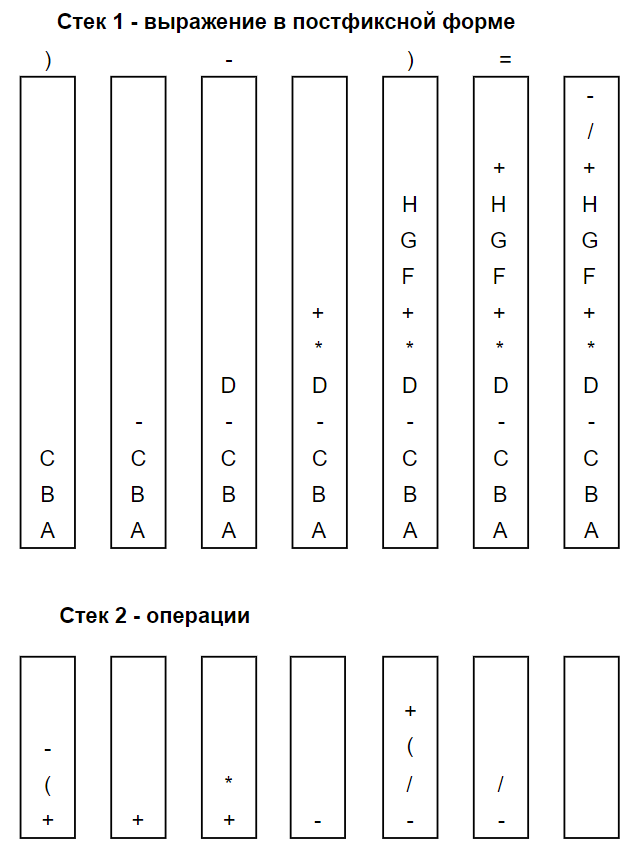


# Экзаменационный билет №15

## 1.Изменение структуры текста (вставка и удаление строк)

```C++
void TText::DelDownLine(void) // Удаление строки в подуровне
{
   if (pCurrent == nullptr)
       SetRetCode(TextErr);
   else if (pCurrent->pDown == nullptr)
       SetRetCode(TextNoDown);
   else if (pCurrent->pDown->IsAtom())
       pCurrent->pDown = pCurrent->pDown->pNext;
}

void TText::InsDownLine(string str) // Вставка строки в подуровень
{
   if (pCurrent == nullptr)
       SetRetCode(TextErr);
   else
   {
       TStr buf; // typedef char TStr[TextLineLength];
       strcpy(buf, str.c_str());
       pCurrent->pDown = new TTextLink(buf, pCurrent->pDown, nullptr);
   }
}
```

## 2. Деревья поиска. Алгоритм удаления


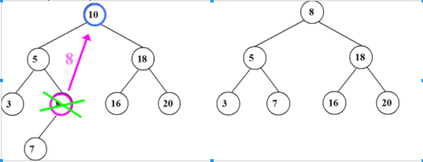


```C++
void TTreeTable :: DelRecord ( TKey k ) { // удалить запись
  if ( FindRecord(k) == NULL ) 
    SetRetCode(TabNoRec); // SKIP_ON
  else {
    SetRetCode(TabOK);
    PTTreeNode pNode = *ppRef;
    if ( pNode->pRight == NULL )
        *ppRef = pNode->pLeft; // один потомок слева
    else if ( pNode->pLeft == NULL )
        *ppRef = pNode->pRight; // один потомок справа
    else { // два потомка - поиск крайнего справа у левого поддерева
      PTTreeNode pN = pNode->pLeft, *ppR = &pNode->pLeft;
      while ( pN->pRight != NULL ) {
        ppR = &pN->pRight; pN  = *ppR;
      } // вместо удаления pNode удается pN
      pNode->pValue = pN->pValue;   // значение в pNode
      pNode->Key    = pN->Key;
      pNode = pN; *ppR = pN->pLeft; // обход удаляемого pN
    }
    delete pNode;
  }// SKIP_OFF
}
```


# Экзаменационный билет №16

## 1.Адаптивная оценка параметров модели в ходе выполнения программ (на примере системы управления несколькими стеками)

- Пусть  есть число перепаковок памяти за некоторый отрезок времени 
- Величина  зависит от  и для повышения эффективности функционирования системы следует определить такое , чтобы число перепаковок было минимально, т.е. 

<!--  -->

Схема определения оптимального значения :
- Выполняется оценка величины  на последовательных друг за другом отрезках времени 


- Определяется величина изменения числа выполненных перепаковок: 
- Применяется следующее правило корректировки значения 


где  - параметр схемы адаптации

## 2. Оценка сложности обработки деревьев поиска. Понятие сбалансированных и идеально сбалансированных деревьев поиска

**Идеально сбалансированное дерево** - дерево, у которого для каждого его узла количество узлов в левом и правом поддеревьях различаются не более чем на 1.

**Сбалансированное дерево** - дереао, у которого для каждого узла высота левого и правого поддеревьев различаются не более,чем на 1(АВЛ-деревья).

Идеально сбалансированные деревья являются сбалансированными.
Операции обработки сбалансированных деревьев имеют **сложность** log2N.(поиск, вставка, удаление)


 (при сбалансированном дереве)
 (при вырожденном дереве)

- Пусть даны N различных ключей со значениями 1,...N и появление любого ключа равновероятно.
- Пусть первый ключ равен i. Левое поддерево будет содержать (i - 1) узлов, правое поддерево - (n - i) узлов.
 - средняя длина пути дерева с N узлами,
где  - средняя длина пути в дереве, в котором корень равен i.


Из последнего выражения следует:


 умножим на  

 подставим (3) в (1)


Отсюда можно получить (проверяется подстановкой):


 (формула Эйлера, )


Пусть  есть средняя длина пути для идеально сбалансированного дерева


# Экзаменационный билет №17

## 1.Организация доступа по имени.

Структура памяти

- Для чтения или записи значения необходимо указать адрес элемента памяти, для человека более привычный способ указания данных - имя.

Структура данных

- Понятие таблицы...
- Пусть `К` - множество имен
- `А` - множество адресов
- тогда отношение “иметь имя” есть функция `f:К->А`

**Возможные задания `f`:возможный способ-табличное задание функции:**

1.  Таблица-последовательность строк(записей)
2.  Запись может состоять из нескольких полей
3.  Одно из полей должно задавать имя записи(ключ),остальные поля образуют тело записи.

**Операции под таблицей:**

- поиск записей по ключу
- вставка новой записи
- удаление записи

**Таблица** - динамическая структура данных.

**Базисное множество** - семейство линейных структур из записей, **базисное отношение** включения определяется операциями вставки и удаления записей.

**Варианты расширения понятия таблицы:**

- наличие нескольких ключей
- доступ по телу записей
- сложные запросы для поиска
- дополнительные операции

Принцип реализации таблиц:

- операции над таблицей не определяются(не предполагают) тот или иной порядок размещения записей в памяти ЭВМ.
- реализация таблицы должна способствовать быстрому выполнению операций(в основном доступа).....свобода в размещении записей позволяет разработать несколько способов организации таблиц.

Введение различных способов предполагает явное или неявное существование разных типов ситуаций при использовании таблиц.

Просматриваемые таблицы.

Таблица последовательности строк(записей)

**По организации способа доступа таблицы делятся на следующие категории:**

- просматриваемые таблицы
- упорядоченные таблицы
- таблицы прямого доступа
- перемешанные(хэш) таблицы

В просматриваемой таблице порядок расположения элементов никак не связан со значениями ключей (рис. II-34). Поэтому поиск элемента по ключу осуществляется обычным просмотром всех элементов таблицы, начиная с первого и до искомого

- если он есть в таблице
  - тогда поиск заканчивается успешно
- или до конца таблицы
  - тогда поиск заканчивается неуспешно

| Ключ | Информация |
| ---- | :--------: |
| 08   |    ...     |
| 33   |    ...     |
| 47   |    ...     |
| 25   |    ...     |
| 18   |    ...     |

`рис. II-34`

- При отображении просматриваемой таблицы списком не играет роли, какую – статическую или динамическую – таблицу использовать
- структура элемента таблицы (списка) будет одинакова
- При включении в таблицу новый элемент может быть размещен в любом месте таблицы (списка)
- Если некоторый элемент удаляется из списка, действия, выполняемые при этом, могут быть разными в зависимости от того, какой элемент удаляется (рис. II–38).


- Если удаляется первый элемент списка, в этом случае должен быть модифицирован указатель на начало списка (таблицы). - Если же удаляется некоторый элемент из середины списка, тогда модифицируется поле указателя предыдущего элемента (рис. II–38).

**Таким образом, при удалении элемента надо:**

- иметь доступ к предшествующему элементу списка
- различать вид предшествующего элемента.

Поскольку операция поиска возвращает искомый элемент и не сообщает о месте его размещения в списке, при реализации операции удаления элемента из списка приходится либо

- (a) повторять поиск элемента
- либо (b) следует несколько изменить реализацию операции поиска.
  - Способ (b) удобно реализуется средствами языка С/С++

Алгоритм удаления элемента из просматриваемой таблицы-списка по варианту a) приведен на рис. II–39.

- В приведенном алгоритме отдельно рассматриваются удаление первого и промежуточного элементов таблицы, поскольку это приводит к необходимости модифицировать разные структуры
  - указатель на начало таблицы при удалении первого элемента и поле указателя в элементе списка при удалении промежуточного элемента
- В результате в блоке C2 сравниваются ключи первого элемента таблицы и удаляемого элемента и, при их совпадении, в блоке D2 переопределяется указатель на начало таблицы.


- Если удаляется не первый элемент, осуществляется в цикле (блоки C3, D3, E3) поиск удаляемого элемента
- При этом используются два указателя – на текущий (cur) и на предыдущий (prev) элементы таблицы
- При совпадении ключей переопределяется поле ссылки в предыдущем элементе (на который указываетprev), в результате чего элемент удаляется из таблицы-списка.

Ниже приводится текст программы, соответствующий приведенному алгоритму.

```C++
struct Item
{
    int key;
    Type info;
    Item *next;
};
Item *ptab; /*указатель на начало таблицы */
int del1(int k)
{
    Item *cur, *prev;
    cur = ptab;
/*проверяем, есть ли в таблице элементы */
    if(!cur)
        return -1; /*таблица пуста – отказ */
/*возможно, требуется удалить первый элемент таблицы */
    if(cur->key == k)
    {
    /* удаляем первый элемент */
        ptab = cur->next;
        delInfo(cur->info);
        delete cur;
        return 0;
    }
/* ищем удаляемый элемент среди других элементов таблицы */
    while(cur->next)
    {
    /* есть другие элементы */
        prev = cur;
        cur = cur->next;
        if(cur->key == k)
        {
        /* нашли элемент, который надо удалить */
            prev->next = cur->next;
            delInfo(cur->info);
            delete cur;
            return 0;
        }
    }
/* естественный выход из цикла – в таблице нет элемента с ключом k */
    return -1;
}
```

## 2. Роль гипотез о росте структур при разработке систем управления памятью путем перепаковки.

Дерево является идеально сбалансированным если для каждого его узла количество узлов в левом и правом поддеревьях различаются не более чем на 1.
Дерево является сбалансированным,если для каждого узла высота левого и правого поддеревьев различаются не более,чем на 1(АВЛ-деревья).
Идеально сбалансированные деревья являются сбалансированными.Операции обработки сбалансированных деревьев имеют сложность log2N.(поиск,вставка,удаление)
Тmin=1
Tmax=log2N(при сбалансированном дереве)
Tmax=N(при вырожденном дереве)


# Экзаменационный билет №18

## 1.Организация доступа по имени

Структура памяти

- Для чтения или записи значения необходимо указать адрес элемента памяти, для человека более привычный способ указания данных - имя.

Структура данных

- Понятие таблицы
- Пусть `К` - множество имен
- `А` - множество адресов
- Отношение “иметь имя” есть функция `f:К->А`

**Возможные задания `f`(возможный способ - табличное задание функции):**

1. Таблица-последовательность строк(записей)
2. Запись может состоять из нескольких полей
3. Одно из полей должно задавать имя записи(ключ),остальные поля образуют тело записи.

**Операции под таблицей:**

- поиск записей по ключу
- вставка новой записи
- удаление записи

**Таблица** - динамическая структура данных.

**Базисное множество** - семейство линейных структур из записей, **базисное отношение** включения определяется операциями вставки и удаления записей.

**Варианты расширения понятия таблицы:**

- наличие нескольких ключей
- доступ по телу записей
- сложные запросы для поиска
- дополнительные операции

**Принцип реализации таблиц:**

- операции над таблицей не определяются(не предполагают) тот или иной порядок размещения записей в памяти ЭВМ
- реализация таблицы должна способствовать быстрому выполнению операций(в основном доступа)
    - свобода в размещении записей позволяет разработать несколько способов организации таблиц

Введение различных способов предполагает явное или неявное существование разных типов ситуаций при использовании таблиц.

**По организации способа доступа таблицы делятся на следующие категории:**

- просматриваемые таблицы
- упорядоченные таблицы
- таблицы прямого доступа
- перемешанные(хэш) таблицы

### Просматриваемые таблицы

Порядок расположения элементов никак не связан со значениями ключей. Поэтому **поиск** элемента по ключу **осуществляется обычным просмотром всех элементов** таблицы, начиная с первого и до искомого

- если он есть в таблице
  - тогда поиск заканчивается успешно
- или до конца таблицы
  - тогда поиск заканчивается неуспешно

| Ключ | Информация |
| ---- | :--------: |
| 08   | ...        |
| 33   | ...        |
| 47   | ...        |
| 25   | ...        |
| 18   | ...        |

- При отображении просматриваемой таблицы списком не играет роли, какую – статическую или динамическую – таблицу использовать
- Структура элемента таблицы (списка) будет одинакова
- При включении в таблицу новый элемент может быть размещен в любом месте таблицы (списка)
- Если некоторый элемент удаляется из списка, действия, выполняемые при этом, могут быть разными в зависимости от того, какой элемент удаляется


- Если удаляется первый элемент списка, в этом случае должен быть модифицирован указатель на начало списка (таблицы)
- Если же удаляется некоторый элемент из середины списка, тогда модифицируется поле указателя предыдущего элемента

**Таким образом, при удалении элемента надо:**

- иметь доступ к предшествующему элементу списка
- различать вид предшествующего элемента.

Поскольку операция поиска возвращает искомый элемент и не сообщает о месте его размещения в списке, при реализации операции удаления элемента из списка приходится либо

- (a) повторять поиск элемента
- либо (b) следует несколько изменить реализацию операции поиска.
  - Способ (b) удобно реализуется средствами языка С/С++

Алгоритм удаления элемента из просматриваемой таблицы-списка по варианту a) приведен на рисунке.

- В приведенном алгоритме отдельно рассматриваются удаление первого и промежуточного элементов таблицы, поскольку это приводит к необходимости модифицировать разные структуры
  - указатель на начало таблицы при удалении первого элемента и поле указателя в элементе списка при удалении промежуточного элемента
- В результате в блоке C2 сравниваются ключи первого элемента таблицы и удаляемого элемента и, при их совпадении, в блоке D2 переопределяется указатель на начало таблицы.


- Если удаляется не первый элемент, осуществляется в цикле (блоки C3, D3, E3) поиск удаляемого элемента
- При этом используются два указателя – на текущий (cur) и на предыдущий (prev) элементы таблицы
- При совпадении ключей переопределяется поле ссылки в предыдущем элементе (на который указывает prev), в результате чего элемент удаляется из таблицы-списка

**Текст программы, соответствующий приведенному алгоритму**

```C++
struct Item
{
    int key;
    Type info;
    Item *next;
};
Item *ptab; /*указатель на начало таблицы */
int del1(int k)
{
    Item *cur, *prev;
    cur = ptab;
/*проверяем, есть ли в таблице элементы */
    if(!cur)
        return -1; /*таблица пуста – отказ */
/*возможно, требуется удалить первый элемент таблицы */
    if(cur->key == k)
    {
    /* удаляем первый элемент */
        ptab = cur->next;
        delInfo(cur->info);
        delete cur;
        return 0;
    }
/* ищем удаляемый элемент среди других элементов таблицы */
    while(cur->next)
    {
    /* есть другие элементы */
        prev = cur;
        cur = cur->next;
        if(cur->key == k)
        {
        /* нашли элемент, который надо удалить */
            prev->next = cur->next;
            delInfo(cur->info);
            delete cur;
            return 0;
        }
    }
/* естественный выход из цикла – в таблице нет элемента с ключом k */
    return -1;
}
```

## 2. Роль гипотез о росте структур при разработке систем управления памятью путем перепаковки

Формирование гипотез происходит в результате теоретического анализа модели решаемой задачи или может быть выполнено на основе статистических данных, получаемых в ходе вычислительных экспериментов с проектируемой программной системой.

**Гипотеза 1**: Стеки используются с одинаковой интенсивностью, память разделяется между стеками поровну.

**Гипотеза 2**: Интенсивность использования стеков различается.

- Конструктивное предположение о характере такой неравномерности может состоять в гипотезе сохранения локальных тенденций роста стеков
  - в каждый момент времени использование стеков на последующих шагах вычислений характеризуется точно таким же поведением, что и на предшествующих этапах обработки данных.
- Сохранение локальных тенденций роста:

  - показатель роста стека 
  - суммарный показатель роста 
  - правило распределение памяти для стеков в соответствии с их показателями роста 

**Гипотеза 3**: Использование вероятностных предположений о поведении стеков.

- Пусть есть 
- вероятность выполнимости гипотезы сохранения локальных тенденций роста. Тогда 


# Экзаменационный билет №19

## 1.Упорядоченные таблицы. Алгоритм быстрой сортировки.

**Сортированные (упорядоченные) таблицы** - таблицы, в которых записи располагаются в порядке возрастания (или убывания) ключей

Упорядоченность таблиц может быть организована только при возможности сравнения ключей (на множестве ключей задано отношение линейного порядка).

**Сортировка** - действия, связанные с размещением записей в порядке возрастания (или убывания) ключей

**Алгоритм сортировки** называют **устойчивым**, если он никогда не меняет относительный порядок в таблице двух записей с равными ключами

**Внутренняя сортировка** - Упорядочивание данных, при котором все значения располагаются в ОП

**Сортировка включением** 

Идея похода – вставка нового значения в упорядоченный набор данных.

**Алгоритм быстрой сортировки.**

Идея подхода (Hoare C.A.R.)– использование процедуры разделения упорядочиваемого набора на две части, в одной из которых располагаются значения, меньшие некоторого порогового (ведущего) элемента массива, в другой – соответственно большие значения. Подобный способ разделения может быть выполнен без привлечения дополнительной памяти.

```C++
// Разделение массива с использованием ведущего элемента
key = k[0]; // ведущий элемент
i1 = i2 = N - 1; // индексы левого (i1) и правого (i2) блоков
// цикл, пока разделяемые блоки не пересекутся
while (i1 <= i2) {
    // пока k[i1] не превышает ведущего элемента, переход вправо
    while ((i1 < N) && (k[i1] <= key))
        i1++;
    // пока k[i2] меньше ведущего элемента, переход влево
    while (k[i2] > key)
        i2--;
    //перестановка значений, которые приостановили разделение массива
    if (i1 < i2) {
        kt = k[i1];
        k[i1] = k[i2];
        k[i2] = kt;
    }
}
// установка ведущего элемента между блоками
k[0] = k[i2];
k[i2] = key;
i1 = i2; // индекс ведущего элемента
```

При наличии процедуры разделения алгоритм сортировки может быть определен рекурсивно – необходимо разбить упорядочиваемый набор на два блока с меньшими и большими значениями соответственно и затем последовательно отсортировать полученные блоки.

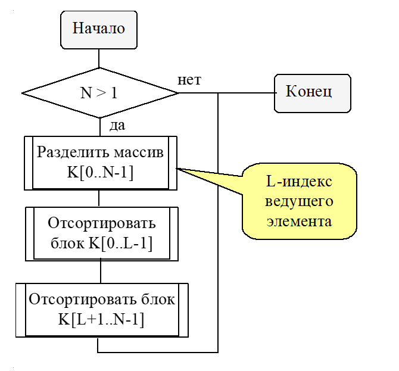

**Оценка сложности:**


Вероятность выбора любого ключа в качестве ведущего элемента является одинаковой:


Докажем по индукции, что


Оценка сложности: 

## 2. Реализация структуры хранения нескольких стеков с использованием списков на языке высокого уровня

Звено списка представляются в виде объекта класса TLink

```C++
class TLink {
  public:
    int Value; 
    int Next;
  protected:
    TLink();
};
```

Образ памяти, выделенной для хранения стека, определяется в виде массива звеньев-объектов

```C++
TLink Mem[MemLimit];
```

Все свободные звенья объединяются в один список свободных звеньев. Звенья этого списка используются при необходимости свободной памяти, в этот список звенья должны возвращаться после освобождения.


Структура хранения стека - линейный список (начало списка - вершина стека)


Схемы работы со стеком и со списком свободных звеньев совпадают. Список свободных звеньев есть стек.


# Экзаменационный билет №20

## 1.Деревья поиска как способ организации таблицы. Алгоритмы обхода.

**Дерево** - связный граф без циклов

Структура типа дерева (древовидная структура) с базовым типом T

- это либо пустая структура,
- либо узел (вершина) со значением типа T, с которым связано конечное число древовидных структур (поддеревьев) с базовым типом T.

### Способы представления дерева

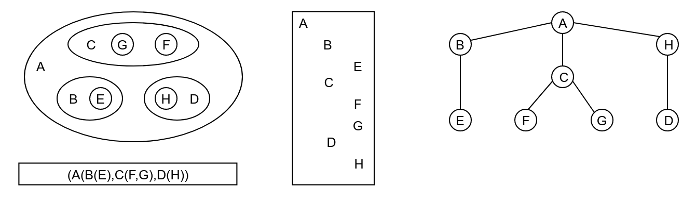

**(Непосредственный) Потомок** - узел у, находящийся непосредственно под узлом х (т.е. есть ребро (х, у)). Узел х - **(непосредственный) предок** узла у

**Корень** - узел, не имеющий предков

**Длина пути** - число ветвей(ребер), которые необходимо пройти, чтобы продвинуться от корня к заданному узлу 

Узлы с одинаковой длиной пути образуют **уровень(ярус) дерева**
* Корень расположен на уровне 1, его потомки на уровне 2 и т.д.
    * Принято изображать узлы дерева одного и того же уровня на одной горизонтальной прямой

**Глубина** - максимальный уровень дерева

**Степень узла** - число непосредственных потомков узла

**Степепь дерева** - максимальная степень всех узлов

**Упорядоченное дерево** - дерево, у которого ветви каждого узла упорядочены

<!-- TODO: Add picture here -->

**Бинарное дерево** - упорядоченное дерево степени 2

**Дерево поиска** - дерево, удовлетворяющее условию:
* Если для любой вершины бинарного дерева значения в левом потомке меньше значения узла, а значение в правом потомке больше значени узла


**Дерево поиска** - дерево, в котором для любой вершины бинарного дерева значения в левом потомке меньше значения узла, а значение в правом потомке больше значения узла

**Обработка дерева** – выполнение необходимой операции для каждой узла дерева. Реализация подобного типа действий предполагает умение обхода (обхода) дерева

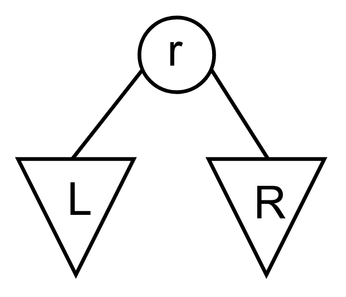

### Представление дерева в общем виде

<!-- TODO: Add picture here -->

* T - top (корень)
* L - left (левое поддерево)
* R - right (правое поддерево)

Возможные варианты обхода:
* TLR - сверху вниз
* LTR - слева направо
* LRT - снизу вверх
* TRL - сверху вниз
* RTL - справа налево
* RLT - снизу вверх


### Печать значений дерева поиска (схема LTR, рекурсия)
```C++
void TTreeTable::PrintTreeTab(ostream &os, pTTreeNode pNode)
{
    // Печать дерева с вершиной pNode
    if (pNode != NULL)
    {
        PrintTreeTab(os, pNode->pLeft);
        pNode->Print(os);
        os << endl;
        PrintTreeTab(os, pNode->pRight);
    }
}
```

## 2. Сравнение непрерывной и списковой структур хранения.

| Непрерывная память                                 |                                            Списки                                            |
| -------------------------------------------------- | :------------------------------------------------------------------------------------------: |
| Перепаковка для динамического распределения памяти | Динамическое распределение памяти эффективно реализуется при помощи списка свободных звеньев |
| В структуре хранения хранятся только данные        |                       В структуре хранения хранятся данные и указатели                       |
| К элементам структуры данных обеспечивается        |                         К элементам структуры данных обеспечивается                          |
| Прямой доступ                                      |                                   Последовательный доступ                                    |


# Экзаменационный билет №21

## 1.Плексы как представление рисунков, состоящих из точек и соединяющих их отрезков

В качестве базовых объектов рассматриваются основные геометрические фигуры – точку, окружность, прямоугольник и т.д.

**Информационное описание объектов** – параметры фигуры (координаты, размер, радиус и др.). В общем случае, описание фигуры включает значение координат некоторой опорной точки.

**Операции обработки** геометрических объектов включают методы для задания и изменения параметров; расширим набор операций процедурами визуализации и скрытия фигур.

Схема иерархии классов для реализации геометрических объектов:


Для обеспечения возможности динамической визуализации геометрических объектов введем тип данных, значения которого вычисляются в соответствии с задаваемым формульным выражением.

**Составной объект** – набор геометрических объектов (как базовых, так и составных), рассматриваемых при выполнении операций обработки как единый объект.

**Геометрический объект** может быть сконструирован с использованием уже существующих объектов (например, ломаная может быть определена через набор конечных точек составляющих отрезков).

**Геометрический объект** может быть образован при помощи сборки существующих объектов – рассмотрим данный способ построения новых объектов на примере рисунков (чертежей), образованных только из объектов двух базовых типов: точек и линий


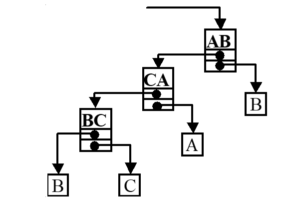

- Узел структуры хранения представляет линию чертежа.
- Указатель на начальную точку линии может также указывать на линию, т.е. конечная точка предыдущей линии является начальной точкой следующей линии.
- **Плекс** - структура хранения данного вида (содержит элементы разного типа).
    - Является общей структурой хранения сетевых моделей данных.
- Повторяющая точка на чертеже должна быть представлена одним и тем же объектом (не следует допускать множественности представления одного и того же значения).
- Разработанная структура хранения позволяет обеспечить представление чертежей, которые можно нарисовать без отрыва карандаша от бумаги.


## 2. Сравнение непрерывной и списковой структур хранения

<!--  -->

- Для хранения элементов базисного множества выделяется вектор памяти размера, достаточного для хранения максимально возможного количества значения в стеке.
- Хранение значений в памяти осуществляется последовательно от младшего элемента вектора к старшему.
- Для запоминания количества хранимых в стеке значений используется индекс последнего занятого элемента в векторе.


Операции:

- IsEmpty - проверка на пустоту
- IsFull - проверка на полноту
- Put - добавление значения
- Get - извлечение значения

<!--  -->

Класс TStack обеспечивает реалзацию динаммической структуры стек.

**Управление памятью** - хранение значений осуществляется в векторе пямяти от младших элементов к старшим. Индекс последнего занятого элемента в векторе пямяти фиксируется в переменной .

Методы:

- GetNextIndex - метод для получения следующего значения индекса (скрытие способа реализации отношения следования)
- Put - операция вставки нового значения в структуру
- Get - операция выборки очередного значения из структуры

<!--  -->

```C++
#define MemSize 25 // размер памяти для стека
class TStack
{
 protected:
    int Mem[MemSize]; // память для СД
    int Top; // индекс последней занятой ячейки
 public:
    TStack () { Top = -1; }
    int IsEmpty (void) const { Top == -1; }
    int IsFull (void) const { Top == MemSize-1;}
    void Put ( const int Val ) { Mem[++Top] = val; }
    TData Get (void) { return Mem[Top--]; }
};
```

### Очередь

Очередь (вставка в конец очереди, исключение из начала - FIFO - first in, first out)

Вставка значений происходит в начало очереди, исключение - с конца очереди => для индикации начала и конца очереди требуется 2 индекса.

В ходе вычислений может возникнуть ситуация  =  = n - 1. Тогда вставка нового значения невозможна, а  = 0.


### Способы достижения полного использования памяти


Сдвиг значений очереди после выборки очередного значения (т.е. обеспечение =0) – возрастание накладных расходов, использование левого участка свободной области при достижении =n-1 (т.е. при отсутствии свободной памяти справа).

**Циклический или кольцевой буфер** - структура хранения, получаемая из вектора расширением отношения следования парой . Реализация кольцевого буфера логически может быть обеспечена переходом индексов  и  при достижении граничного значения `MemSize-1` на индекс первого элемента вектора памяти.


# Экзаменационный билет №22

## 1. Способы агрегации графических объектов (группирование и конструирование)

**Агрегация** – абстракция, превращающая связь между объектами в некоторый агрегированный объект.

### Группирование

**Составной объект** - набор геометрических объектов (как базовых так и составных), рассматриваемых при выполнении операций обработки как единый объект.

```C++
class TChartGroup : public TChartRoot
{
 protected:
    TDatList Group;  // Список объектов
 public:
    TChartGroup() { }
    void InsUnit(TChartRoot *pUnit);  // Добавление
    virtual void Show();  // Визуализация
    virtual void Hide();  // Скрытие
    virtual void CalcParams(double t = -1);  // Пересчет параметров
};
```

### Конструирование

**Геометрический объект** может быть сконструирован с использованием уже существующих объектов. Например, ломаная может быть определена через набор конечных точек составляющих отрезков

```C++
class TChartPolyline : public TChartGroup
{
 public:
    TChartPolyline() { }
    void InsPoint(TChartRoot *pUnit);  // Добавление
    virtual void Show();  // Визуализация
    virtual void Hide();  // Скрытие
    virtual void CalcParams(double t = -1);  // Пересчет параметров
};
```

## 2. Сравнение структур хранения линейных и динамических структур данных

### Линейные структуры

- Базисное множество - множество элементов
- Базисное отношение - отношение следования
- В структуре хранения хранятся все элементы структуры
- Отношение следования реализуется при помощи адресной арифметики

### Динамические структуры

- Элементы базисного множества являются структурами (ДС - структуры структур)
- Базисное отношение - отношение включения
- В структуре хранения хранится только текущий элемент
- Отношение включения реализуется при помощи программ


# Экзаменационный билет №23

## 1. Способы агрегации графических объектов (группирование и конструирование)

**Агрегация** – абстракция, превращающая связь между объектами в некоторый агрегированный объект.

### Группирование

**Составной объект** - набор геометрических объектов (как базовых так и составных), рассматриваемых при выполнении операций обработки как единый объект.

```C++
class TChartGroup : public TChartRoot
{
 protected:
    TDatList Group;  // Список объектов
 public:
    TChartGroup() { }
    void InsUnit(TChartRoot *pUnit);  // Добавление
    virtual void Show();  // Визуализация
    virtual void Hide();  // Скрытие
    virtual void CalcParams(double t = -1);  // Пересчет параметров
};
```

### Конструирование

**Геометрический объект** может быть сконструирован с использованием уже существующих объектов. Например, ломаная может быть определена через набор конечных точек составляющих отрезков

```C++
class TChartPolyline : public TChartGroup
{
 public:
    TChartPolyline() { }
    void InsPoint(TChartRoot *pUnit);  // Добавление
    virtual void Show();  // Визуализация
    virtual void Hide();  // Скрытие
    virtual void CalcParams(double t = -1);  // Пересчет параметров
};
```

## 2. Сравнение структур хранения линейных и динамических структур данных.

### Линейные структуры

- Базисное множество - множество элементов
- Базисное отношение - отношение следования
- В структуре хранения хранятся все элементы структуры
- Отношение следования реализуется при помощи адресной арифметики

### Динамические структуры

- Элементы базисного множества являются структурами (ДС - структуры структур)
- Базисное отношение - отношение включения
- В структуре хранения хранится только текущий элемент
- Отношение включения реализуется при помощи программ


# Экзаменационный билет №24

## 1. Деревья поиска. Алгоритмы поиска и вставки


- поиск в дереве поиска – рекурсия PTTreeNode

```C++
FindRecord(TKey k, PTTreeNode pNode)
{
    if (pNode != NULL) // лист
    {
        if (pNode->Key < k) // вправо
            pNode = FindRecord(k, pNode->Right);
        if (pNode->Key > k) // влево
            pNode = FindRecord(k, pNode->Left);
    }
    return pNode;
}
```

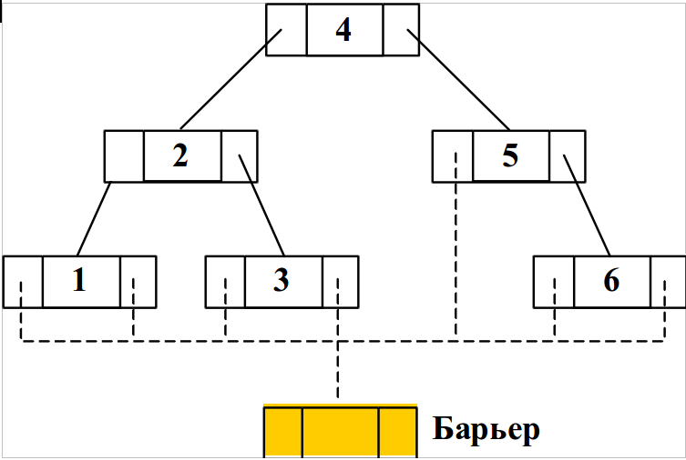

Введение барьера.

- поиск в дереве поиска – рекурсия PTTreeNode

```C++
FindRecord(TKey k, PTTreeNode pNode)
{
    if (pNode->Key < k) // вправо
        pNode = FindRecord(k, pNode->Right);
    if (pNode->Key > k) // влево
        pNode = FindRecord(k, pNode->Left);
    return (pNode == pBarrier) ? NULL : pNode;
}
```


- Поиск до тупика и вставка

```C++
void TTreeTable ::InsRecord(TKey k, PTDatValue pVal)
{ // вставить запись
    if (IsFull())
        SetRetCode(TabFull);
    else if (FindRecord(k) != NULL)
        SetRetCode(TabRecDbl);
    else
    {
        SetRetCode(TabOK);
        ppRef = new TTreeNode(k, pVal);
        DataCount++;
    }
}
```

## 2. Алгоритм копирования текста

- Для копирования текста необходимо предварительно скопировать разделы текста, на которые указывают pDown и pNext, испоьзуя алгоритмы NDT или DNT.
- Для навигации по тексту-копии также необходим стек
  - использование стеков исходного текста и текста-копии должно быть согласовано
- Для навигации по исходному тексту и тексту-копии используется один объединенный стек
- Каждое звено стека копируется в 2 прохода
  - 1 проход - при подъеме из подуровня (pDown)
    - создание копии звена
    - заполнение поля pDown (подуровень уже скопирован)
    - запись в поле Str значения Copy
      - для распознания звена при попадании на него во втором проходе
    - запись в поле pNext указателя на звено-оригинал
      - для возможности дальнейшего копирования текста исходной строки
    - запись указателя на звено-копию в стек
  - 2 проход - при извлечении звена из стека
    - заполнение полей Str и pNext
    - указатель на звено-копию запоминается в переменной cpl


# Экзаменационный билет №25

## 1. Алгоритм обхода плекса.

### Алгоритм 1 - общая схема алгоритма обхода для плекса

- переход на крайнюю левую точку
- подъем по плексу
  - пока стек не пуст, достаем точки траектории и рисуем линии

```C++
while (pN (не принадлежит) TChartPoint)
{
    St.push(pN);
    pN = pN->GetFirstPoint();
}
//подъем по плексу и рисование
pF = pN;
while (!St.Empty())
{
    pN = St.top();
    St.Pop();
    pL = pN->GetLastPoint(); //рисование линии<pN, pF, pL>
    pF = pL;
}
```

### Алгоритм 2 - рекурсивный вариант

- Линии, определяемые при обходе плекса, помещаются в стек
- При линии, извлекаемой из стека, последовательно определяются начальная и конечная точки
- Для определения начальной точки используется метод линии GetFirstPoint
- Если получаемый указатель указывает на линию, обработка текущей линии откладывается (линия помещается в стек) и начинается анализ новой линии
  - данная процедура выполняется итеративно до получения линии, с которой начали.

```C++
TChartPoint *Show(TChart *pN)
{
    if (pN != NULL)
        pL = NULL;
    else if (pN (принадлежит) TChartPoint)
        pL = pN;
    else
    {
        pF = Show(pN->GetFirstPoint());
        pL = Show(pN->GetLastPoint()); //рисование линии <pN,pF,pL>
    }
    return pN;
}
```

## 2. Линейные структуры данных

**Линейные структуры данных** - структуры, которым соответствует ориентированный граф с вершинами, лежащими на одной ломаной

**Линейные структуры данных** - упорядоченные структуры, в которых адрес элемента однозначно определяется его номером

Свойства:

- каждый элемент имеет не более 1 предшественника
- 2 разных элемента не могут иметь одинакового последователя

Примеры линейных структур:

- Массивы
  - динамические массивы
- Связный список
- Стек
- Очередь
- Дек
- Хеш-таблицы


# Экзаменационный билет №26

## 1. Таблицы с вычислимым входом. Запись и поиск при переполнении (способ открытого перемешивания).

### Методичка с лабами.

**Таблица** – динамическая структура данных, базисным множеством которой является семейство линейных структур из записей.

**Запись** – кортеж, каждый элемент которого обычно именуется полем.

**Имя записи** (ключ) – одно из полей записи, по которому обычно осуществляется поиск
записей в таблице; остальные поля образуют тело записи.

**Хеш-функция** – функция, ставящая в соответствие ключу номер записи в таблице.

**Хеш-таблицами**, **таблицами с вычисляемыми адресами** или **перемешиваемыми таблицами** - таблицы, получаемые при некотором способе построения.

- Этот способ построения таблиц при большом количестве записей состоит в предварительном (перед непосредственным поиском по таблице) вычислении месторасположения искомой записи
- Данный метод предполагает наличие некоторой простой функции `h(key)`, которая отображает множество имен на множество номеров строк таблицы
  - Эта функция называется **функцией хеширования** или **расстановки**.
- Эффективность обработки таблиц с вычислимым входом зависит не от количества записей, а от степени заполненности структуры хранения.

При использовании таблиц с вычисляемыми адресами может возникнуть ряд дополнительных проблем

Так, например, при вставке новой записи функция расстановки может выдать номер занятой строки массива (функция расстановки может определять одни и те же значения для нескольких разных ключей)

- Такая ситуация называется относительным переполнением таблицы или **коллизией**
- При возникновении коллизий возможны разные методы их разрешения

**Метод открытого перемешивания** (или **закрытое хеширование**) - добавление к вычисленному занятому номеру некоторого фиксированного смещения (поторное перемешивание) `k' = (k + p) mod N`

- если новый адрес `k'` также является занятым, следует повторить процедуру повторного перемешивания до тех пор, пока не обнаружится свободная строка, либо таблица не будет исчерпана
  - если значения `p` и `N` являются взаимнопростыми, открытое перемешивание обеспечивает нахождение свободной строки массива

Среднее количество просматриваемых записей при поиске записи в перемешиваемых таблицах

- при предположении равной вероятности использования ключей
- при использовании функции расстановки с равномерным рассеиванием ключей по строкам массива определяется следующим соотношением
  - разрешение коллизий по методу открытого перемешивания:

`Tср = (1 - a / 2) / (1 - a)`

- `a` - коэффициент заполненности таблицы (`a = N / M`)
- `M` - количество строк в массиве для хранения записей
- `N` - количество записей в таблице.

Следует отметить, что количество сравнений при поиске в перемешиваемых таблицах зависит не от количества записей в таблице, а от заполненности памяти, отведённой для размещения записей. Для примера, при заполненности массива на 75% (`a = 0.75`) количество сравнений в среднем равно 2.5.

**Вставка**:

```
1. Если n==M, ТО { Переполнение; Останов }
2. f = -1 // f – номер первой найденной пустой строки
3. s = h(key) // применение функции расстановки
4. ЕСЛИ s занята и K[s]==key, ТО {Дублир.; Останов }
5. ЕСЛИ s пустая и (f < 0), ТО { f = s }
6. ЕСЛИ s свободна и (f < 0), ТО { K[s]=key; Останов }
7. ЕСЛИ s свободна и (f >-1), ТО { K[f]=key; Останов }
8. (!) Коллизия {s = (s+p) mod M и переход к п. 4 }.
```

**Поиск**:

```
1) f = -1 // f – номер первой найденной пустой строки
2) s = h(key) // применение функции расстановки
3) ЕСЛИ s занята и K[s]==key, ТО { Останов }
4) ЕСЛИ s пустая и (f < 0), ТО { f = s }
5) ЕСЛИ s свободна, ТО { Останов }
6) (!) Коллизия { s = (s+p) mod M и переход к п. 3 }.
```

## 2. Понятие линейного списка.

Необходимость перепаковки для обеспечения динамического распределения памяти возникает в силу принятого способа реализации отношения следования - следующий элемент структуры располагается в следующем элементе памяти (с адресом, большим на 1). Устранение перепаковки возможно только при кардинальном изменении способа реализации основных отношений – необходимо допустить размещение следующих элементов структуры в произвольных элементах памяти (там, где имеется свободные области памяти). Возможность такого подхода может быть обеспечена запоминанием для каждого текущего элемента структуры адреса памяти, где хранится следующий элемент. Интерпретация содержимого элемента памяти (значение или адрес следующего элемента) в самом простом варианте может быть обеспечена фиксированным форматом используемых участков памяти.

Под **квантом памяти** понимается последовательность элементов памяти с последовательно-возрастающими адресами.

**Именем** (адресом) этой группы считается адрес первого слова кванта. Элементы кванта называются **полями**. В общем случае, набор элементов памяти, связанных с одним именем, называют **звеном**.

Далее будут использоваться двухэлементные звенья памяти, в которых первое поле будет использоваться для хранения значений, а второе поле – для запоминания адресов.

Способ задания отношения следования, в котором фиксация месторасположения следующего элемента производится путем запоминания соответствующего адреса памяти, называется **сцеплением** (пары, хранящие `ai` и `ai+1`, сцеплены адресными указателями).

Для изображения структуры хранения с использованием сцепления звенья памяти рисуются в виде прямоугольников, а сцепление звеньев показывается в виде стрелок.


Индикация последнего звена в списке обычно производится записью в поле адреса некоторого **барьера** – фиктивного (неадресного) значения (как правило, 0 или -1). Для доступа к звеньям списка должен быть известен адрес первого звена списка. Указатель, в котором этот адрес запоминается, называется **переменной связи**.

Структура хранения данного типа (звенья, сцепление, барьер, переменная связи) называется **линейным** или **односвязным списком**.


# Экзаменационный билет №27

## 1. Таблицы с вычислимым входом. Метод цепочек для разрешения коллизий.

**Таблица с вычисляемым входом (хеш-таблица)** – это таблица, элементы которой располагаются в соответствии с некоторой функцией расстановки (**хеш-функцией**)

Функция расстановки f (ключ) вычисляет для каждого элемента таблицы по его ключу номер (позицию) элемента в массиве.

- Диапазон значений функции f (ключ) – `0…N–1` или `1…N`
- Хеш-таблица должна быть инициализирована, т. е. элементы таблицы вначале должны получить значение “пусто”, что позволяет определить, есть в данной позиции элемент или нет
- При поиске данных в таблицах во многих случаях можно предварительно оценить место расположения искомых записей
- Пусть для ключей записей имеется правило преобразования к значениям целого типа. Используем получаемые значения для определения места расположения записей

### Пример

- Пусть ключ есть строка не более чем из 6 символов
- Каждый символ может быть преобразован в целое число (код символа)
- Тогда и ключ может рассматриваться как значение целого типа 
- Всего разных имен может быть , тогда положив размер памяти для таблицы , возможно организовать **прямой доступ** к записм

Организация прямого доступа в рассмотренном виде приводит к неэффективному использованию памяти
- требуется больше памяти (М >> 1)
- количество используемых ключей, как правило, существенно меньше теоретически возможного набора

Размер памяти для представления таблицы значительно меньше возможного количества имен (M << N), и, как результат, получаемые по ключам числовые значения необходимо преобразовывать к диапазону номеров (адресов) строк памяти

**Функция** (хеширования, перемешивания, рассеивания) **расстановки** (hash - мешанина, путаница) - функция преобразования значения ключа к номеру (адресу) строки памяти для хранения записи H : K -> L (L = (0, ..., M - 1))

**Таблицы с вычислимыми адресами (хеш-таблицы, перемешиваемые таблицы)** - таблицы, представление которых организуется при использовании функции расстановки

**Метод цепочек**

Замечания к открытому перемешиванию как способу размешения коллизий:

- Размер памяти для таблиц фиксирован
- Хранение записей без упорядоченности по ключам.

Широко используемый подход для разрешения коллизий - **метод цепочек**, когда все записи, для которых функция хеширования определяет одно и тоже значение,представляются в виде линейного списка.

Открытое перемешивание еще называют **закрытым хэшированием**, метод цепочек - **открытое хэширование**.


---

### Википедия

Каждая ячейка массива является указателем на связный список (цепочку) пар ключ-значение, соответствующих одному и тому же хеш-значению ключа. Коллизии просто приводят к тому, что появляются цепочки длиной более одного элемента. Операции поиска или удаления элемента требуют просмотра всех элементов соответствующей ему цепочки, чтобы найти в ней элемент с заданным ключом. Для добавления элемента нужно добавить элемент в конец или начало соответствующего списка, и, в случае, если коэффициент заполнения станет слишком велик, увеличить размер массива и перестроить таблицу.

---

## 2. Плекс, как представление арифметического выражения.

Плекс может рассматриваться как структура представления для выражений самого общего вида (линия – операция, точки - операнды).

Пример: Арифметическое выражение `(a * b + c) * (d - e / f)`:


# Экзаменационный билет №28

## 1.Сравнительная характеристика способов организации таблиц

Здесь необходимо расписать + и - использования просмотровых таблиц, сортированных таблиц, хеш таблиц и ...

## 2. Представление текста связным списком.

<!-- 


 -->

Текст – линейная последовательность символов


Текст – линейная последовательность слов (слово - линейная последовательность символов)


Текст – линейная последовательность строк, строки состоят из слов, слова – из символов и т.д.


Математическая модель текста – иерархическая структура представления (дерево).


- На всех уровнях представления (кроме символов) значение задается указателем на соответствующую структуру ниже расположенного уровня
- Разработанная структура хранения называется **связным (иерархическим) списком**
- Абстрактная структура типа дерева представима в виде **связного списка**
- В списке существуют делимые и неделимые (атомарные, терминальные) элементы
- Визуальное представление текста содержит только атомарные элементы, структура хранения должна включать все элементы - Разные типы звеньев – трудности при управлении памятью, дублирование программ обработки

Единый тип звена:

```C++
typedef Tlink *PTLink;
class TLink
{
    PTLink pNext;
    int Atom; // =1 – звено-атом
    union {PTLink pDown; char Symb;}
```


# Экзаменационный билет №29

## 1.Структура хранения множеств

**Множество** – набор элементов.

Для множества определены операции:

- проверка наличия элемента a ∈ A,
- добавление элемента A + a,
- удаление элемента A – a.
  Теоретико-множественные операции:
- объединение A ∪ B,
- пересечение A ∩ B,
- вычитание A \ B.
  Универс U – множество всех элементов.

**Проектирование:**


Текст – линейная последовательность слов (слово - линейная последовательность символов)


Текст – линейная последовательность строк, строки состоят из слов, слова – из символов и т.д.


Математическая модель текста – иерархическая структура представления (дерево).


## 2. Повторное использование памяти (сборка мусора)

При удалении разделов текста для освобождения звеньев следует учитывать следующие моменты:

- обход всех звеньев удаляемого текста может потребовать длительного времени
- при множественности ссылок на разделы текста (для устранения дублирования одинаковых частей) удаляемый текст нельзя исключить
    - этот текст может быть задействован в других фрагментах текста.

Память, занимаемая удаляемым текстом, не освобождается, а удаление текста фиксируется установкой указателей в состояние NULL (например, `pFirst=NULL`).

Подобный способ выполнения операций удаления текста может привести к ситуации, когда в памяти, используемой для хранения текста, могут присутствовать звенья, на которые нет ссылок в тексте и которые не возвращены в систему управления памятью для повторного использования. Элементы памяти такого вида носят наименование "**мусора**". Наличие "мусора" в системе может быть допустимым, если имеющейся свободой памяти достаточно для работы программ. В случае нехватки памяти необходимо выполнить "**сборку мусора**".

Возможный подход доступа к системе управления памятью – разработка специальной системы управления при помощи перегрузки операторов `new` и `delete`.

Общая схема подхода:

- Для системы управления память выделяется полностью при начале работы программы; вся память форматируется и представляется в виде линейного списка свободных звеньев.
- Для фиксации состояния памяти в классе `TTextLink` создается статическая переменная `MemHeader` типа `TTextMem`.

```C++
class TTextMem{
    PTTextLink pFirst; // первое звено
    PTTextLink pLast; // последнее звено
    PTTextLink pFree; // первое свободное
```

- Для выделения и форматирования памяти определяется статический метод `InitMemSystem` класса `TTextLink`.

```C++
void TTextLink::InitMemSystem(int size) // инициализация памяти
{
    char Line[100];
    char *tmp = new char[sizeof(TTextLink)*size];
    MemHeader.pFirst = (PTTextLink)new char[sizeof(TTextLink)*size];
    MemHeader.pFree = MemHeader.pFirst;
    MemHeader.pLast = (PTTextLink)tmp + size - 1;
    PTTextLink pLink = MemHeader.pFirst;
    for (int i = 0; i < size - 1; i++, pLink++) // размер памяти
        pLink->pNext = pLink + 1;
    pLink->pNext = nullptr;
}
```

- При запросе памяти в операторе new выделяется первое свободное звено.

```C++
void * TTextLink::operator new(size_t size) // выделение звена
{
    PTTextLink pLink = MemHeader.pFree;
    if (MemHeader.pFree != nullptr)
        MemHeader.pFree = pLink->pNext;
    return pLink;
}
```

- При освобождение звена в операторе `delete` звено включается в список свободных звеньев.

```C++
void operator delete (void *pM)
{
    PTTTextLink pLink=(PTTTextLink)pM;
    pLink->pNext=MemHeader.pFree;
    MemHeader.pFree=pLink;
}
```

- Для различения звеньев «мусора» и текста – маркировка текстовых звеньев и звеньев списка свободных звеньев.


# Экзаменационный билет №30

## 1.Группирование геометрических объектов

**Составной объект** - набор геометрических объектов (как базовых так и составных), рассматриваемых при выполнении операций обработки как единый объект

```C++
class TChartGroup : public TChartRoot
{
 protected:
    TDatList Group;  // Список объектов
 public:
    TChartGroup() { }
    void InsUnit(TChartRoot *pUnit);  // Добавление
    virtual void Show();  // Визуализация
    virtual void Hide();  // Скрытие
    virtual void CalcParams(double t = -1);  // Пересчет параметров
};
```

## 2. Алгоритмы обхода графов. Поиск в глубину

Ориентрованный граф G представляет собой набор G = (V, R), где
-  - множество вершин графа
-  - множество дуг(ребер) графа

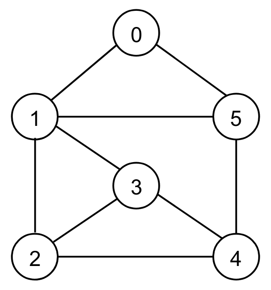

### Поиск в глубину

Обработка очередной вершины графа продолжается рекурсивной процедурой обработки смежных вершин


- Для исключения циклов и запоминания набора уже обработанных вершин можно использовать множество TSet
- Для запоминания набора достигнутых, но еще не обработанных вершин, можно использовать структуры:
    - Стек - для алгоритма поиска в глубину
    - Очередь - для алгорита поиска в ширину

<!--  -->


# Экзаменационный билет №31

## 1.Конструирование геометрических объектов

**Геометрический объект** может быть сконструирован с использованием уже существующих объектов. Например, ломаная может быть определена через набор конечных точек составляющих отрезков

```C++
class TChartPolyline : public TChartGroup
{
 public:
    TChartPolyline() { }
    void InsPoint(TChartRoot *pUnit);  // Добавление
    virtual void Show();  // Визуализация
    virtual void Hide();  // Скрытие
    virtual void CalcParams(double t = -1);  // Пересчет параметров
};
```

## 2. Алгоритмы обхода графов. Поиск в ширину

Для каждой вершины сначала выполняется обработка непосредственно смежных вершин


- Для исключения циклов и запоминания набора уже обработанных вершин можно использовать множество TSet
- Для запоминания набора достигнутых, но еще не обработанных вершин, можно использовать структуры:
    - Стек - для алгоритма поиска в глубину
    - Очередь - для алгорита поиска в ширину

<!--  -->


# Экзаменационный билет №32

## 1.Комбинирование геометрических объектов (плексы)

Геометрический объект может быть образован при помощи **сборки существующих объектов**.


Рассмотрим данный способ построения новых объектов на примере рисунков (чертежей), образованных только их объектов двух базовых типов: точек и линий

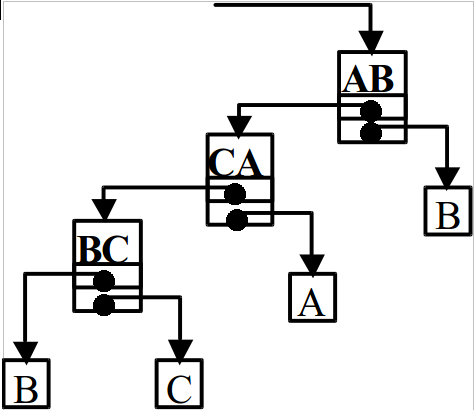

- Узел структуры хранения представляет линию чертежа
- Указатель на начальную точку линии может также указывать на линию
  - т.е. конечная точка предыдущей линии является начальной точкой следующей линии
- Структура хранения данного типа называется **плексом**(содержит элементы разного типа) повторяющаяся точка на чертеже должна быть представлена одним и тем же объектом
- Разработанная структура хранения позволяет обеспечить представление чертежей, которые можно нарисовать без отрыва карандаша от бумаги


### Алгоритм 1 - общая схема алгоритма обхода для плекса

- переход на крайнюю левую точку
- подъем по плексу
  - пока стек не пуст, достаем точки траектории и рисуем линии

```C++
while (pN (не принадлежит) TChartPoint)
{
    St.push(pN);
    pN = pN->GetFirstPoint();
}
//подъем по плексу и рисование
pF = pN;
while (!St.Empty())
{
    pN = St.top();
    St.Pop();
    pL = pN->GetLastPoint(); //рисование линии<pN, pF, pL>
    pF = pL;
}
```

### Алгоритм 2 - рекурсивный вариант

- Линии, определяемые при обходе плекса, помещаются в стек
- При линии, извлекаемой из стека, последовательно определяются начальная и конечная точки
- Для определения начальной точки используется метод GetFirstPoint линии
- Если получаемый указатель указывает на линию, обработка текущей линии откладывается (линия помещается в стек) и начинается анализ новой линии
  - данная процедура выполняется итеративно до получения линии, с которой начали.

```C++
TChartPoint *Show(TChart *pN)
{
    if (pN != NULL)
        pL = NULL;
    else if (pN (принадлежит) TChartPoint)
        pL = pN;
    else
    {
        pF = Show(pN->GetFirstPoint());
        pL = Show(pN->GetLastPoint()); //рисование линии <pN,pF,pL>
    }
    return pN;
}
```

## 2. Реализация алгоритма обхода графа

Алгоритмы обхода (итератор)

```C++
TSearchMode; // способ обхода
PTGraphNode pCurrNode; // текущая вершина
// Достигнутые, но не обработанные вершины
TDataRoot *pStream;
// Множество вершин, достигнутых в ходе обхода
TBitField *pFound;
```

**Инициализация `(Reset)`**

- Инициализация структур
- Вставка первой вершины в поток `pStream` и ее отметка в множестве `pFound`
- Выполнение метода `GoNext`

**Проверка завершения `(IsGraphEnded)`**

```C++
return pCurrNode == NULL // текущее звено?
``` 

**Переход к следующей вершине графа `(GoNext)`**

- Получить вершину из потока `pStream`
- Поместить смежные вершины, если они еще остались не достигнуты, в поток `pStream`
- Отметить смежные вершины в множестве pFound

```C++
    int Reset (void); // установить на первую вершину
    int IsGraphEnded (void) const; // обход завершен?
    int GoNext (void); // переход к следующей вершине
    PTGraphNode GetCurrNode (void) { return pCurrNode; } // доступ
    PTGraphPath GetShortestPath (string fn, string ln); // поиск кратчайшего пути
protected:
    virtual void Print (ostream &os); // печать графа
};
typedef TGraph * PTGraph;
// end of tgraph.h
```
