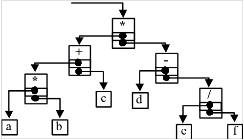

# Экзаменационный билет №2

## 1. Понятие экземпляра и схемы структуры на примере стека. Элементы базисного множества динамической структуры стек.

**Схема стуктуры** - структура данных Sa = (Ма, R; pa, p1), соответствующая рассмотрению структуры как переменной величины.

Алгоритм соответствует схеме структуры

**Экземпляр** - структура данных Sa ^ \* = (Ма, R; pa, p1 ^ \*) с установленными значениями элементов.

- p1 ^ \* - отражает не отношения между элементами, а индивидуальные свойства элемента

Вычисление соответствует экземпляру

Структуры с бинарными отношениями допускают случай графического изображения

- Элементы множества изображаются точками или кружками
- пары (ai,aj), для которых отношение истина, соединяются стрелкой от первого аргумента ко второму
- образ структуры с бинарными отношениями - ориентированный граф

## 2. Плекс, как представление арифметического выражения.

**Плекс** - структура представления для выражений самого общего вида (линия – операция, точки – операнды)

Пример:

- Арифметическое выражение (a*b+c)*(d-e/f)

