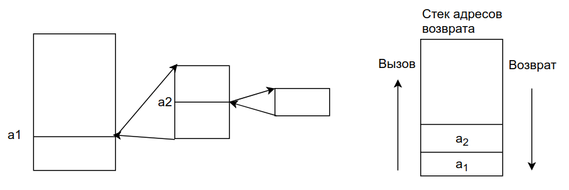
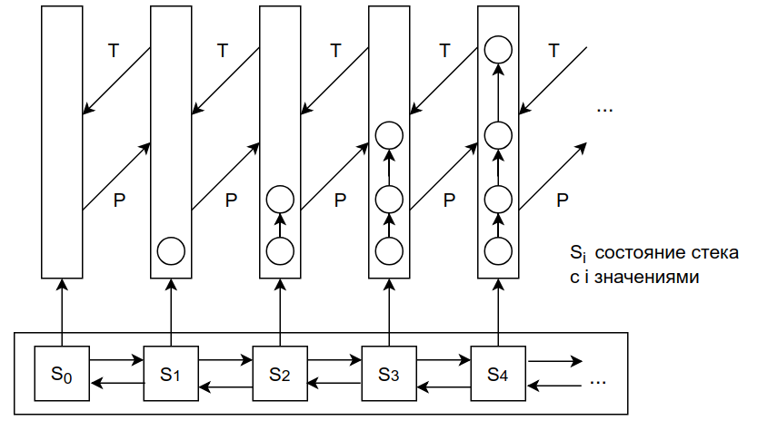

# Экзаменационный билет №3

## 1. Динамические структуры: свойства и применение.

Структуры данных являются **операндами операций обработки**.

<!-- CORRECT KATEX MATRIX BUT NOT SHOWN ON GITHUB OR IN PRESENTATION
$$ab^T = \begin{pmatrix}
a_{1}\\
a_{2}\\         
\vdots\\
a_{n}
\end{pmatrix} * (b_1 \dots b_m) = \begin{pmatrix}
c_{11} & \dots & c_{1m}\\
& \dots\\
c_{n1} & \dots & c_{nm}
\end{pmatrix} = c$$ -->

<!-- WORKS FOR PRESENTATIONS -->


Результаты вычислений также являются структурами, модель которых может как совпадать, так и отличаться от структуры исходных данных.

### Пример. Организация последовательного вызова подпрограмм.



- Для возврата в точку вызова необходимо запоминать адрес возврата
- При завершении вызываемой подпрограммы для возврата используется последний запомненный адрес
- В ходе вызова подпрограмм количество запоминаемых адресов постоянно изменяется
  - увеличивается при вызове очередной подпрограммы и уменьшается после завершения работы текущей подпрограммы
- Отличительная особенность – структура исходных и результирующих данных являются близкими.

Анализ примера:

- Текущий набор адресов – линейная структура  <!-- $S_n=(a_1 a_2 … a_n)$ -->.
- Пусть T – операция исключения последнего адреса.
- Тогда . Пусть P – операция добавления нового адреса. Тогда .
- Орграф результата является подорграфом орграфа операнда или включает его
- Последовательное применение операций T и P позволяет получить набор состояний стека адресов
- Пусть
  - P1 - отношение следования, порождаемое операцией вставки
  - P2 - отношение следования, порождаемое операцией исключения
- Тогда стек есть структура 
  - каждый элемент – структура
  - в любой момент существует только один конкретный элемент из M
  - элементы частично упорядочены по включению

**Динамическая структура** - математическая структура, которой соответствует частично-упорядоченное (по включению) базовое множество M, элементы которого являются структурами данных. При этом отношения включения индуцируются операциями преобразования структуры данных.

Примеры:

- очередь (FIFO) вставка в конец очереди исключение из начала
- дек - вставка и исключение из начала и конца дека - FOLIFOLO

**Средства поддержки динамической структуры** - программы реализующие отношения включения

### Взято из интернета

**Динамические структуры данных** – это структуры данных, память под которые выделяется и освобождается по мере необходимости.

Свойства:

- ей выделяется память в процессе выполнения программы
- количество элементов структуры может не фиксироваться;
- отсутствует физическая смежность элементов структуры в памяти;
- размерность структуры может меняться в процессе выполнения программы;
- в процессе выполнения программы может меняться характер взаимосвязи между элементами структуры

Выгодно использовать, если:

- Используются переменные, имеющие довольно большой размер (например, массивы большой размерности), необходимые в одних частях программы и совершенно не нужные в других
- В процессе работы программы нужен массив, список или иная структура, размер которой изменяется в широких пределах и трудно предсказуем.
- Когда размер данных, обрабатываемых в программе, превышает объем сегмента данных



**Может быть эта схема здесь не нужна**

## 2. Реализация списка на языке программирования высокого уровня.

### Подход 1

Для имитации звеньев могут быть использованы два массива один из которых используется для хранения значений, другой- для хранения индексов следующих элементов. В этом случае, звено есть элемент массивов с одинаковым индексом, адрес (имя) звена – индекс массивов.

### Подход 2

С использованием ООП звено может быть представлено в виде объекта. Образ памяти, выделенной для хранения структур данных, в это случае будет представлять массив звеньев-объектов.

```C++
Class TLink
{
 public:
    Int value;  //значение
    Int next;  //индекс следующего звена
 protected:
    TLink();
};
TLinkMem[MemLimit];
```
