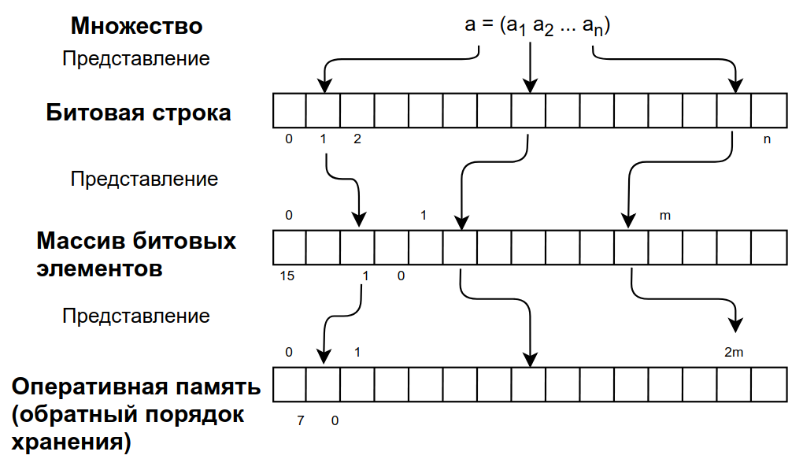

# Экзаменационный билет №5

## 1. Представление множества битовой строкой. Оценки сложности по памяти и времени.




#### ВОЗМОЖНО ПО ТЕМЕ

Множество – набор элементов. Для множества определены операции: проверка наличия элемента aA, добавление элемента A+a, удаление элемента A –a. Теоретико-множественные операции: объединение AB, пересечение AB, вычитание A\B. Универс U – множество всех элементов. Конкретизация (допущения и ограничения): элементы множества проиндексированы (каждому элементу соответствует уникальный индекс), множество индексов элементов составляют непрерывный диапазон целых значений. Тогда любое множество AU может быть описано характеристическим вектором =(1 2… n), ,
если иначе. Множество → битовая строка → массив битовых элементов → оперативная память (обратный порядок хранения). Нумерация бит в битовой строке – слева направо. Нумерация элементов в массиве – слева направо, биты элемента – справа налево. Байты двухбайтового элемента располагаются в ОП в обратном порядке (сначала байт с младшими битами, затем байт со старшими битами).

## 2. Реализация стека с использованием динамически распределяемой памяти.

### Вставка в стек

```C++
    PTDatLink pTemp;
    pTemp = new TDatLink();
    pTemp-> SetDatValue(Val);
    pTemp->SetNextLink(pFirst);
    pFirst = pTemp;
```

### Выборка из стека

```C++
    PTDatLink pTemp = pFirst;
    Val = pFirst->GetDatValue();
    pFirst = pFirst->GetNextLink();
    delete pTemp;
```
