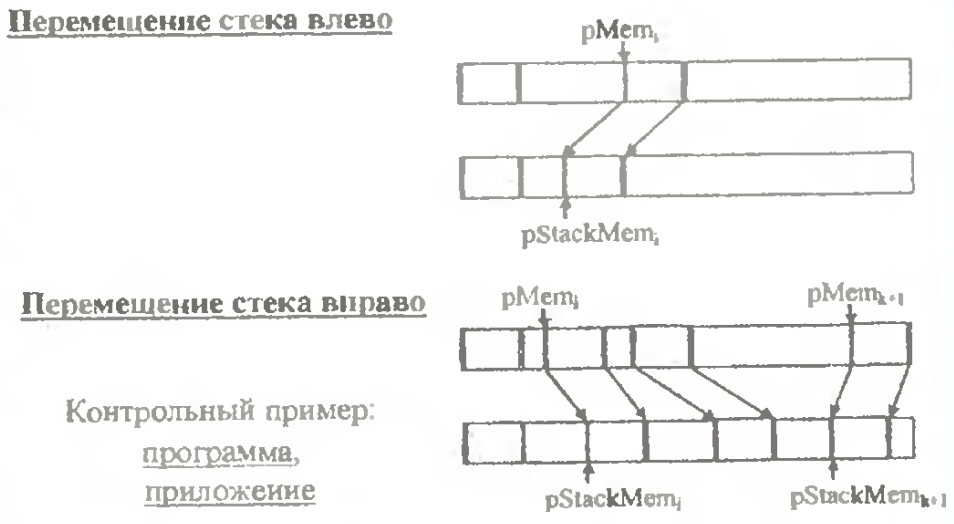
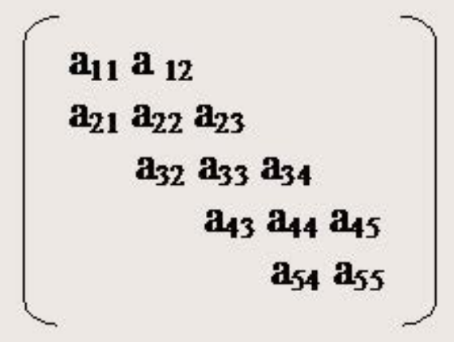
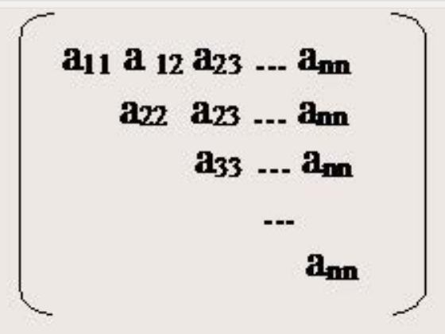

# Экзаменационный билет № 6

## 1. Управление памятью путем перепаковки структур хранения на прмере реализации N стеков на одном массиве.

**Перепаковка памяти (перепаковка)** - процедура динамического перераспределения памяти путем переписи части хранимых значений в другую область

Перепаковка **обеспечивает эффективное использование** одного ресурса ЭВМ (памяти) за счет другого ресурса (времени).

Для выполнения перепаковки требуется разработка управляющих программ.

**Управление памятью** - выполнение функций анализа свободной памяти, планирование размещения структур, переписывание структур

**Система управления памятью** - комплекс программ, реализующих управление памятью

Необходимость перепаковки обуславливается принятым способом реализации отношений следования.

- N – количество стеков
- m – размер памяти

Свойства:

- Li0 = 0 - условие неподвижности 1 стека
- Hik = Lik - 1 - условие пустоты
- Hik < Lik + 1 - условие неперекрытия
- Hik = Lik+1 - 1 - условие переполнения
- Для выполнимости последних двух условий для всех стеков введем фиктивный стек N, для которого LiN = m
- Будем предполагать, что все стеки используются с одинаковой интенсивностью
  - значит память распределяется всем стекам поровну: Li0 = 0, LiN = m, Lik = Lik-1 + m / N, 1 <= k <= N

Выполняется при попытке вставки нового значения в стек s, у которого отсутствует свободная память: F = 'сумма' (Hik-Lik-1-1), 1 <= k <= N.

- F =0 – свободной памяти нет
- F =1 – свободен 1 элемент памяти и его следует отдать стеку s
- F>1 – необходимо перераспределить свободную память.

Для гарантированного выделения свободной памяти стеку s при наличии только одного свободного элемента памяти (случай 2), выполним:

- His=His+1 – перед началом процедуры оценки свободной памяти
- His=His-1 – после завершения перепаковки. Снова предположим, что все стеки используются с одинаковой интенсивностью - значит свободная память должна распределиться всем стекам поровну: Li'0= Li0, Li'N= LiN, Li'k=Li'k-1+ (Hik-1-Lik-1+1) + F / N, 1 <= k <= N
- На равномерности распределения памяти может сказаться целочисленность операции деления

## 2. Структуры хранения для матриц специального вида

### Ленточные матрицы

Для хранения элементов можно выделить непрерывный вектор памяти размера 3*n-2
Адрес (aij) = a(альфа) + 3*(i-1) + (j-i)

### Треугольные матрицы

Подход 1:

- Матрицы подобного вида можно представить как матрицы общего вида и использовать для хранения двухиндексные массивы. - Используется память Vисп= n2, необходимая память Vнеоб= n (n+1)/2
- Эффективность использования памяти Emem 0.5

Подход 2:

- Исключение хранения элементов ниже главной диагонали (построчная запись в массив)
- Адрес (aij) = a(альфа) + i*n – i*(i-1)/2 + (j-i), 0 <= i,j <= n-1
- Ускорение доступа – использование вектора указателей на первые элементы каждой строки. Адрес (aij) = pRow[i] + (j-i),0 <= i,j <= n-1

Подход 3:

- Представление матрицы в виде набора векторов

Подход 4:

- Матрица как вектор векторных элементов (шаблоны)
