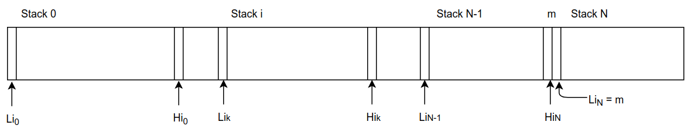
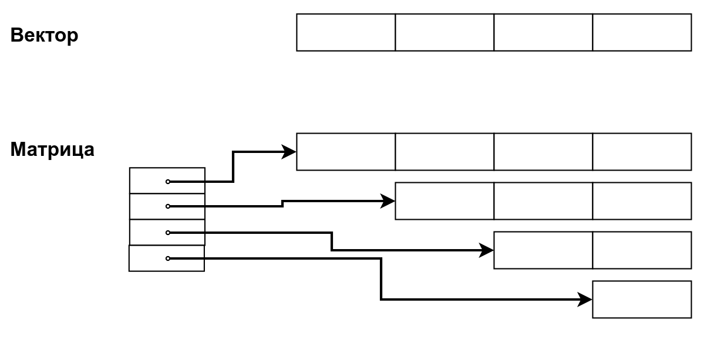

# Экзаменационный билет № 6

## 1. Управление памятью путем перепаковки структур хранения на примере реализации N стеков на одном массиве.

**Перепаковка памяти (перепаковка)** - процедура динамического перераспределения памяти путем переписи части хранимых значений в другую область

Перепаковка **обеспечивает эффективное использование** одного ресурса ЭВМ (памяти) за счет другого ресурса (времени).

**Управление памятью** - выполнение функций анализа свободной памяти, планирование размещения структур, переписывание структур

**Система управления памятью** - комплекс программ, реализующих управление памятью

Необходимость перепаковки обуславливается принятым способом реализации отношений следования.

- N – количество стеков
- m – размер памяти

Свойства:

-  - условие неподвижности 1 стека
-  - условие пустоты
-  - условие неперекрытия
-  - условие переполнения
- Для выполнимости последних двух условий для всех стеков введем фиктивный стек N, для которого 
- Будем предполагать, что все стеки используются с одинаковой интенсивностью
  - значит память распределяется всем стекам поровну: 

Выполняется при попытке вставки нового значения в стек s, у которого отсутствует свободная память: 

- F = 0 – свободной памяти нет
- F = 1 – свободен 1 элемент памяти и его следует отдать стеку s
- F > 1 – необходимо перераспределить свободную память.

Для гарантированного выделения свободной памяти стеку s при наличии только одного свободного элемента памяти (случай 2), выполним:

-  – перед началом процедуры оценки свободной памяти
-  – после завершения перепаковки. Снова предположим, что все стеки используются с одинаковой интенсивностью - значит свободная память должна распределиться всем стекам поровну: 
  - 
  - 
  - 
- На равномерности распределения памяти может сказаться целочисленность операции деления

## 2. Структуры хранения для матриц специального вида

### Ленточные матрицы

Для хранения элементов можно выделить непрерывный вектор памяти размера 3*n-2

Адрес 

### Треугольные матрицы

Подход 1:

- Матрицы подобного вида можно представить как матрицы общего вида и использовать для хранения двухиндексные массивы. - Используется память  = n2, необходимая память  = n * (n+1) / 2
- Эффективность использования памяти Emem = 0.5

Подход 2:

- Исключение хранения элементов ниже главной диагонали (построчная запись в массив)
- Адрес 
- Ускорение доступа – использование вектора указателей на первые элементы каждой строки. Адрес 

Подход 3:

- Представление матрицы в виде набора векторов

Подход 4:

- Матрица как вектор векторных элементов (шаблоны)
