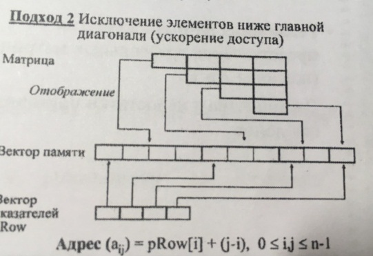
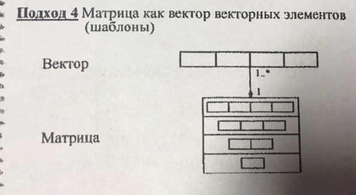
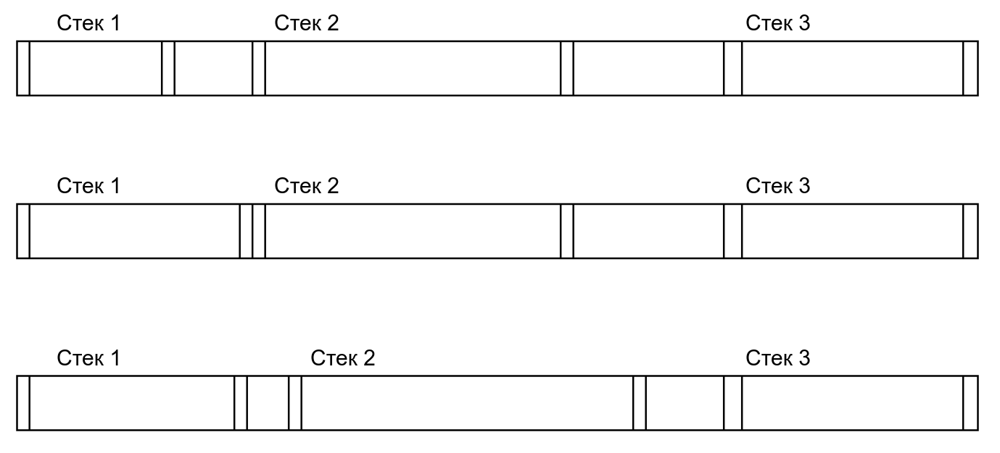

# Экзаменационный билет №7

## 1. Матрица как вектор векторов и матрица как вектор указателей. Оценки сложности по памяти и времени.

**Бред, который нужно исправить**

### Оценки сложности по памяти

это же треугольные матрицы, в матрице рамером n \* n n ^ 2 ячееки, нулевые мы не храним

### Оценки сложности по времени

поиск будет О(1)т.к. мы просто индекс считаем грубо говоря,если с матрицами типо A + B,где а и б матрицы, то нам нужно каждый элемент с каждым сложитьсоотв. это будет такой же O как и у памятивычитание аналогично
а как скалярное произведение матриц-сумма попарных произведений?

## 2. Статическое и динамическое распределение памяти.

**Статическое распределение памяти** - распределение памяти до начала процесса вычислений.

**Динамическое распределение памяти** - распределение памяти в ходе выполнения программы.

**Перепаковка памяти (перепаковка)** - процедура динамического перераспределения памяти путем переписи части хранимых значений в другую область памяти.

