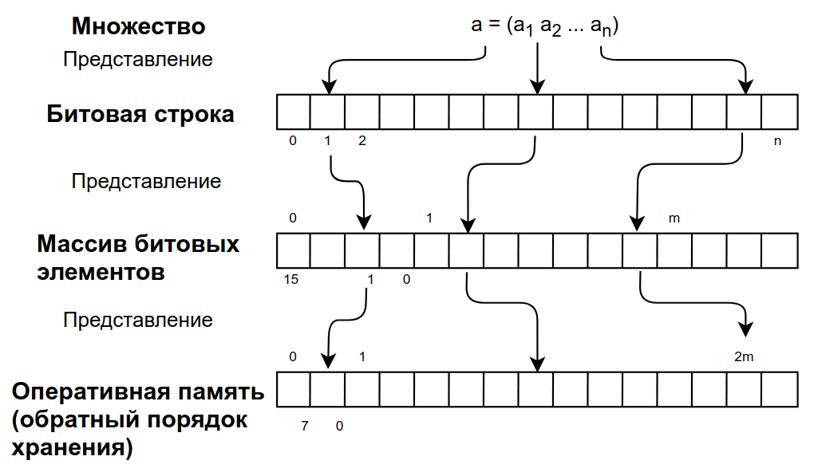

# Экзаменационный билет №8

## 1. Роль гипотез о росте структур при разработке систем управления памятью путем перепаковки на примере работы с N стеками.

### Гипотезы о поведении структур служат основой для принятия решений о распределении памяти.

Формирование гипотез происходит в результате теоретического анализа модели решаемой задачи или может быть выполнено на основе статистических данных, получаемых в ходе вычислительных экспериментов с проектируемой программной системой.

**Гипотеза 1**: Стеки используются с одинаковой интенсивностью, память разделяется между стеками поровну.

**Гипотеза 2**: Интенсивность использования стеков различается.

- Конструктивное предположение о характере такой неравномерности может состоять в гипотезе сохранения локальных тенденций роста стеков
  - в каждый момент времени использование стеков на последующих шагах вычислений характеризуется точно таким же поведением, что и на предшествующих этапах обработки данных.
- Сохранение локальных тенденций роста:

  - показатель роста стека 
  - суммарный показатель роста 
  - правило распределение памяти для стеков в соответствии с их показателями роста 

**Гипотеза 3**: Использование вероятностных предположений о поведении стеков.

- Пусть есть 
- вероятность выполнимости гипотезы сохранения локальных тенденций роста. Тогда 

## 2. Структура хранения множеств.

**Множество** – набор элементов



### Операции над множествами

- получение значения бита n
  - проверка наличия элемента (a принадлежит A)
  - при условии, если бит больше -1 и меньше количества битов
  - в противном случае возвращается 0

```C++
int TBitField::GetBit(const int n) const
{
	if ((n > -1) && (n < BitLen))
		return (pMem[(GetMemIndex(n))] & (GetMemMask(n)));
	else return(0);
}
```

- установка бита
  - добавление элемента (A + a)
  - происходит в позицию n том случае, если бит больше -1 и меньше количества битов

```C++
void TBitField::SetBit(const int n)
{	if ((n > -1) && (n < BitLen))
		pMem[(GetMemIndex(n))] |= GetMemMask(n);
}
```

- удаление бита в позиции n
  - удаление элемента A – a
  - при условии, если бит больше -1 и меньше количества битов

```C++
void TBitField::ClrBit(const int n)
{	if ((n > -1) && (n < BitLen))
		pMem[(GetMemIndex(n))] &= ~GetMemMask(n);
}
```

### Теоретико-множественные операции

- объединение A ⋃ B
  - Операция "или" для двух битовых полей, осуществляется с помощью сравнивания двух полей, причем, результирующее будет с длиной наибольшего из них
  - Затем последовательно выполняется дизъюнкция для i-ых элементов двух массивов

```C++
TBitField TBitField::operator|(const TBitField& bf)
{
	int i, len;
	if (BitLen > bf.BitLen)
		len = BitLen;
	else len = bf.BitLen;
	TBitField temp(len);
	for (i = 0; i < MemLen; i++)
		temp.pMem[i] = pMem[i];
	for (i = 0; i < bf.MemLen; i++)
		temp.pMem[i] |= bf.pMem[i];
	return temp;
}
```

- пересечение A ∩ B
  - Операция "и" для двух битовых полей, осуществляется с помощью сравнивания двух полей, результирующее будет с длиной наименьшего из них
  - Затем последовательно выполняется конъюнкция для i-ых элементов двух массивов

```C++
TBitField TBitField::operator&(const TBitField &bf)
{
	int i, len;
	if (BitLen < bf.BitLen)
		len = BitLen;
	else len = bf.BitLen;
	TBitField temp(len);
	for (i = 0; i < MemLen; i++)
		temp.pMem[i] = pMem[i];
	for (i = 0; i < bf.MemLen; i++)
		temp.pMem[i] &= bf.pMem[i];
	return temp;
}
```

- вычитание A \ B
  - Для отрицания последовательно выполняется инверсия для каждого бита массива

```C++
TBitField TBitField::operator~(void)
{
    TBitField temp(BitLen);
    for (int i = 0; i < MemLen; i++)
    	temp.pMem[i] = ~pMem[i];
    return temp;
}
```

**Универс** U – множество всех элементов.

Конкретизация (допущения и ограничения):

- элементы множества проиндексированы (каждому элементу соответствует уникальный индекс)
- множество индексов элементов составляют непрерывный диапазон целых значений
- Тогда любое множество A ⊂ U может быть описано характеристическим вектором <!-- $a=(a_1 a_2 \dots a_n). a_i = 1$ -->
  - если <!-- $a_i \in A$, $a_i$ = 0 --> иначе
- Множество → битовая строка → массив битовых элементов → оперативная память (обратный порядок хранения)
- Нумерация бит в битовой строке – слева направо
- Нумерация элементов в массиве – слева направо, биты элемента – справа налево
- Байты двухбайтового элемента располагаются в ОП в обратном порядке (сначала байт с младшими битами, затем байт со старшими битами)
