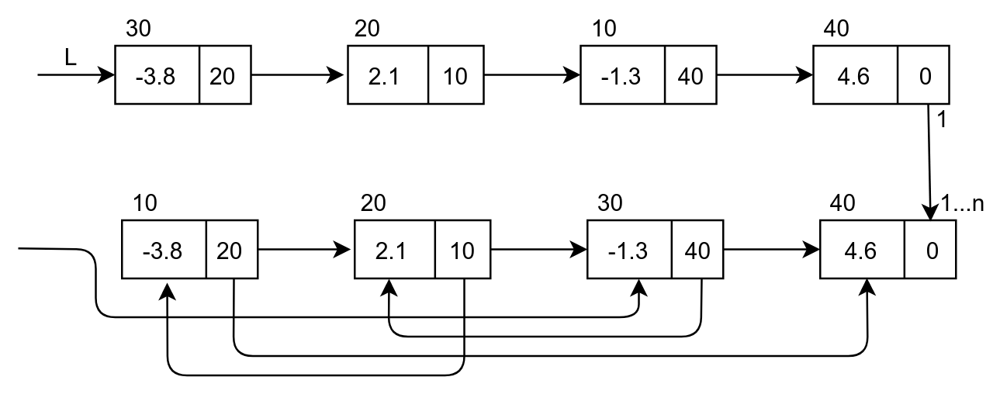

# Экзаменационный билет №9

## 1. Управление свободной памятью при использовании сцепления.

### ОБЩАЯ ИНФОРМАЦИЯ О СЦЕПЛЕНИЯХ(НЕ ЯВЛЯЕТСЯ ОТВЕТОМ НА ВОПРОС)

**Сцепление** - способ задания отношения следования, в котором фиксация месторасположения следующего элемента производится путем запоминания соответствующего адреса памяти (пары, хранящие  и , сцеплены адресными указателями)


Сверху - логический порядок звеньев
Снизу - физический порядок звеньев

- Для изображения структуры хранения с использованием сцепления звенья памяти рисуются в виде **прямоугольников**, а сцепление звеньев показывается в виде **стрелок**.
- Индикация последнего звена в списке обычно производится записью в поле адреса некоторого барьера – фиктивного (неадресного) значения (как правило, 0 или -1).
- Для доступа к звеньям списка должен быть известен адрес первого звена списка.
- Указатель, в котором этот адрес запоминается, называется **переменной связи**.
- Структура хранения данного типа (звенья, сцепление, барьер, переменная связи) называется **линейным или односвязным списком**.

## 2. Алгоритм сложения многочленов от N переменных.

Основные алгоритмические моменты метода сложения полиномов operator+ состоят в следующем:

- результат сложения запоминается в объекте первого операнда
- операция сложения сводится к последовательной обработке мономов полиномов-операндов p и q
  - если моном p меньше монома q, то моном q добавляется в полином p и текущая позиция в q сдвигается вправо
  - если моном p старше монома q, то текущая позиция в p сдвигается вправо
  - если моном p равен моному q, то коэффициенты мономов складываются и запоминаются в p
  - далее если результат сложения равен 0, то моном в p удаляется и текущая позиция в q сдвигается вправо
  - если же результат сложения ненулевой, то текущая позиция сдвигается вправо, и в p, и в q.

```C++
TList TList::plus(TList list)
{
    pLink tmp, ptr, temp, prev1, prev2, cnt, n;
    tmp = prev1 = cnt = Head;
    ptr = prev2 = temp = n = list.Head;
    size = this->GetSize();
    int flag = 1;
    while ((tmp->pNext->data != -1) && (ptr->pNext->data != -1))
    {
        if ((ptr->data == -1) && (tmp->data == -1))
        {
            ptr = ptr->pNext;
            tmp = tmp->pNext;
            temp = temp->pNext;
            cnt = cnt->pNext;
        }
        if ((tmp->data > ptr->data) && (flag == 1))
        {
            ptr = ptr->pNext;
            this->insCurrent(temp->data, temp->data2);
            list.deleteCurrent(temp->data);
            temp = ptr;
            flag = 0;
        }
        if ((tmp->data < ptr->data) && (flag == 1))
        {
            ptr = ptr->pNext;
            tmp = tmp->pNext;
            this->insCurrent(temp->data, temp->data2);
            list.deleteCurrent(temp->data);
            temp = ptr;
            flag = 0;
        }
        if ((tmp->data == ptr->data) && (flag == 1))
        {
            this->insCurrent(tmp->data, tmp->data2 + ptr->data2);
            if ((tmp->data2 + ptr->data2) == 0)
            {
                while ((prev1->pNext != tmp) && (n->pNext != ptr))
                {
                    prev1 = prev1->pNext;
                    n = n->pNext;
                }
                tmp = tmp->pNext;
                ptr = ptr->pNext;
                this->deleteCurrent(cnt->data);
                list.deleteCurrent(temp->data);
                cnt = tmp;
                temp = ptr;
            }
            flag = 0;
        }
        flag = 1;
    }
    if ((ptr->data == tmp->data) && (ptr->data != -1)
    && (tmp->data != -1))
    {
        this->insCurrent(ptr->data, tmp->data2 + ptr->data2);
        if ((tmp->data2 + ptr->data2) == 0)
        {
            while ((prev1->pNext != tmp) && (n->pNext != ptr))
            {
                prev1 = prev1->pNext;
                n = n->pNext;
            }
            tmp = tmp->pNext;
            ptr = ptr->pNext;
            this->deleteCurrent(cnt->data);
            list.deleteCurrent(temp->data);
            list.size--;
            cnt = tmp;
            temp = ptr;
        }
    }
    if (ptr->data != tmp->data)
    {
        if (tmp->data == -1)
            while (ptr->pNext != list.Head)
            {
                this->insCurrent(ptr->data, ptr->data2);
                ptr = ptr->pNext;
                list.size--;
            }
    }
    if ((ptr->data != -1) && (tmp->data != -1))
    {
        this->insCurrent(ptr->data, ptr->data2);
        list.deleteCurrent(ptr->data);
    }

    return *this;
}
```
