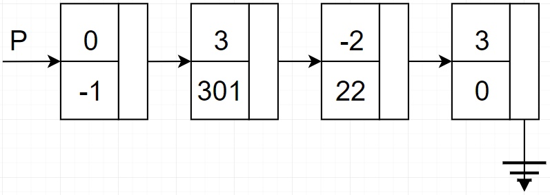
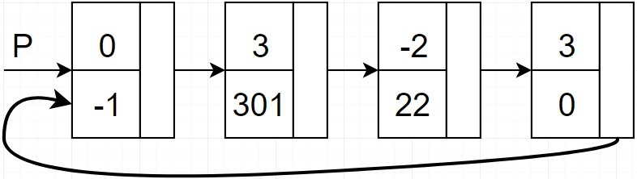
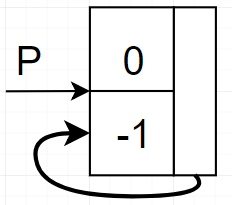

# Экзаменационный билет №11

## 1.Представление многочленов от N переменных. Исключение хранения мономов с нулевыми коэффициентами

- Структура хранения полинома, тождественно равного нулю, не содержит звеньев (список вырождается)
- Данная ситуация может отражаться установкой нулевого значения указателю на список, но тогда все программы для полиномов должны включать специальные действия по обнаружению и обработке уникального состояния полинома
  Возможное решение проблемы может состоять во введении дополнительного служебного звена размещаемого в начале списка(**звено-заголовок**)

- **Звено-заголовок** маркируется логически-недопустимым значением индекса монома
- Аналогичным образом можно уйти от проверки нулевого указателя последнего звена, установив в последнем звене в качестве следующего звена первый элемент списка (звено-заголовок)
  - Данная модификация приводит к использованию в качестве структуры хранения циклического списка

- Цикличность списка, кроме того позволит разработать более эффективные программы обработки полиномов
- Структура хранения полинома имеет вид:

## 2. Копирование текста

Для копирования текста необходимо предварительно скопировать разделы текста, на которые указывают указатели `pDown` и `pNext`

Алгоритмы обхода NDT или DNT.

- Для навигации по тексту-копии также необходим стек
- Использование стеков исходного текста и текста-копии должны быть согласованы
- Для навигации по исходному тексту и тексту-копии используется один объединенный стек

Каждое звено текста копируется за два прохода:

- **Первый проход** – при подъеме из подуровня (pDown):
  - создание копии звена
  - заполнение поля `pDown` (подуровень уже скопирован)
  - запись в поле `Str` значения Copy (для распознания звена при попадании на него при втором проходе)
  - запись в поле `pNext` указателя на звено-оригинал (для возможности последующего копирования текста исходной строки)
  - запись указателя на звено-копию в стек
- **Второй проход** – при извлечении звена из стека:
  - заполнение полей `Str` и `pNext`
  - указатель на звено-копию запоминается в переменной cpl
