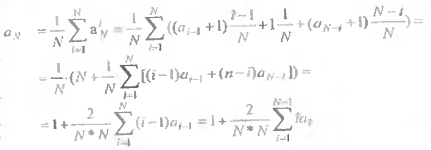
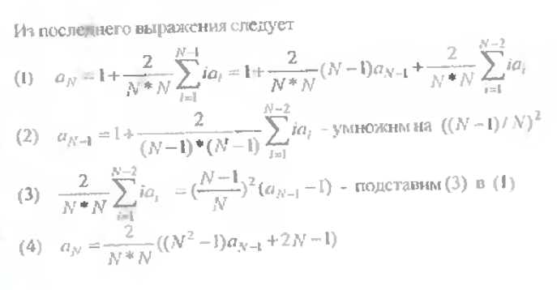
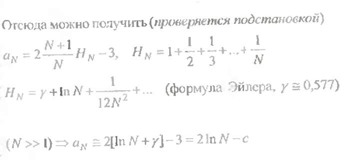
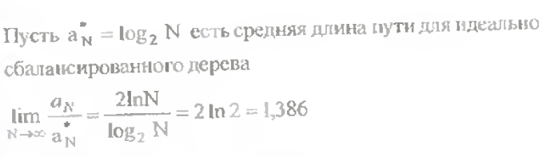

# Экзаменационный билет №12

## 1.Сборка мусора (Повторное использование памяти).

При удалении разделов текста для освобождения звеньев следует учитывать следующие моменты:

- обход всех звеньев удаляемого текста может потребовать длительного времени
- при множественности ссылок на разделы текста (для устранения дублирования одинаковых частей) удаляемый текст нельзя исключить – этот текст может быть задействован в других фрагментах текста.

Память, занимаемая удаляемым текстом, не освобождается, а удаление текста фиксируется установкой указателей в состояние NULL (например, `pFirst=NULL`).

- Подобный способ выполнения операций удаления текста может привести к ситуации, когда в памяти, используемой для хранения текста, могут присутствовать звенья, на которые нет ссылок в тексте и которые не возвращены в систему управления памятью для повторного использования
- Элементы памяти такого вида носят наименование "**мусора**"
- Наличие "мусора" в системе может быть допустимым, если имеющейся свободой памяти достаточно для работы программ
- В случае нехватки памяти необходимо выполнить "**сборку мусора**".

Возможный подход доступа к системе управления памятью – разработка специальной системы управления при помощи перегрузки операторов `new` и `delete`.

### Общая схема подхода

- Для системы управления память выделяется полностью при начале работы программы
- вся память форматируется и представляется в виде линейного списка свободных звеньев
- Для фиксации состояния памяти в классе `TTextLink` создается статическая переменная `MemHeader` типа `TTextMem`.

```C++
class TTextMem{
    PTTextLink pFirst; // первое звено
    PTTextLink pLast; // последнее звено
    PTTextLink pFree; // первое свободное
```

- Для выделения и форматирования памяти определяется статический метод `InitMemSystem` класса `TTextLink`.

```C++
void TTextLink::InitMemSystem(int size) // инициализация памяти
{
    char Line[100];
    char *tmp = new char[sizeof(TTextLink)*size];
    MemHeader.pFirst = (PTTextLink)new char[sizeof(TTextLink)*size];
    MemHeader.pFree = MemHeader.pFirst;
    MemHeader.pLast = (PTTextLink)tmp + size - 1;
    PTTextLink pLink = MemHeader.pFirst;
    for (int i = 0; i < size - 1; i++, pLink++) // размер памяти
        pLink->pNext = pLink + 1;
    pLink->pNext = nullptr;
}
```

- При запросе памяти в операторе new выделяется первое свободное звено.

```C++
void * TTextLink::operator new(size_t size) // выделение звена
{
    PTTextLink pLink = MemHeader.pFree;
    if (MemHeader.pFree != nullptr)
        MemHeader.pFree = pLink->pNext;
    return pLink;
}
```

- При освобождение звена в операторе `delete` звено включается в список свободных звеньев.

```C++
void operator delete (void *pM)
{
    PTTTextLink pLink=(PTTTextLink)pM;
    pLink->pNext=MemHeader.pFree;
    MemHeader.pFree=pLink;
}
```

- Для различения звеньев «мусора» и текста – маркировка текстовых звеньев и звеньев списка свободных звеньев.

## 2. Оценка сложности обработки деревьев поиска.

```
Тmin=1
Tmax=log2N(при сбалансированном дереве)
Tmax=N(при вырожденном дереве)
```








