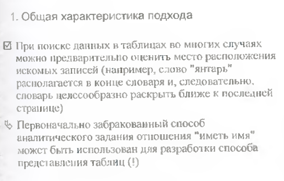
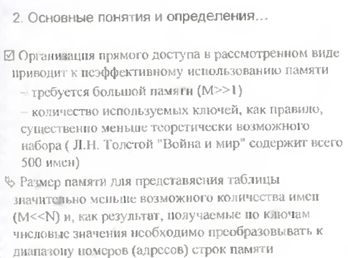
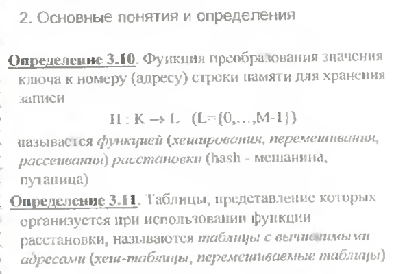

# Экзаменационный билет №13

## 1.Представление текста связным списком.

Текст – линейная последовательность символов


Текст – линейная последовательность слов (слово - линейная последовательность символов)


Текст – линейная последовательность строк, строки состоят из слов, слова – из символов и т.д.


Математическая модель текста – иерархическая структура представления (дерево).


- На всех уровнях представления (кроме символов) значение задается указателем на соответствующую структуру ниже расположенного уровня
- Разработанная структура хранения называется **связным (иерархическим) списком**
- Абстрактная структура типа дерева представима в виде **связного списка**
- В списке существуют делимые и неделимые (атомарные, терминальные) элементы
- Визуальное представление текста содержит только атомарные элементы, структура хранения должна включать все элементы - Разные типы звеньев – трудности при управлении памятью, дублирование программ обработки

Единый тип звена:

```C++
typedef Tlink *PTLink;
class TLink
{
    PTLink pNext;
    int Atom; // =1 – звено-атом
    union {PTLink pDown; char Symb;}
```

## 2. Таблицы с вычислимым входом.

**Таблица с вычисляемым входом (хеш-таблица)** – это таблица, элементы которой располагаются в соответствии с некоторой функцией расстановки (**хеш-функцией**)

Функция расстановки f (ключ) вычисляет для каждого элемента таблицы по его ключу номер (позицию) элемента в массиве.

- диапазон значений функции f (ключ) – `0…N–1` или `1…N`
- Хеш-таблица должна быть инициализирована, т. е. элементы таблицы вначале должны получить значение “пусто”, что позволяет определить, есть в данной позиции элемент или нет.








**Метод цепочек**.

Замечания к открытому перемешиванию как способу размешения коллизий:

- Размер памяти для таблиц фиксирован
- Хранение записей без упорядоченности по ключам.

Широко используемый подход для разрешения коллизий - **метод цепочек**, когда все записи, для которых функция хеширования определяет одно и тоже значение,представляются в виде линейного списка.

Открытое перемешивание еще называют **закрытым хэшированием**, метод цепочек - **открытое хэширование**.


