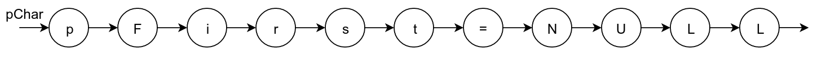
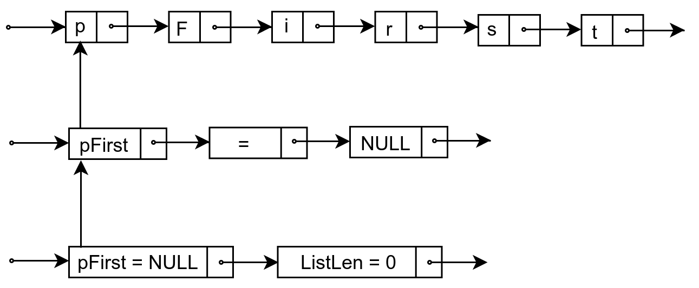

# Экзаменационный билет №13

## 1.Представление текста связным списком.

Текст – линейная последовательность символов



Текст – линейная последовательность слов (слово - линейная последовательность символов)


Текст – линейная последовательность строк, строки состоят из слов, слова – из символов и т.д.


Математическая модель текста – иерархическая структура представления (дерево).



- На всех уровнях представления (кроме символов) значение задается указателем на соответствующую структуру ниже расположенного уровня
- Разработанная структура хранения называется **связным (иерархическим) списком**
- Абстрактная структура типа дерева представима в виде **связного списка**
- В списке существуют делимые и неделимые (атомарные, терминальные) элементы
- Визуальное представление текста содержит только атомарные элементы, структура хранения должна включать все элементы - Разные типы звеньев – трудности при управлении памятью, дублирование программ обработки

Единый тип звена:

```C++
typedef Tlink *PTLink;
class TLink
{
    PTLink pNext;
    int Atom; // =1 – звено-атом
    union {PTLink pDown; char Symb;}
```

## 2. Таблицы с вычислимым входом.

**Таблица с вычисляемым входом (хеш-таблица)** – это таблица, элементы которой располагаются в соответствии с некоторой функцией расстановки (**хеш-функцией**)

Функция расстановки f (ключ) вычисляет для каждого элемента таблицы по его ключу номер (позицию) элемента в массиве.

- диапазон значений функции f (ключ) – `0…N–1` или `1…N`
- Хеш-таблица должна быть инициализирована, т. е. элементы таблицы вначале должны получить значение “пусто”, что позволяет определить, есть в данной позиции элемент или нет.

<!-- TODO:
- Add more info from pictures-->

Функция преобразования значения ключа к номеру (адресу) строки памяти для хранения записи H: K  L (L={0,…,M-1}) называется функцией (хеширования, перемешивания, рассеивания) расстановки (hash - мешанина, путаница).Таблицы, представление которых организуется при использовании функции расстановки, называются таблицы с вычислимыми адресами (хеш-таблицы, перемешиваемые таблицы). Ситуация, когда для расположения записи функцией расстановки определяется уже занятая строка памяти, называется относительным переполнением (коллизией). Уменьшение эффекта сгущений может быть достигнуто при применении способа открытого или линейного перемешивания s' = (s+p)modM (1p<M). Возможное решение состоит в выборе взаимно-простых значений для M и p. В более общем виде правило разрешения коллизии может быть представлено как  функция вторичного перемешивания s'=h'(s). Теорема. Алгоритм открытого перемешивания при взаимно-простых M и p гарантирует нахождение свободных строк структуры хранения таблицы. Доказательство. Рассмотрим множество G={0,1,…,M-1} c операцией ab=(a+b)mod M. Свойства операции: G замкнута относительно , операция ассоциативна и коммутативна,   нулевой и обратные элементы  Множество G с операцией  является группой. Выделим подмножество G'={0, a, a  a,…}. Такое множество G' с операцией  тоже является группой (такие группы называются циклическими). Обозначим a  a … a через na (a - число повторений). Если n>0, то минимальное значение n, при котором na=0, называется порядком элемента a и обозначается |a|(т.е. порядок определяет количество итераций открытого перемешивания, после которого начнется повторение строк). Целое значение в операции (n a) / M получится только при n=M  (т.к. a<M и для взаимно простых а и M). Но это означает также, что na=0, и, тем самым, |a|=M. Отсюда следует G=G'. При разрешении коллизии просматриваемые строки могут рассматриваться как список, в котором порядок следования определяется при помощи алгоритмического правила. Тем самым, удаление записи в середине подобного списка не должно разрушать связность записей. Это может быть достигнуто специальной маркировкой строк с удаленными записями. Строка структуры хранения имеет три возможных состояния – свободное, занятое, пустое (пустое состояние строки возникает после удаления хранимой в строке записи). Вставка (окончательный вариант). 1) Если n==M, ТО { Переполнение; Останов }, 2) f=-1  // f – номер первой найденной пустой строки, 3) s = h(key)  // применение функции расстановки, 4) ЕСЛИ s занята и K[s]==key, ТО {Дублир.; Останов }, 5) ЕСЛИ s пустая и (f<0), ТО { f = s }, 6) ЕСЛИ s свободна и (f < 0), ТО { K[s]=key; Останов }, 7) ЕСЛИ s свободна и (f >-1), ТО { K[f]=key; Останов }, 8) (!) Коллизия {s = (s+p) mod M  и переход к п. 4 }. Поиск. 1) f=-1  // f – номер первой найденной пустой строки, 2) s = h(key)  // применение функции расстановки, 3) ЕСЛИ s занята и K[s]==key, ТО { Останов }, 4) ЕСЛИ s пустая и (f<0), ТО { f = s }, 5) ЕСЛИ s свободна, ТО { Останов }, 6) (!) Коллизия { s = (s+p) mod M  и переход к п. 3 }. 

**Метод цепочек**.

Замечания к открытому перемешиванию как способу размешения коллизий:

- Размер памяти для таблиц фиксирован
- Хранение записей без упорядоченности по ключам.

Широко используемый подход для разрешения коллизий - **метод цепочек**, когда все записи, для которых функция хеширования определяет одно и тоже значение,представляются в виде линейного списка.

Открытое перемешивание еще называют **закрытым хэшированием**, метод цепочек - **открытое хэширование**.


