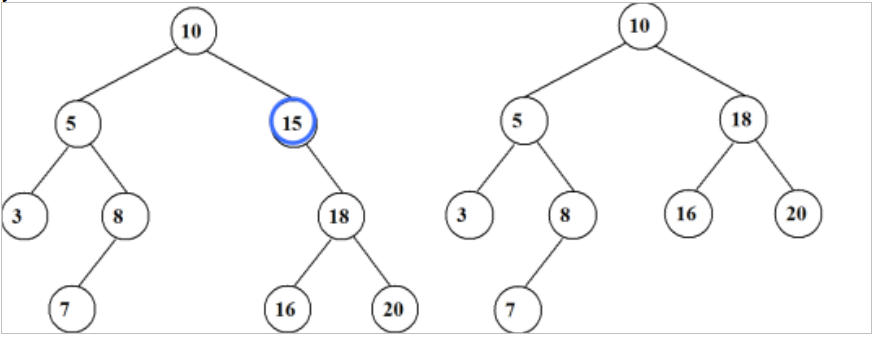
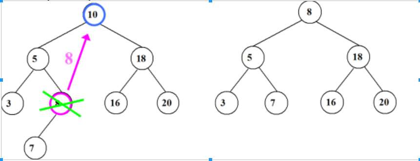

# Экзаменационный билет №15

## 1.Изменение структуры текста (вставка и удаление строк)

```C++
void TText::DelDownLine(void) // Удаление строки в подуровне
{
   if (pCurrent == nullptr)
       SetRetCode(TextErr);
   else if (pCurrent->pDown == nullptr)
       SetRetCode(TextNoDown);
   else if (pCurrent->pDown->IsAtom())
       pCurrent->pDown = pCurrent->pDown->pNext;
}

void TText::InsDownLine(string str) // Вставка строки в подуровень
{
   if (pCurrent == nullptr)
       SetRetCode(TextErr);
   else
   {
       TStr buf; // typedef char TStr[TextLineLength];
       strcpy(buf, str.c_str());
       pCurrent->pDown = new TTextLink(buf, pCurrent->pDown, nullptr);
   }
}
```

## 2. Деревья поиска. Алгоритм удаления






```C++
void TTreeTable :: DelRecord ( TKey k ) { // удалить запись
  if ( FindRecord(k) == NULL ) 
    SetRetCode(TabNoRec); // SKIP_ON
  else {
    SetRetCode(TabOK);
    PTTreeNode pNode = *ppRef;
    if ( pNode->pRight == NULL )
        *ppRef = pNode->pLeft; // один потомок слева
    else if ( pNode->pLeft == NULL )
        *ppRef = pNode->pRight; // один потомок справа
    else { // два потомка - поиск крайнего справа у левого поддерева
      PTTreeNode pN = pNode->pLeft, *ppR = &pNode->pLeft;
      while ( pN->pRight != NULL ) {
        ppR = &pN->pRight; pN  = *ppR;
      } // вместо удаления pNode удается pN
      pNode->pValue = pN->pValue;   // значение в pNode
      pNode->Key    = pN->Key;
      pNode = pN; *ppR = pN->pLeft; // обход удаляемого pN
    }
    delete pNode;
  }// SKIP_OFF
}
```
