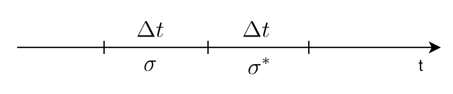
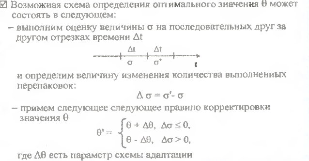
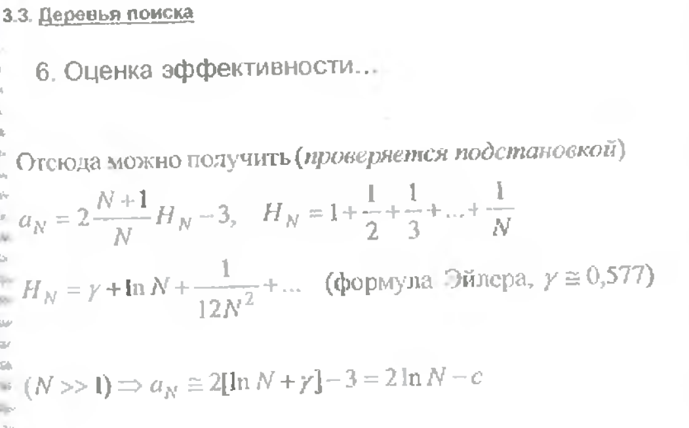
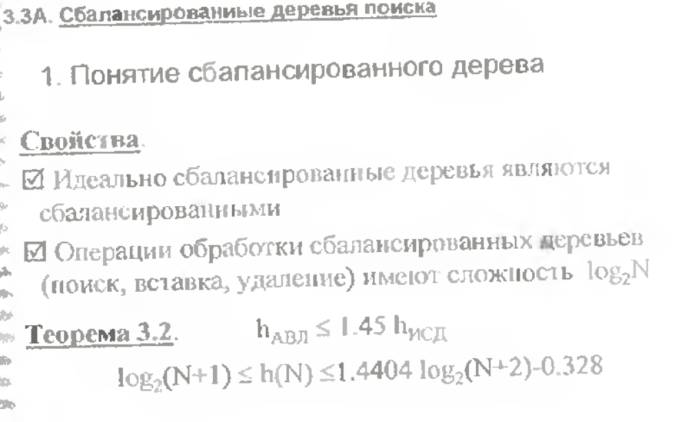

# Экзаменационный билет №16

## 1.Адаптивная оценка параметров модели в ходе выполнения программ (на примере системы управления несколькими стеками).

## 2. Оценка сложности обработки деревьев поиска. Понятие сбалансированных и идеально сбалансированных деревьев поиска.

Дерево является идеально сбалансированным если для каждого его узла количество узлов в левом и правом поддеревьях различаются не более чем на 1.
Дерево является сбалансированным,если для каждого узла высота левого и правого поддеревьев различаются не более,чем на 1(АВЛ-деревья).
Идеально сбалансированные деревья являются сбалансированными.Операции обработки сбалансированных деревьев имеют сложность log2N.(поиск,вставка,удаление)
Тmin=1
Tmax=log2N(при сбалансированном дереве)
Tmax=N(при вырожденном дереве)

