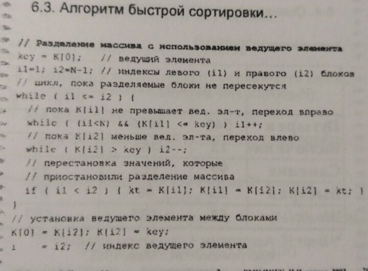
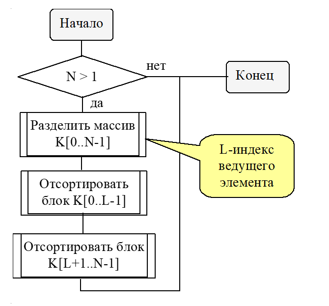
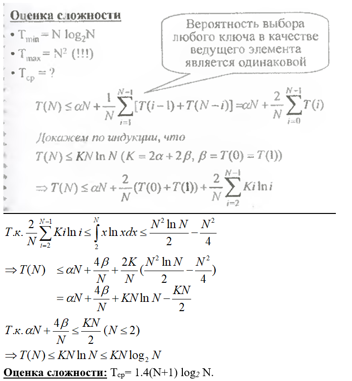
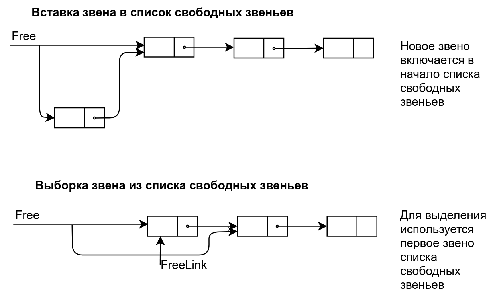
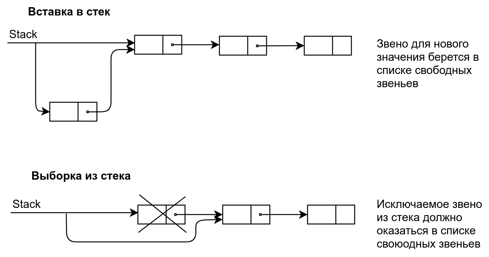
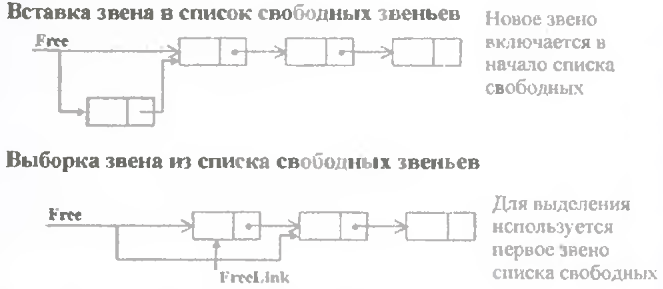

# Экзаменационный билет №19

## 1.Упорядоченные таблицы. Алгоритм быстрой сортировки.

**Сортированные (упорядоченные) таблицы** - таблицы, в которых записи располагаются в порядке возрастания (или убывания) ключей

Упорядоченность таблиц может быть организована только при возможности сравнения ключей (на множестве ключей задано отношение линейного порядка).

**Сортировка** - действия, связанные с размещением записей в порядке возрастания (или убывания) ключей

**Алгоритм сортировки** называют **устойчивым**, если он никогда не меняет относительный порядок в таблице двух записей с равными ключами

**Внутренняя сортировка** - Упорядочивание данных, при котором все значения располагаются в ОП

**Сортировка включением** 

Идея похода – вставка нового значения в упорядоченный набор данных.

**Алгоритм быстрой сортировки.**

Идея подхода (Hoare C.A.R.)– использование процедуры разделения упорядочиваемого набора на две части, в одной из которых располагаются значения, меньшие некоторого порогового (ведущего) элемента массива, в другой – соответственно большие значения. Подобный способ разделения может быть выполнен без привлечения дополнительной памяти.

При наличии процедуры разделения алгоритм сортировки может быть определен рекурсивно – необходимо разбить упорядочиваемый набор на два блока с меньшими и большими значениями соответственно и затем последовательно отсортировать полученные блоки.

## 2. Реализация структуры хранения нескольких стеков с использованием списков на языке высокого уровня

Все свободные звенья объединяются в один список свободных звеньев. Звенья этого списка используются при необходимости свободной памяти, в этот список звенья должны возвращаться после освобождения.

Схемы работы со стеком и со списком свободных звеньев совпадают. Список свободных звеньев есть стек.
