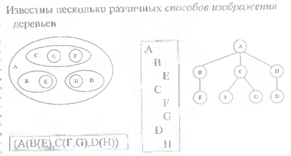
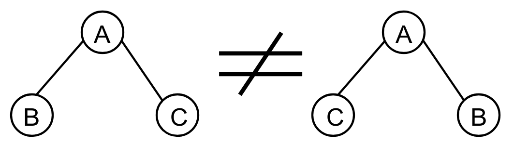
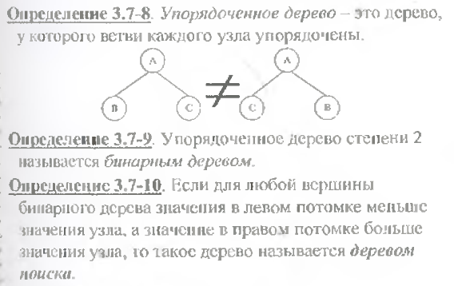
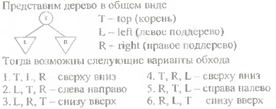
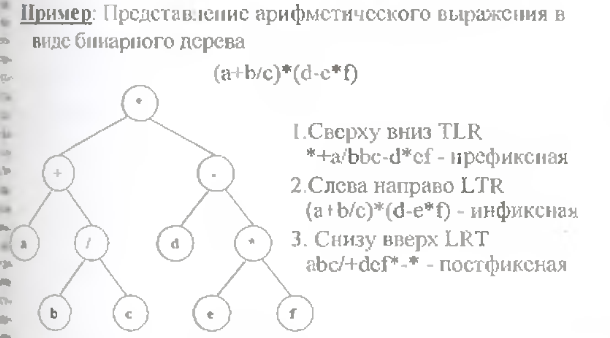
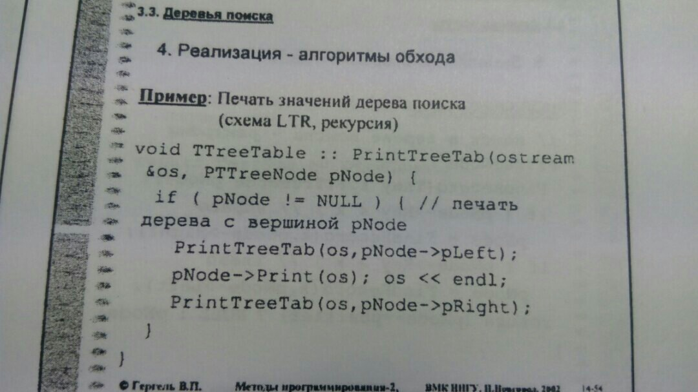

# Экзаменационный билет №20

## 1.Деревья поиска как способ организации таблицы. Алгоритмы обхода.

**Дерево** - связный граф без циклов

Структура типа дерева (древовидная структура) с базовым типом T

- это либо пустая структура,
- либо узел (вершина) со значением типа T, с которым связано конечное число древовидных структур (поддеревьев) с базовым типом T.

**Дерево поиска** - деревоб в котором для любой вершины бинарного дерева значения в левом потомке меньше значения узла, а значение в правом потомке больше значения узла

**Обработка дерева** – выполнение необходимой операции для каждой узла дерева. Реализация подобного типа действий предполагает умение обхода (обхода) дерева

## 2. Сравнение непрерывной и списковой структур хранения.

| Непрерывная память                                 |                                            Списки                                            |
| -------------------------------------------------- | :------------------------------------------------------------------------------------------: |
| Перепаковка для динамического распределения памяти | Динамическое распределение памяти эффективно реализуется при помощи списка свободных звеньев |
| В структуре хранения хранятся только данные        |                       В структуре хранения хранятся данные и указатели                       |
| К элементам структуры данных обеспечивается        |                         К элементам структуры данных обеспечивается                          |
| Прямой доступ                                      |                                   Последовательный доступ                                    |
