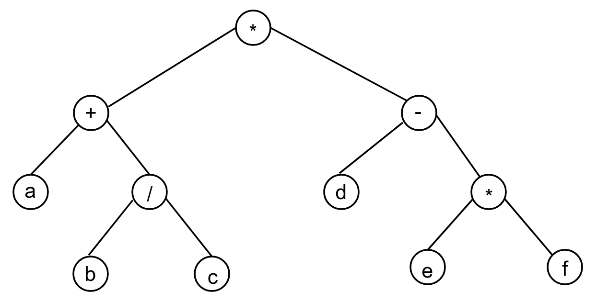

# Экзаменационный билет №20

## 1.Деревья поиска как способ организации таблицы. Алгоритмы обхода.

**Дерево** - связный граф без циклов

Структура типа дерева (древовидная структура) с базовым типом T

- это либо пустая структура,
- либо узел (вершина) со значением типа T, с которым связано конечное число древовидных структур (поддеревьев) с базовым типом T.

### Способы представления дерева


**(Непосредственный) Потомок** - узел у, находящийся непосредственно под узлом х (т.е. есть ребро (х, у)). Узел х - **(непосредственный) предок** узла у

**Корень** - узел, не имеющий предков

**Длина пути** - число ветвей(ребер), которые необходимо пройти, чтобы продвинуться от корня к заданному узлу 

Узлы с одинаковой длиной пути образуют **уровень(ярус) дерева**
* Корень расположен на уровне 1, его потомки на уровне 2 и т.д.
    * Принято изображать узлы дерева одного и того же уровня на одной горизонтальной прямой

**Глубина** - максимальный уровень дерева

**Степень узла** - число непосредственных потомков узла

**Степепь дерева** - максимальная степень всех узлов

**Упорядоченное дерево** - дерево, у которого ветви каждого узла упорядочены

<!-- TODO: Add picture here -->

**Бинарное дерево** - упорядоченное дерево степени 2

**Дерево поиска** - дерево, удовлетворяющее условию:
* Если для любой вершины бинарного дерева значения в левом потомке меньше значения узла, а значение в правом потомке больше значени узла


**Дерево поиска** - дерево, в котором для любой вершины бинарного дерева значения в левом потомке меньше значения узла, а значение в правом потомке больше значения узла

**Обработка дерева** – выполнение необходимой операции для каждой узла дерева. Реализация подобного типа действий предполагает умение обхода (обхода) дерева


### Представление дерева в общем виде

<!-- TODO: Add picture here -->

* T - top (корень)
* L - left (левое поддерево)
* R - right (правое поддерево)

Возможные варианты обхода:
* TLR - сверху вниз
* LTR - слева направо
* LRT - снизу вверх
* TRL - сверху вниз
* RTL - справа налево
* RLT - снизу вверх




### Печать значений дерева поиска (схема LTR, рекурсия)
```C++
void TTreeTable::PrintTreeTab(ostream &os, pTTreeNode pNode)
{
    // Печать дерева с вершиной pNode
    if (pNode != NULL)
    {
        PrintTreeTab(os, pNode->pLeft);
        pNode->Print(os);
        os << endl;
        PrintTreeTab(os, pNode->pRight);
    }
}
```

## 2. Сравнение непрерывной и списковой структур хранения.

| Непрерывная память                                 |                                            Списки                                            |
| -------------------------------------------------- | :------------------------------------------------------------------------------------------: |
| Перепаковка для динамического распределения памяти | Динамическое распределение памяти эффективно реализуется при помощи списка свободных звеньев |
| В структуре хранения хранятся только данные        |                       В структуре хранения хранятся данные и указатели                       |
| К элементам структуры данных обеспечивается        |                         К элементам структуры данных обеспечивается                          |
| Прямой доступ                                      |                                   Последовательный доступ                                    |
