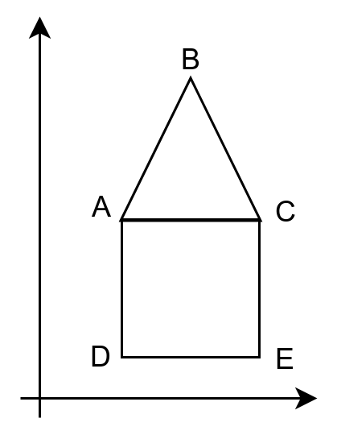

# Экзаменационный билет №21

## 1.Плексы как представление рисунков, состоящих из точек и соединяющих их отрезков.

Рассмотрим в качестве базовых объектов основные геометрические фигуры – точку, окружность, прямоугольник и т.д.

**Информационное описание объектов** – параметры фигуры (координаты, размер, радиус и др.). В общем случае, описание фигуры включает значение координат некоторой опорной точки.

**Операции обработки** геометрических объектов включают методы для задания и изменения параметров; расширим набор операций процедурами визуализации (например, на экране дисплея) и скрытия фигур.


Для обеспечения возможности динамической визуализации геометрических объектов введем тип данных, значения которого вычисляются в соответствии с задаваемым формульным выражением.

**Составной объект** – набор геометрических объектов (как базовых, так и составных), рассматриваемых при выполнении операций обработки как единый объект.

**Геометрический объект** может быть сконструирован с использованием уже существующих объектов (например, ломаная может быть определена через набор конечных точек составляющих отрезков).

**Геометрический объект** может быть образован при помощи сборки существующих объектов – рассмотрим данный способ построения новых объектов на примере рисунков (чертежей), образованных только из объектов двух базовых типов: точек и линий


- Узел структуры хранения представляет линию чертежа.
- Указатель на начальную точку линии может также указывать на линию, т.е. конечная точка предыдущей линии является начальной точкой следующей линии.
- **Плекс** - структура хранения данного вида (содержит элементы разного типа). **Плекс** является общей структурой хранения сетевых моделей данных.
- Повторяющая точка на чертеже должна быть представлена одним и тем же объектом (не следует допускать множественности представления одного и того же значения).
- Разработанная структура хранения позволяет обеспечить представление чертежей, которые можно нарисовать без отрыва карандаша от бумаги.



## 2. Сравнение непрерывной и списковой структур хранения.


- Для хранения элементов базисного множества выделяется вектор памяти размера, достаточного для хранения максимально возможного количества значения в стеке.
- Хранение значений в памяти осуществляется последовательно от младшего элемента вектора к старшему.
- Для запоминания количества хранимых в стеке значений используется индекс последнего занятого элемента в векторе.


```C++
#define MemSize 25 // размер памяти для стека
class TStack
{
 protected:
    int Mem[MemSize]; // память для СД
    int Top; // индекс последней занятой ячейки
 public:
    TStack () { Top = -1; }
    int IsEmpty (void) const { Top == -1; }
    int IsFull (void) const { Top == MemSize-1;}
    void Put ( const int Val ) { Mem[++Top] = val; }
    TData Get (void) { return Mem[Top--]; }
};
```

### Очередь


**Способы достижения полного использования памяти:**


Сдвиг значений очереди после выборки очередного значения (т.е. обеспечение `Li=0`) – возрастание накладных расходов, использование левого участка свободной области при достижении `Hi=n-1` (т.е. при отсутствии свободной памяти справа).

**Циклический или кольцевой буфер** - структура хранения, получаемая из вектора расширением отношения следования парой `p(an,a1)`. Реализация кольцевого буфера логически может быть обеспечена переходом индексов `Li` и `Hi` при достижении граничного значения `MemSize-1` на индекс первого элемента вектора памяти.
