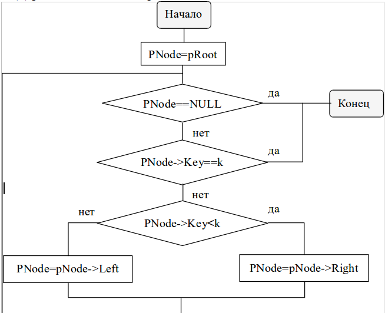
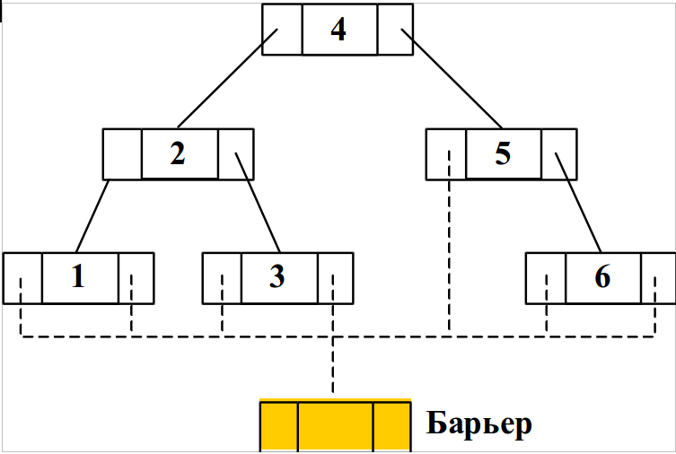
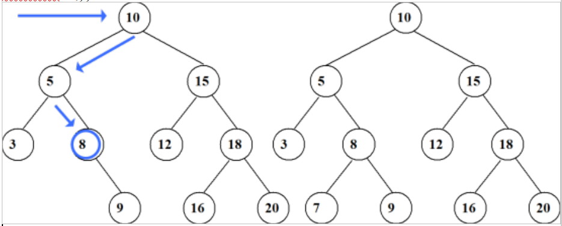

# Экзаменационный билет №24

## 1. Деревья поиска. Алгоритмы поиска и вставки



- поиск в дереве поиска – рекурсия PTTreeNode

```C++
FindRecord(TKey k, PTTreeNode pNode)
{
    if (pNode != NULL) // лист
    {
        if (pNode->Key < k) // вправо
            pNode = FindRecord(k, pNode->Right);
        if (pNode->Key > k) // влево
            pNode = FindRecord(k, pNode->Left);
    }
    return pNode;
}
```



Введение барьера.

- поиск в дереве поиска – рекурсия PTTreeNode

```C++
FindRecord(TKey k, PTTreeNode pNode)
{
    if (pNode->Key < k) // вправо
        pNode = FindRecord(k, pNode->Right);
    if (pNode->Key > k) // влево
        pNode = FindRecord(k, pNode->Left);
    return (pNode == pBarrier) ? NULL : pNode;
}
```



- Поиск до тупика и вставка

```C++
void TTreeTable ::InsRecord(TKey k, PTDatValue pVal)
{ // вставить запись
    if (IsFull())
        SetRetCode(TabFull);
    else if (FindRecord(k) != NULL)
        SetRetCode(TabRecDbl);
    else
    {
        SetRetCode(TabOK);
        ppRef = new TTreeNode(k, pVal);
        DataCount++;
    }
}
```

## 2. Алгоритм копирования текста

- Для копирования текста необходимо предварительно скопировать разделы текста, на которые указывают pDown и pNext, испоьзуя алгоритмы NDT или DNT.
- Для навигации по тексту-копии также необходим стек
  - использование стеков исходного текста и текста-копии должно быть согласовано
- Для навигации по исходному тексту и тексту-копии используется один объединенный стек
- Каждое звено стека копируется в 2 прохода
  - 1 проход - при подъеме из подуровня (pDown)
    - создание копии звена
    - заполнение поля pDown (подуровень уже скопирован)
    - запись в поле Str значения Copy
      - для распознания звена при попадании на него во втором проходе
    - запись в поле pNext указателя на звено-оригинал
      - для возможности дальнейшего копирования текста исходной строки
    - запись указателя на звено-копию в стек
  - 2 проход - при извлечении звена из стека
    - заполнение полей Str и pNext
    - указатель на звено-копию запоминается в переменной cpl
