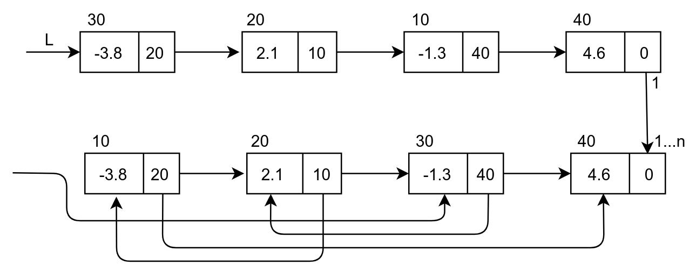

# Экзаменационный билет №26

## 1. Таблицы с вычислимым входом. Запись и поиск при переполнении (способ открытого перемешивания).

### Методичка с лабами.

**Таблица** – динамическая структура данных, базисным множеством которой является семейство линейных структур из записей.

**Запись** – кортеж, каждый элемент которого обычно именуется полем.

**Имя записи** (ключ) – одно из полей записи, по которому обычно осуществляется поиск
записей в таблице; остальные поля образуют тело записи.

**Хеш-функция** – функция, ставящая в соответствие ключу номер записи в таблице.

**Хеш-таблицами**, **таблицами с вычисляемыми адресами** или **перемешиваемыми таблицами** - таблицы, получаемые при некотором способе построения.

- Этот способ построения таблиц при большом количестве записей состоит в предварительном (перед непосредственным поиском по таблице) вычислении месторасположения искомой записи
- Данный метод предполагает наличие некоторой простой функции `h(key)`, которая отображает множество имен на множество номеров строк таблицы
  - Эта функция называется **функцией хеширования** или **расстановки**.
- Эффективность обработки таблиц с вычислимым входом зависит не от количества записей, а от степени заполненности структуры хранения.

При использовании таблиц с вычисляемыми адресами может возникнуть ряд дополнительных проблем

Так, например, при вставке новой записи функция расстановки может выдать номер занятой строки массива (функция расстановки может определять одни и те же значения для нескольких разных ключей)

- Такая ситуация называется относительным переполнением таблицы или **коллизией**
- При возникновении коллизий возможны разные методы их разрешения

**Метод открытого перемешивания** (или **закрытое хеширование**) - добавление к вычисленному занятому номеру некоторого фиксированного смещения (поторное перемешивание) `k' = (k + p) mod N`

- если новый адрес `k'` также является занятым, следует повторить процедуру повторного перемешивания до тех пор, пока не обнаружится свободная строка, либо таблица не будет исчерпана
  - если значения `p` и `N` являются взаимнопростыми, открытое перемешивание обеспечивает нахождение свободной строки массива

Среднее количество просматриваемых записей при поиске записи в перемешиваемых таблицах

- при предположении равной вероятности использования ключей
- при использовании функции расстановки с равномерным рассеиванием ключей по строкам массива определяется следующим соотношением
  - разрешение коллизий по методу открытого перемешивания:

`Tср = (1 - a / 2) / (1 - a)`

- `a` - коэффициент заполненности таблицы (`a = N / M`)
- `M` - количество строк в массиве для хранения записей
- `N` - количество записей в таблице.

Следует отметить, что количество сравнений при поиске в перемешиваемых таблицах зависит не от количества записей в таблице, а от заполненности памяти, отведённой для размещения записей. Для примера, при заполненности массива на 75% (`a = 0.75`) количество сравнений в среднем равно 2.5.

**Вставка**:

```
1. Если n==M, ТО { Переполнение; Останов }
2. f = -1 // f – номер первой найденной пустой строки
3. s = h(key) // применение функции расстановки
4. ЕСЛИ s занята и K[s]==key, ТО {Дублир.; Останов }
5. ЕСЛИ s пустая и (f < 0), ТО { f = s }
6. ЕСЛИ s свободна и (f < 0), ТО { K[s]=key; Останов }
7. ЕСЛИ s свободна и (f >-1), ТО { K[f]=key; Останов }
8. (!) Коллизия {s = (s+p) mod M и переход к п. 4 }.
```

**Поиск**:

```
1) f = -1 // f – номер первой найденной пустой строки
2) s = h(key) // применение функции расстановки
3) ЕСЛИ s занята и K[s]==key, ТО { Останов }
4) ЕСЛИ s пустая и (f < 0), ТО { f = s }
5) ЕСЛИ s свободна, ТО { Останов }
6) (!) Коллизия { s = (s+p) mod M и переход к п. 3 }.
```

## 2. Понятие линейного списка.

Необходимость перепаковки для обеспечения динамического распределения памяти возникает в силу принятого способа реализации отношения следования - следующий элемент структуры располагается в следующем элементе памяти (с адресом, большим на 1). Устранение перепаковки возможно только при кардинальном изменении способа реализации основных отношений – необходимо допустить размещение следующих элементов структуры в произвольных элементах памяти (там, где имеется свободные области памяти). Возможность такого подхода может быть обеспечена запоминанием для каждого текущего элемента структуры адреса памяти, где хранится следующий элемент. Интерпретация содержимого элемента памяти (значение или адрес следующего элемента) в самом простом варианте может быть обеспечена фиксированным форматом используемых участков памяти.

Под **квантом памяти** понимается последовательность элементов памяти с последовательно-возрастающими адресами.

**Именем** (адресом) этой группы считается адрес первого слова кванта. Элементы кванта называются **полями**. В общем случае, набор элементов памяти, связанных с одним именем, называют **звеном**.

Далее будут использоваться двухэлементные звенья памяти, в которых первое поле будет использоваться для хранения значений, а второе поле – для запоминания адресов.

Способ задания отношения следования, в котором фиксация месторасположения следующего элемента производится путем запоминания соответствующего адреса памяти, называется **сцеплением** (пары, хранящие `ai` и `ai+1`, сцеплены адресными указателями).

Для изображения структуры хранения с использованием сцепления звенья памяти рисуются в виде прямоугольников, а сцепление звеньев показывается в виде стрелок.



Индикация последнего звена в списке обычно производится записью в поле адреса некоторого **барьера** – фиктивного (неадресного) значения (как правило, 0 или -1). Для доступа к звеньям списка должен быть известен адрес первого звена списка. Указатель, в котором этот адрес запоминается, называется **переменной связи**.

Структура хранения данного типа (звенья, сцепление, барьер, переменная связи) называется **линейным** или **односвязным списком**.
