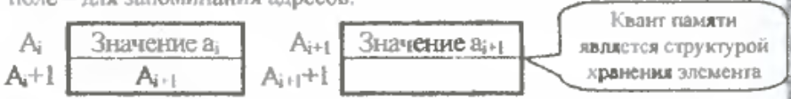

# Экзаменационный билет №26

## 1. Таблицы с вычислимым входом. Запись и поиск при переполнении (способ открытого перемешивания).

### Методичка с лабами.


*Таблица* – динамическая структура данных, базисным множеством которой является семейство линейных структур из записей.
*Запись* – кортеж, каждый элемент которого обычно именуется полем.
*Имя записи* (ключ) – одно из полей записи, по которому обычно осуществляется поиск
записей в таблице; остальные поля образуют тело записи.
*Хеш-функция* – функция, ставящая в соответствие ключу номер записи в таблице.

*Хеш-таблицами*, *таблицами с вычисляемыми адресами* или *перемешиваемыми таблицами* называют таблицы, получаемые при некотором способе построения. Этот способ построения таблиц при большом количестве записей состоит в предварительном (перед непосредственным поиском по таблице) вычислении месторасположения искомой записи. Данный метод предполагает наличие некоторой простой функции `h(key)`, которая отображает множество имен на множество номеров строк таблицы. Эта функция называется функцией хеширования или расстановки.  
Эффективность обработки табиц с вычислимым входом зависит не от количества записей, а от степени заполненности структуры хранения.

При использовании таблиц с вычисляемыми адресами может возникнуть ряд дополнительных проблем. Так, например, при вставке новой записи функция расстановки может выдать номер занятой строки массива (функция расстановки может определять одни и те же значения для нескольких разных ключей). Такая ситуация называется относительным переполнением таблицы или *коллизией*. При возникновении коллизий возможны разные методы их разрешения. Рассмотрим метод *открытого перемешивания*.

*Метод открытого перемешивания* (или *закрытое хеширование*) состоит в добавлении к вычисленному занятому номеру некоторого фиксированного смещения (поторное перемешивание) `k' = (k + p) mod N`; если новый адрес `k'` также является занятым, следует повторить процедуру повторного перемешивания до тех пор, пока не обнаружится свободная строка, либо таблица не будет исчерпана (если значения `p` и `N` являются взаимнопростыми, открытое перемешивание обеспечивает нахождение свободной строки массива);

Среднее количество просматриваемых записей при поиске записи в перемешиваемых
таблицах при предположении равной вероятности использования ключей и при
использовании функции расстановки с равномерным рассеиванием ключей по строкам
массива определяется следующим соотношением (разрешение коллизий по методу открытого
перемешивания): `Tср = (1 - a / 2) / (1 - a)`, где: `a` - коэффициент заполненности таблицы (`a = N / M`);  `M` - количество строк в массиве для хранения записей; `N` - количество записей в таблице.  
Следует отметить, что количество сравнений при поиске в перемешиваемых таблицах зависит не от количества записей в таблице, а от заполненности памяти, отведённой для размещения записей. Для примера, при заполненности массива на 75% (`a = 0.75`) количество сравнений в среднем равно 2.5.

***

### Шпоры ПМИ

Функция преобразования значения ключа к номеру (адресу) строки памяти для хранения записи `H: K → L (L = { 0, ... , M - 1 })` называется функцией расстановки (хеширования, перемешивания, рассеивания). Таблицы, представление которых организуется при использовании функции расстановки, называются таблицы с вычислимыми адресами (хеш-таблицы, перемешиваемые таблицы). При `M` < `N` (`M` - количество строк памяти, `N` - количество записей) функция расстановки является взаимно-неоднозначной (неинъективной). Темсымым, при использовании функции расстановки могут возникать ситуации, когда получаемый функцией номер строки памяти для расположения записи уже является использованным. Ситуация, когда для расположения записи функцией расстановки определяется уже занятая строка памяти, называется относительным переполнением (коллизией). Уменьшение эффекта сгущений может быть достигнуто при применении способа открытого или линейного перемешивания `s' = (s + p) mod M (1 <= p < M)`. Возможное решение нахождения свободных строк состоит в выборе взаимнопростых значений для `M` и `p`. В более общем виде правило разрешения коллизии может быть представлено как функция вторичного перемешивания `s' = h'(s)`.

Теорема: Алгоритм открытого перемешивания при взаимно-простых `M` и `p` гарантирует нахождение свободных строк структуры хранения таблицы.  
Доказательство: Рассмотрим множество `G = { 0, 1, ... , M - 1 }` с операцией `a ⊕ b = (a + b) mod M`. Свойства операции: `G` замкнута относительно `⊕`, операция ассоциативна и коммутативна, ∃ нулевой и обратные элементы => Множество `G` с операцией `⊕` является **группой**. Выделим подмножество `G' = { 0, a, a ⊕ a, ... }`. Такое множество `G'` с операцией `⊕` тоже является группой (такие группы называются циклическими). Обозначим `a ⊕ a ⊕ ... ⊕ a` через `na` (`a` - число повторений). Если `n > 0`, то минимальное значение `n`, при котором `na = 0`, называется порядком элемента `a` и обозначатся `|a|` (т.е. порядок определяет количество итераций открытого перемешивания, после которого начнётся повторение строк). Целое значение в операции `(n a) / M` получится только при `n = M` (т.к. `a < M` и для взаимно простых `a` и `M`). Но это означает также, что `na = 0`, и, тем самым, `|a| = M`. Отсюда следует `G = G'`.

При открытом перемешивании размер памяти для таблицы фиксирован + хранение записей без упорядоченности по ключам.

При разрешении коллизии просматриваемые строки могут рассматриваться как список, в котором порядок следования определяется при помощи алгоритмического правила. Тем самым, удаление записи в середине подобного списка не должно разрушать связность записей. Это может быть достигнуто специальной маркировкой строк с удалёнными записями. Строка структуры хранения имеет три возможных состояния - **свободное**, **занятое**, **пустое** (пустое состояние строки возникает посе удаления хранимой в строке записи).  

**Вставка**:
```
1. Если n==M, ТО { Переполнение; Останов } 
2. f = -1 // f – номер первой найденной пустой строки 
3. s = h(key) // применение функции расстановки 
4. ЕСЛИ s занята и K[s]==key, ТО {Дублир.; Останов } 
5. ЕСЛИ s пустая и (f < 0), ТО { f = s } 
6. ЕСЛИ s свободна и (f < 0), ТО { K[s]=key; Останов } 
7. ЕСЛИ s свободна и (f >-1), ТО { K[f]=key; Останов } 
8. (!) Коллизия {s = (s+p) mod M и переход к п. 4 }.
```

**Поиск**:
```
1) f = -1 // f – номер первой найденной пустой строки 
2) s = h(key) // применение функции расстановки 
3) ЕСЛИ s занята и K[s]==key, ТО { Останов } 
4) ЕСЛИ s пустая и (f < 0), ТО { f = s } 
5) ЕСЛИ s свободна, ТО { Останов } 
6) (!) Коллизия { s = (s+p) mod M и переход к п. 3 }.
```


## 2. Понятие линейного списка. 

Необходимость перепаковки для обеспечения динамического
распределения памяти возникает в силу принятого способа реализации отношения
следования - следующий элемент структуры располагается в следующем элементе памяти (с
адресом, большим на 1). Устранение перепаковки возможно только при кардинальном
изменении способа реализации основных отношений – необходимо допустить размещение
следующих элементов структуры в произвольных элементах памяти (там, где имеется
свободные области памяти). Возможность такого подхода может быть обеспечена
запоминанием для каждого текущего элемента структуры адреса памяти, где хранится
следующий элемент. Интерпретация содержимого элемента памяти (значение или адрес
следующего элемента) в самом простом варианте может быть обеспечена фиксированным
форматом используемых участков памяти.  
Под `квантом памяти` понимается последовательность элементов памяти с последовательно-возрастающими адресами. `Именем` (адресом) этой группы считается адрес первого слова кванта. Элементы кванта называются `полями`. В общем случае, набор элементов памяти, связанных с одним именем, называют `звеном`.

Далее будут использоваться двухэлементные звенья памяти, в которых первое поле будет использоваться для хранения значений, а второе поле – для запоминания адресов.  
  
Способ задания отношения следования, в котором фиксация месторасположения следующего элемента производится путем запоминания соответствующего адреса памяти, называется *сцеплением* (пары, хранящие `ai` и `ai+1`, сцеплены адресными указателями).  
Для изображения структуры хранения с использованием сцепления звенья памяти рисуются в виде прямоугольников, а сцепление звеньев показывается в виде стрелок.  
  
Индикация последнего звена в списке обычно производится записью в поле адреса некоторого *барьера* – фиктивного (неадресного) значения (как правило, 0 или -1). Для доступа к звеньям списка должен быть известен адрес первого звена списка. Указатель, в котором этот адрес запоминается, называется *переменной связи*.  
Структура хранения данного типа (звенья, сцепление, барьер, переменная связи) называется `линейным` или `односвязным списком`.