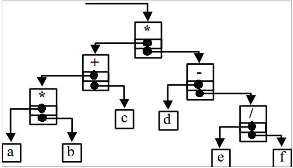

# Экзаменационный билет №27

## 1. Таблицы с вычислимым входом. Метод цепочек для разрешения коллизий.
### Копия билета 13.2

### Методичка с лабами.

*Таблица* – динамическая структура данных, базисным множеством которой является семейство линейных структур из записей.
*Запись* – кортеж, каждый элемент которого обычно именуется полем.
*Имя записи* (ключ) – одно из полей записи, по которому обычно осуществляется поиск
записей в таблице; остальные поля образуют тело записи.
*Хеш-функция* – функция, ставящая в соответствие ключу номер записи в таблице.

*Хеш-таблицами*, *таблицами с вычисляемыми адресами* или *перемешиваемыми таблицами* называют таблицы, получаемые при некотором способе построения. Этот способ построения таблиц при большом количестве записей состоит в предварительном (перед непосредственным поиском по таблице) вычислении месторасположения искомой записи. Данный метод предполагает наличие некоторой простой функции `h(key)`, которая отображает множество имен на множество номеров строк таблицы. Эта функция называется функцией хеширования или расстановки.  
Эффективность обработки табиц с вычислимым входом зависит не от количества записей, а от степени заполненности структуры хранения.

При использовании таблиц с вычисляемыми адресами может возникнуть ряд дополнительных проблем. Так, например, при вставке новой записи функция расстановки может выдать номер занятой строки массива (функция расстановки может определять одни и те же значения для нескольких разных ключей). Такая ситуация называется относительным переполнением таблицы или *коллизией*. При возникновении коллизий возможны разные методы их разрешения. Рассмотрим *метод цепочек*.

*Метод цепочек* при возникновении коллизий формирует линейные списки (цепочки), в каждом из которых располагаются записи с одинаковым значением функции расстановки (в этом случае в строках массива для размещения записей следует добавить ещё одно поле для ссылки на следующее звено списка).

***

### Шпоры ПМИ

Функция преобразования значения ключа к номеру (адресу) строки памяти для хранения записи `H: K → L (L = { 0, ... , M - 1 })` называется функцией расстановки (хеширования, перемешивания, рассеивания). Таблицы, представление которых организуется при использовании функции расстановки, называются таблицы с вычислимыми адресами (хеш-таблицы, перемешиваемые таблицы). При `M` < `N` (`M` - количество строк памяти, `N` - количество записей) функция расстановки является взаимно-неоднозначной (неинъективной). Темсымым, при использовании функции расстановки могут возникать ситуации, когда получаемый функцией номер строки памяти для расположения записи уже является использованным. Ситуация, когда для расположения записи функцией расстановки определяется уже занятая строка памяти, называется относительным переполнением (коллизией).

*Метод цепочек* (или *открытое хеширование*) - все записи, для которых функция хеширования определяет одно и тоже значение, представляются в виде линейного списка.  
Метод цепочек обеспечивает получение структуры хранения таблицы с динамическим распределением памяти.

***

### Википедия

Каждая ячейка массива является указателем на связный список (цепочку) пар ключ-значение, соответствующих одному и тому же хеш-значению ключа. Коллизии просто приводят к тому, что появляются цепочки длиной более одного элемента. Операции поиска или удаления элемента требуют просмотра всех элементов соответствующей ему цепочки, чтобы найти в ней элемент с заданным ключом. Для добавления элемента нужно добавить элемент в конец или начало соответствующего списка, и, в случае, если коэффициент заполнения станет слишком велик, увеличить размер массива и перестроить таблицу.

***

## 2. Плекс, как представление арифметического выражения.
### Копия билета 2.2

Плекс может рассматриваться как структура представления для выражений самого общего вида (линия – операция, точки - операнды).  
Пример: Арифметическое выражение `(a*b + c)*(d - e/f)`:

