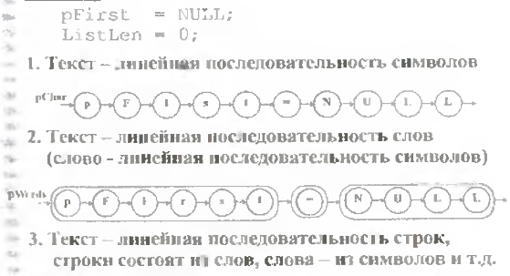
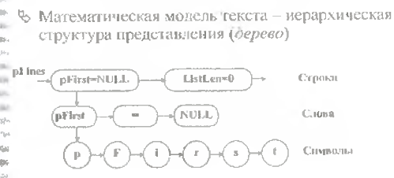
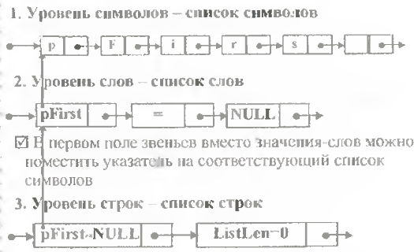

# Экзаменационный билет №28

## 1.Сравнительная характеристика способов организации таблиц

Здесь необходимо расписать + и - использования просмотровых таблиц, сортированных таблиц, хеш таблиц и ...

## 2. Представление текста связным списком.

<!-- 



 -->

Текст – линейная последовательность символов


Текст – линейная последовательность слов (слово - линейная последовательность символов)


Текст – линейная последовательность строк, строки состоят из слов, слова – из символов и т.д.


Математическая модель текста – иерархическая структура представления (дерево).


- На всех уровнях представления (кроме символов) значение задается указателем на соответствующую структуру ниже расположенного уровня
- Разработанная структура хранения называется **связным (иерархическим) списком**
- Абстрактная структура типа дерева представима в виде **связного списка**
- В списке существуют делимые и неделимые (атомарные, терминальные) элементы
- Визуальное представление текста содержит только атомарные элементы, структура хранения должна включать все элементы - Разные типы звеньев – трудности при управлении памятью, дублирование программ обработки

Единый тип звена:

```C++
typedef Tlink *PTLink;
class TLink
{
    PTLink pNext;
    int Atom; // =1 – звено-атом
    union {PTLink pDown; char Symb;}
```
