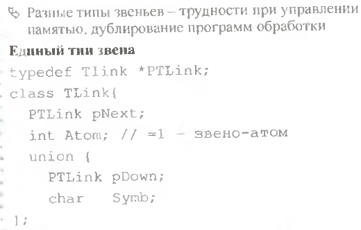

# Экзаменационный билет №28

## 1.Сравнительная характеристика способов организации таблиц

# `НЕТУ ЧОТА`

## 2. Представление текста связным списком.

- На всех уровнях представления (кроме символов) значение задается указателем на соответствующую структуру нижерасположенного уровня.
- Разработанная структура хранения называется связным (иерархическим) списком.
- Абстрактная структура типа дерева представима в виде связного списка.
- В списке существуют делимые и неделимые (атомарные, терминальные) элементы.
- Визуальное представление текста содержит только атомарные элементы, структура хранения должна включать все элементы.

