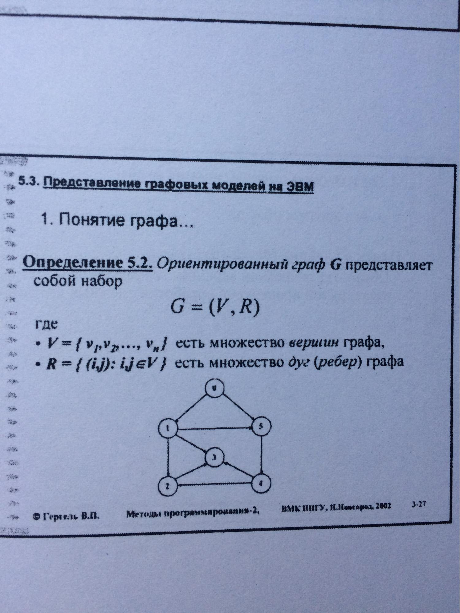
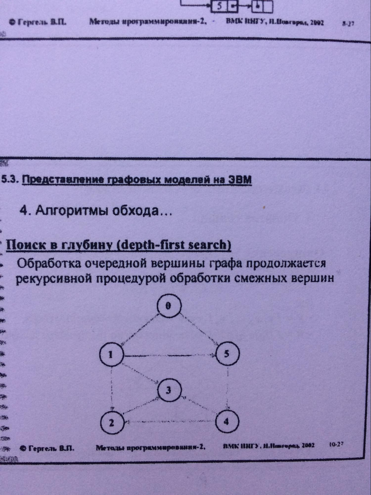

# Экзаменационный билет №30

## 1.Группирование геометрических объектов

**Составной объект** - набор геометрических объектов (как базовых так и составных), рассматриваемых при выполнении операций обработки как единый объект\

```C++
class TChartGroup : public TChartRoot
{
 protected:
    TDatList Group;  // Список объектов
 public:
    TChartGroup() { }
    void InsUnit(TChartRoot *pUnit);  // Добавление
    virtual void Show();  // Визуализация
    virtual void Hide();  // Скрытие
    virtual void CalcParams(double t = -1);  // Пересчет параметров
};
```

## 2. Алгоритмы обхода графов. Поиск в глубину.






