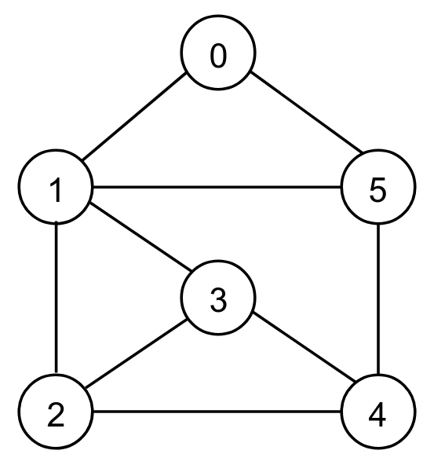

# Экзаменационный билет №31

## 1.Конструирование геометрических объектов

**Геометрический объект** может быть сконструирован с использованием уже существующих объектов. Например, ломаная может быть определена через набор конечных точек составляющих отрезков

```C++
class TChartPolyline : public TChartGroup
{
 public:
    TChartPolyline() { }
    void InsPoint(TChartRoot *pUnit);  // Добавление
    virtual void Show();  // Визуализация
    virtual void Hide();  // Скрытие
    virtual void CalcParams(double t = -1);  // Пересчет параметров
};
```

## 2. Алгоритмы обхода графов. Поиск в ширину

Для каждой вершины сначала выполняется обработка непосредственно смежных вершин



- Для исключения циклов и запоминания набора уже обработанных вершин можно использовать множество TSet
- Для запоминания набора достигнутых, но еще не обработанных вершин, можно использовать структуры:
    - Стек - для алгоритма поиска в глубину
    - Очередь - для алгорита поиска в ширину

<!--  -->
