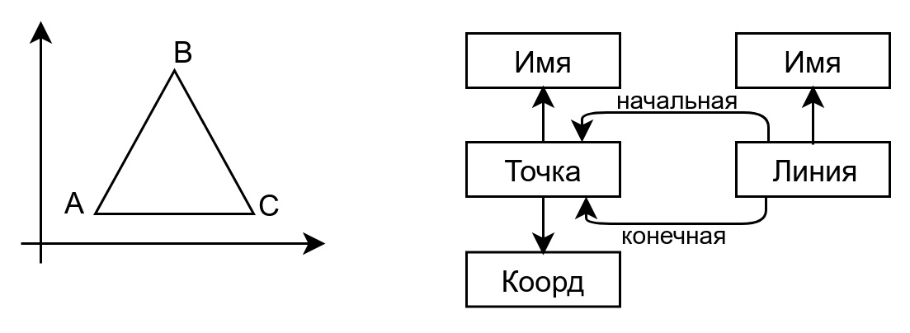
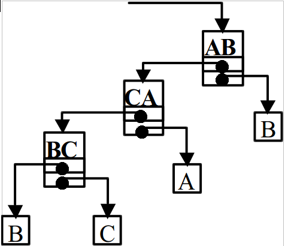
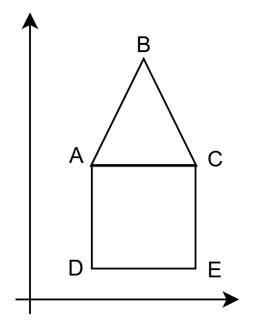

# Экзаменационный билет №32

## 1.Комбинирование геометрических объектов (плексы)

Геометрический объект может быть образован при помощи **сборки существующих объектов**.



Рассмотрим данный способ построения новых объектов на примере рисунков (чертежей), образованных только их объектов двух базовых типов: точек и линий



- Узел структуры хранения представляет линию чертежа
- Указатель на начальную точку линии может также указывать на линию
  - т.е. конечная точка предыдущей линии является начальной точкой следующей линии
- Структура хранения данного типа называется **плексом**(содержит элементы разного типа) повторяющаяся точка на чертеже должна быть представлена одним и тем же объектом
- Разработанная структура хранения позволяет обеспечить представление чертежей, которые можно нарисовать без отрыва карандаша от бумаги



### Алгоритм 1 - общая схема алгоритма обхода для плекса

- переход на крайнюю левую точку
- подъем по плексу
  - пока стек не пуст, достаем точки траектории и рисуем линии

```C++
while (pN (не принадлежит) TChartPoint)
{
    St.push(pN);
    pN = pN->GetFirstPoint();
}
//подъем по плексу и рисование
pF = pN;
while (!St.Empty())
{
    pN = St.top();
    St.Pop();
    pL = pN->GetLastPoint(); //рисование линии<pN, pF, pL>
    pF = pL;
}
```

### Алгоритм 2 - рекурсивный вариант

- Линии, определяемые при обходе плекса, помещаются в стек
- При линии, извлекаемой из стека, последовательно определяются начальная и конечная точки
- Для определения начальной точки используется метод GetFirstPoint линии
- Если получаемый указатель указывает на линию, обработка текущей линии откладывается (линия помещается в стек) и начинается анализ новой линии
  - данная процедура выполняется итеративно до получения линии, с которой начали.

```C++
TChartPoint *Show(TChart *pN)
{
    if (pN != NULL)
        pL = NULL;
    else if (pN (принадлежит) TChartPoint)
        pL = pN;
    else
    {
        pF = Show(pN->GetFirstPoint());
        pL = Show(pN->GetLastPoint()); //рисование линии <pN,pF,pL>
    }
    return pN;
}
```

## 2. Реализация алгоритма обхода графа

Алгоритмы обхода (итератор)

```C++
TSearchMode; // способ обхода
PTGraphNode pCurrNode; // текущая вершина
// Достигнутые, но не обработанные вершины
TDataRoot *pStream;
// Множество вершин, достигнутых в ходе обхода
TBitField *pFound;
```

**Инициализация `(Reset)`**

- Инициализация структур
- Вставка первой вершины в поток `pStream` и ее отметка в множестве `pFound`
- Выполнение метода `GoNext`

**Проверка завершения `(IsGraphEnded)`**

```C++
return pCurrNode == NULL // текущее звено?
```

**Переход к следующей вершине графа `(GoNext)`**

- Получить вершину из потока `pStream`
- Поместить смежные вершины, если они еще остались не достигнуты, в поток `pStream`
- Отметить смежные вершины в множестве pFound

```C++
    int Reset (void); // установить на первую вершину
    int IsGraphEnded (void) const; // обход завершен?
    int GoNext (void); // переход к следующей вершине
    PTGraphNode GetCurrNode (void) { return pCurrNode; } // доступ
    PTGraphPath GetShortestPath (string fn, string ln); // поиск кратчайшего пути
protected:
    virtual void Print (ostream &os); // печать графа
};
typedef TGraph * PTGraph;
// end of tgraph.h
```
